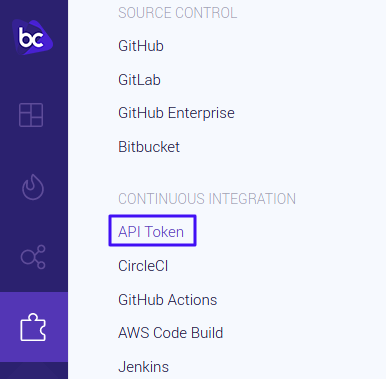
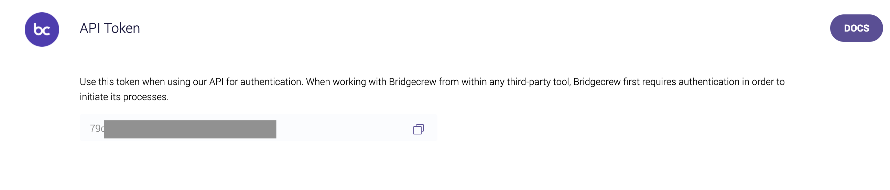

## Your Bridgecrew API Key

To run the Bridgecrew CLI we installed with `pip3` earlier, you’ll need an API token from your bridgecrew account.

To get it, go here! [(https://www.bridgecrew.cloud/integrations/api-token)](https://www.bridgecrew.cloud/integrations/api-token) or, when logged into the bridgecrew console, go to Integrations > API Token and copy the token provided!

