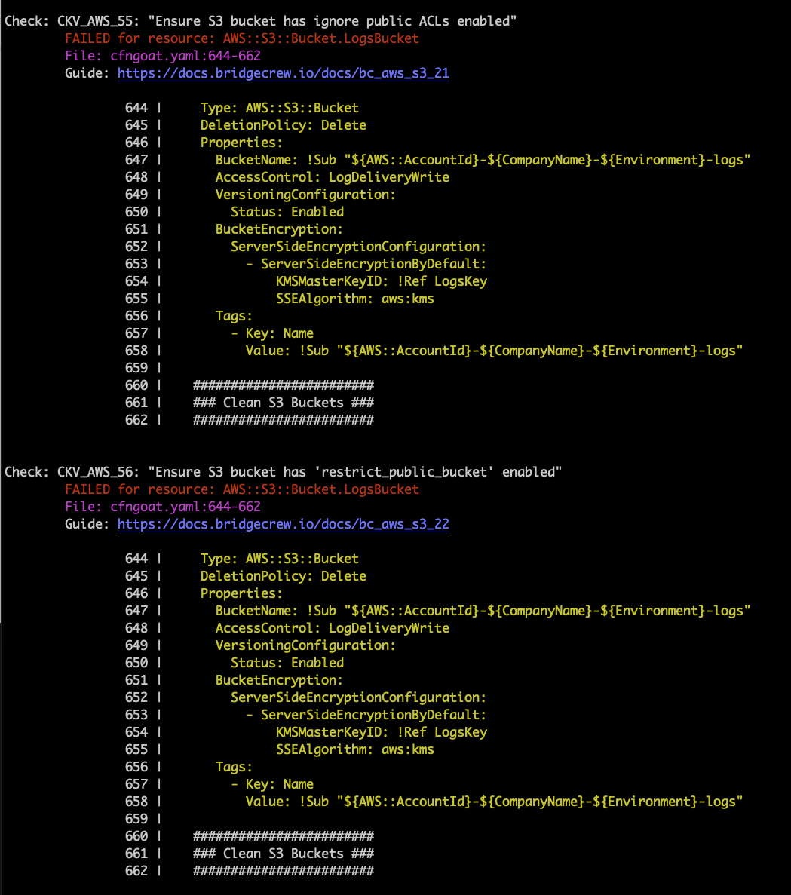

## Scan a repo locally with the bridgecrew CLI

We use the Bridgecrew API token to connect our local Bridgecrew CLI with the Bridgecrew cloud, the following command will scan the CFNGoat repository we cloned for infrastructure vulnerabilitues and display any issues and violations.

The API key also sends these results to the Bridgecrew cloud for so we can track, inspect in more detail and remediate them there, we'll cover this a little later.

`bridgecrew -f cfngoat.yaml --bc-api-key YOUR_API_KEY_HERE`

You can also scan entire directories with -d:

`bridgecrew -d cfn --framework cloudformation --bc-api-key YOUR_API_KEY_HERE` 

{}

Make sure you are in the `cfngoat` directory we checked out from git during the getting started section

{}

The results show all the failed checks, as well as link to a guide explaining the cause and how to fix them. Note the output also includes the filename and snippet of code that is misconfigured:

Bridgecrew comes pre-built with hundreds of AWS security and compliance policies. To get the list of security checks, use -l or --list:

`bridgecrew --list`

In many instances, when testing locally with the CLI, like now, you may only be interested in running a select few checks. In that case, you can add the -c or --check option:

`bridgecrew -f cfngoat.yaml -c CKV_AWS_1,CKV_AWS_2  --bc-api-key YOUR_API_KEY_HERE`

Or, if you want to run all but some checks, use the --skip-check option:
`bridgecrew -f cfngoat.yaml --skip-check CKV_AWS_1,CKV_AWS_2  --bc-api-key YOUR_API_KEY_HERE`

Next, we'll inspect these results in the Bridgecrew dashboard!

{}

You can use the bridgecrew CLI without --bc-api-key, the results will still display locally, without uploading to the bridgecrew cloud, for testing or local-only scans.

{}