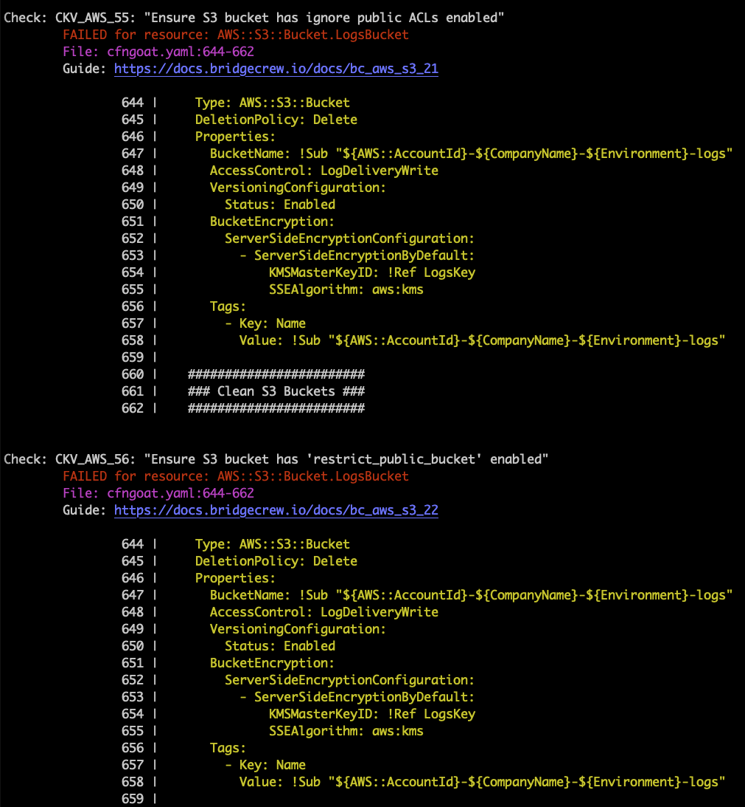

## Run Checkov CLI locally

To demonstrate what kinds of security and compliance errors Bridgecrew can identify in CloudFormation templates, we’ll start by using Checkov CLI and send the results to the Bridgecrew platform.

Make sure you are in the `cfngoat` directory from the previous step, copy your unique Bridgecrew API token, and scan the `cfngoat.yaml` file:


```bash
checkov -f cfngoat.yaml --bc-api-key $YOUR_BC_API_KEY --repo bridgecrewio/cfngoat
```

You can also scan entire directories with `-d <path>`:

```bash
checkov -d . --framework cloudformation --bc-api-key $YOUR_BC_API_KEY --repo bridgecrewio/cfngoat
```

{}
<p style='text-align: left;'>
You can use the checkov CLI without --bc-api-key, the results will still display locally, without uploading to the bridgecrew cloud, for testing or local-only scan results.
</p>
{}

The results will show all the failed checks and link to a guide explaining the cause and how to fix them. Note the output also includes the filename and snippet of code that is misconfigured:



As you can see in the highlighted CLI output above, our demo CloudFormation repository has failing checks for two policies:
- Ensure S3 bucket has ignore public ACLs enabled
- Ensure S3 bucket has ‘restrict_public_bucket’ enabled

To get the list of policies that Bridgecrew checks for, use -l or –list:

```bash
checkov --list
```

## Bridgecrew policies

In many instances, when testing locally with the Checkov CLI, you may only be interested in running just a few checks. In that case, you can add the `-c` or `--check` option:


```
checkov -f cfngoat.yaml -c CKV_AWS_55,CKV_AWS_56
```

Alternatively, if you want to run all but a few checks, use the `--skip-check` option: 


```
checkov -f cfngoat.yaml --skip-check CKV_AWS_55,CKV_AWS_56 
```

Next, let’s inspect these results in the Bridgecrew dashboard.

