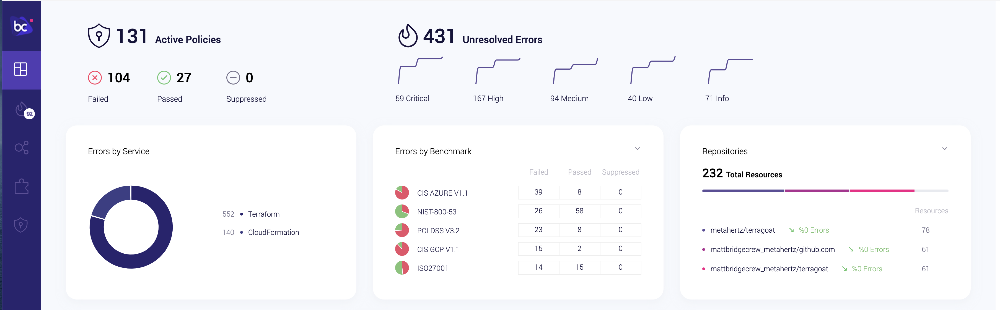
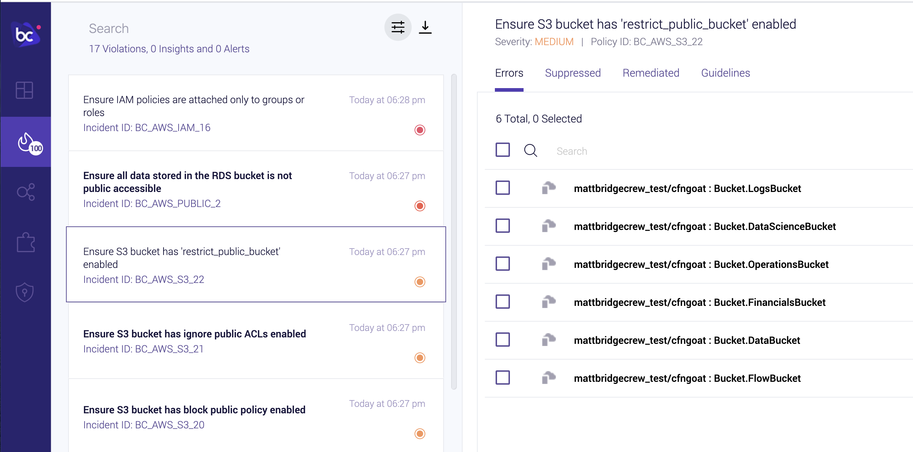
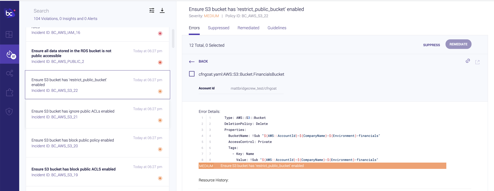

## Viewing our results in the Bridgecrew Dashboard

If we access the Bridgecrew dashboard at [https://bridgecrew.cloud](https://bridgecrew.cloud) we will see statistics for the configuration issues and policy violations found by the Bridgecrew CLI in our `cfngoat` repository, feel free to explore the dashboard, then click onto the "Incidents" tab on the left navigation bar to drill down and explore the reported issues we saw on the CLI output in more details.

Once in the Incidents view, you'll see each violation, clicking into one of the violations will group all resources found in our CloudFormation manifests which violates that policy.

From here, we can click on a specfic CloudFormation object to see the relevant peice of code, and any offered remediation suggestions, which we'll cover in more depth with an automated setup a little later!

Now we've seen some of our own data in the Bridgecrew dashboard some of the the insights provided, lets have a look how we make this real! ...**Automated scanning of any changes, without manually running a CLI tool**