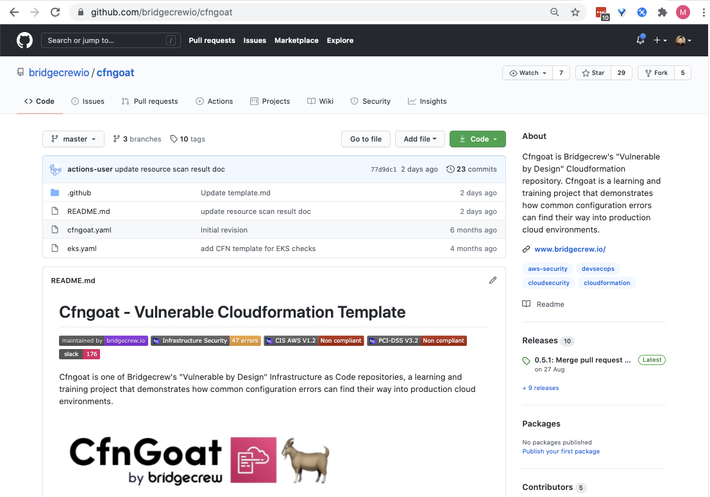
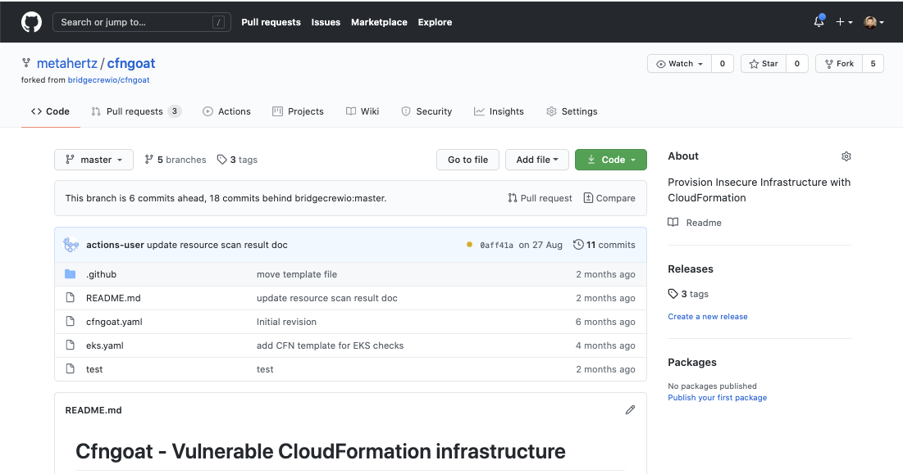

## Creating your own CfnGoat repository on GitHub

To set up our continuous workflow and demonstrate the value of getting automated infrastructure security scanning, we need a hosted source repository. You can either push your local demo repository to GitHub or, since CfnGoat is already hosted on GitHub, we recommend you fork the repository to your own GitHub account.

Head to your GitHub account, visit the CfnGoat repository at [https://github.com/bridgecrewio/cfngoat](https://github.com/bridgecrewio/cfngoat), and select Fork in the top right-hand corner:

If you have multiple organizations, GitHub will ask which of your orgs to fork into. Choose your personal account via your username in the list to fork the repo.

You’ll then be redirected to your newly forked repository—notice your username at the top of the page:

Now we’re ready to make changes and integrate our automated pipeline!
