## Setting up AWS CodeBuild for our CloudFormation repository.
AWS CodeBuild paired with AWS CodePipeline is a CI/CD platform that can build projects, run jobs, and deploy infrastructure. We’re going to use it to scan the CloudFormation templates before deployment, allowing us to fail the build job and halt a deployment if there are any security violations in our CloudFormation code.

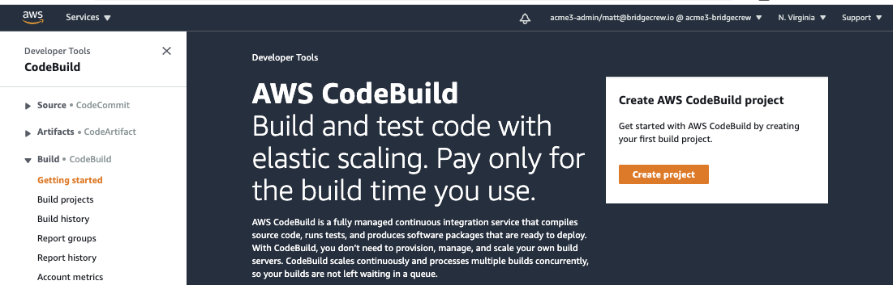

We’ll also automatically send the results to Brigecrew  to maintain a view across all of our infrastructure projects and share visibility throughout our organization.

First, tell the Bridgecrew dashboard you’re going to integrate AWS CodeBuild. To do this, open the integrations menu in your Bridgecrew account and select AWS CodeBuild, then **Add Subscription**.

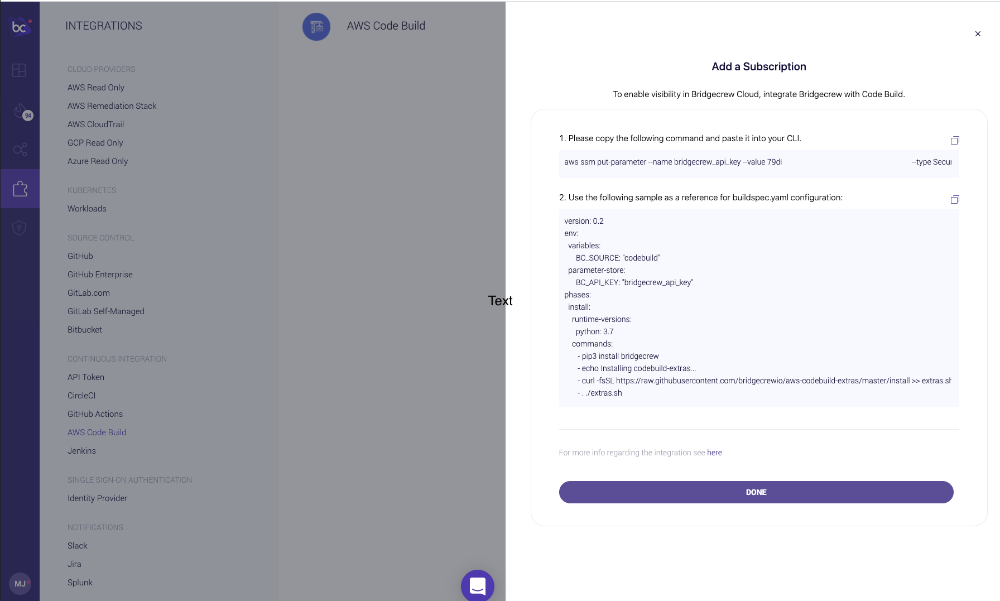

Run the command provided by Bridgecrew with your local aws CLI. This will save the Bridgecrew API key into your AWS System Manager’s parameter store so we can access it from our CodeBuild jobs later.

Next, copy the `buildspec.yaml` configuration to keep handy (or keep this Bridgecrew tab open).

{}

If the aws command fails, your IAM user may not have the correct permissions to create parameters in AWS Systems Manager (SSM). In that case, you’ll need to add write permissions to the user.

{}

### New Codebuild Project

Now go to your [AWS CodeBuild service](https://aws.amazon.com/codebuild/) select Create a Build Project and name your project `bridgecrew-tutorial`. 

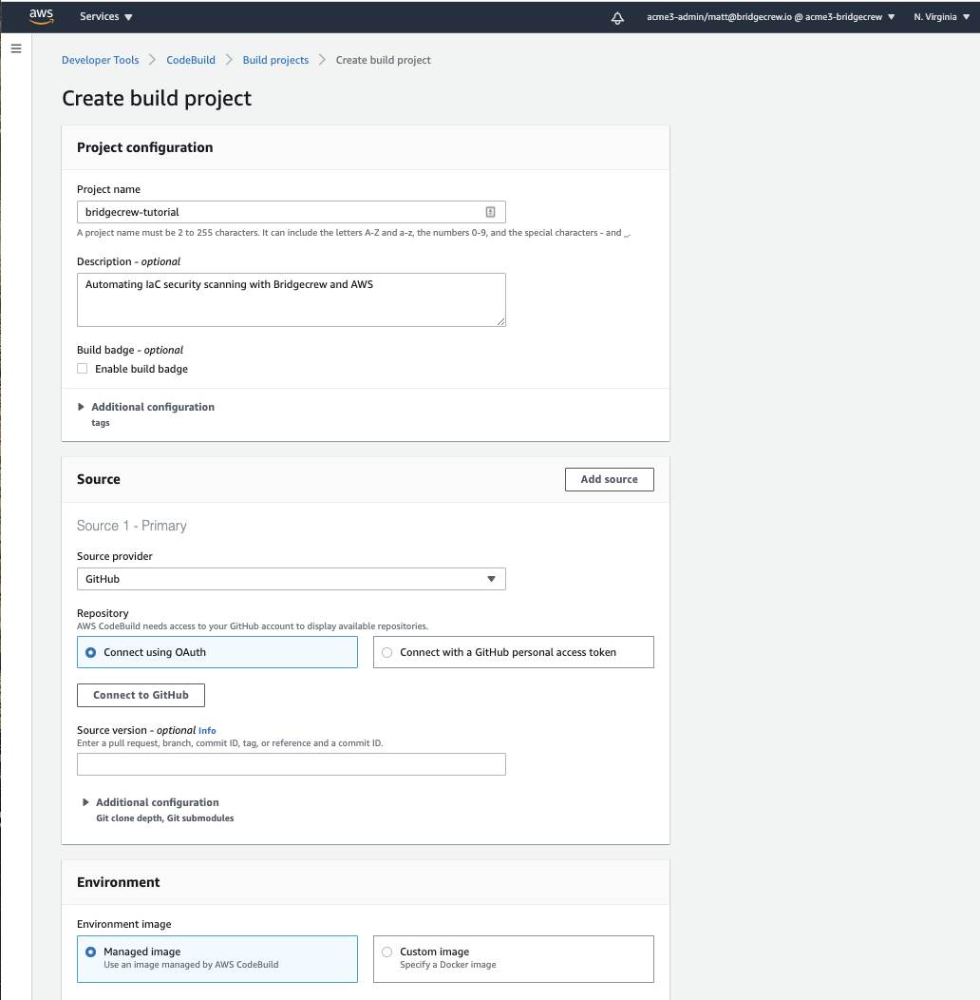

Under the Source section, choose **GitHub** in the **Source Provider** dropdown and select **Connect using OAuth**. When you select Connect to GitHub, you’ll be prompted to authorize your GitHub account:

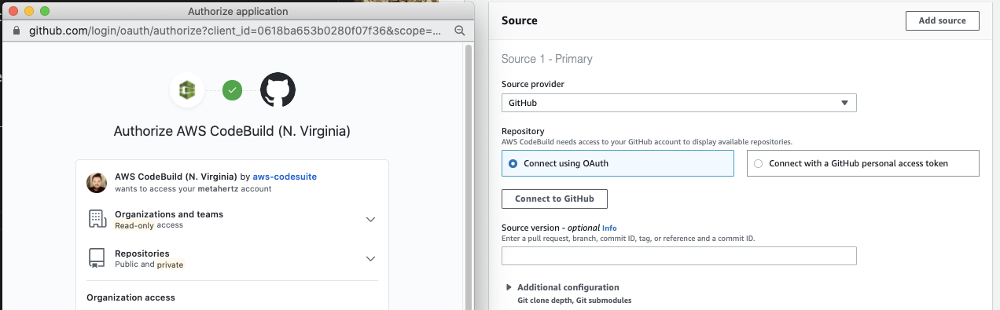

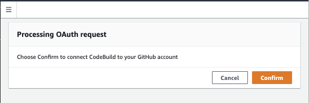

Now the **Source** section will have changed, allowing us to search for and select our `CfnGoat` repository from GitHub:

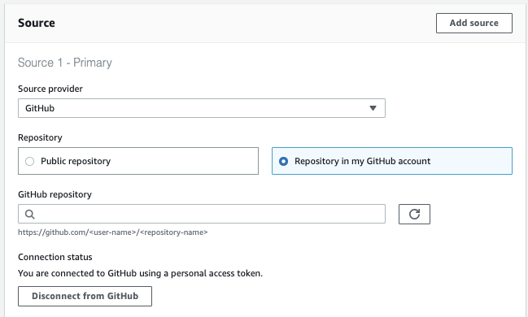

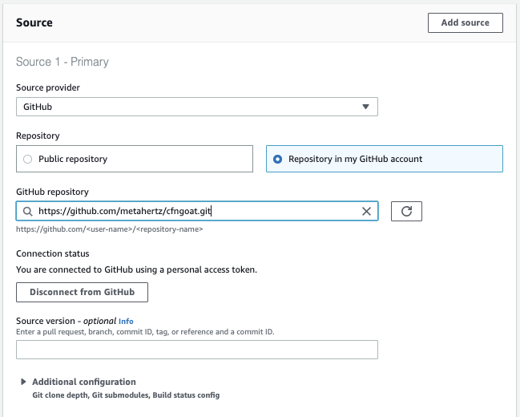

Configure your Environment setup to mirror the image below:

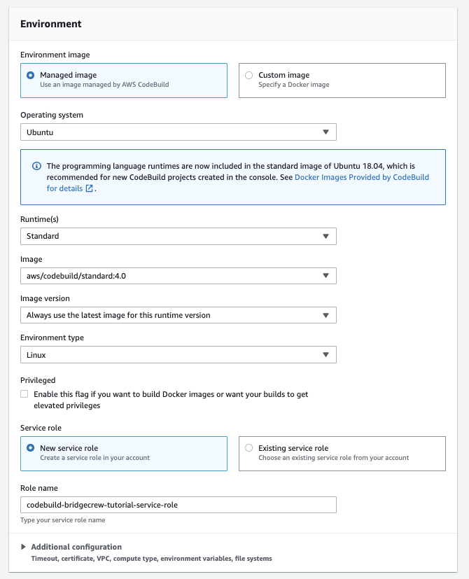

### Adding our Buildspec 

To complete our build setup, we need to add the build commands. Select **Insert build commands**, and use the editor to overwrite the contents with the YAML code you copied from Bridgecrew earlier. 

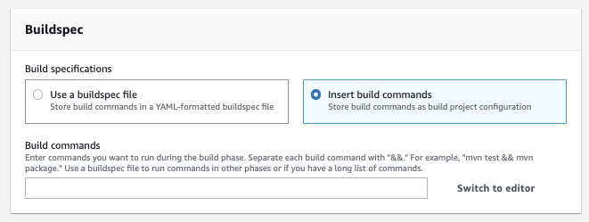

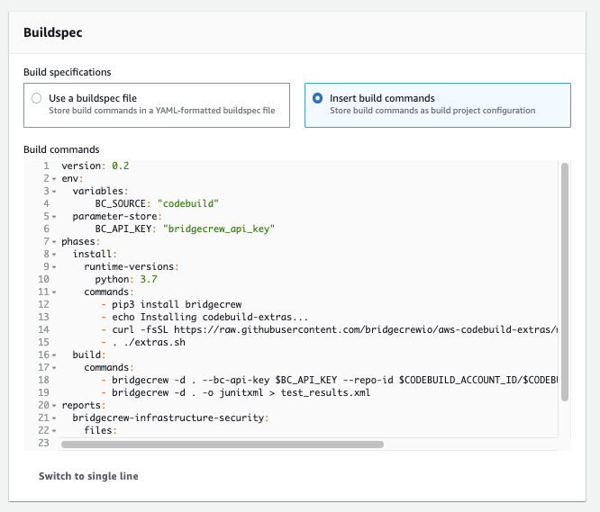

Select **Create build project** to finalize our CodeBuild project setup!

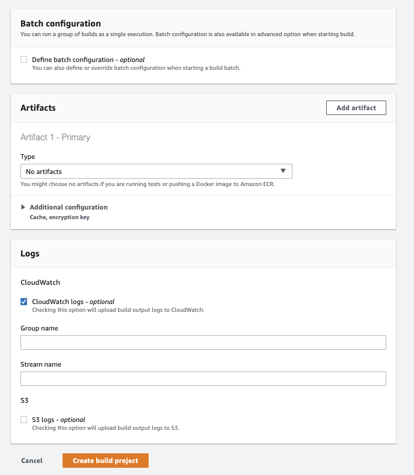

