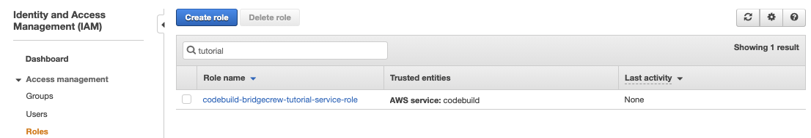
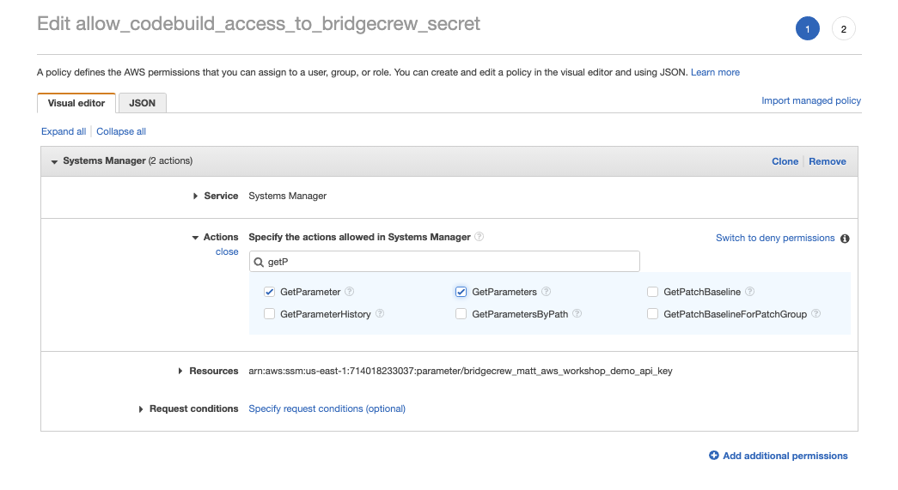
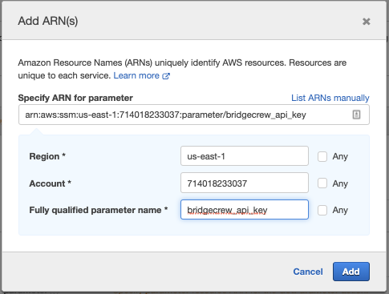
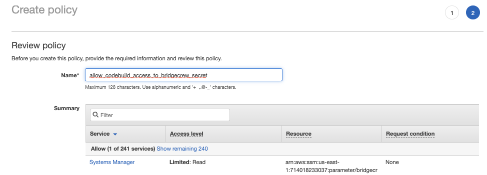

## Edit AWS IAM permissions to enable CodeBuild
CodeBuild creates an IAM role for running builds, however, we need CodeBuild to access our Bridgecrew API secret we stored in system manager, so we'll need to add some more permissions to the IAM role.

In the [AWS IAM Dashboard](https://console.aws.amazon.com/iam/home), find the role, it will be called `codebuild-bridgecrew-tutorial-service-role` unless you renamed the CodeBuild project we've just set up.

Select the role, then click select  **Add Inline Policy** from the right hand side (it's a text link, not a button, so not the easiest thing to spot!). 

This will bring up the Create Policy Visual Editor, for **Service**, select **Systems Manager** in the search box.

Then chose the **GetParameters** and **GetParameter** Actions.

Scroll down, and under **Resources**, choose **Specific**. Select **Add ARN**. Fill in the region you've created your CodeBuild project, and leave the account number as the default. and account number. Type `bridgecrew_api_key` as the parameter name, to match the name we gave the key in the `aws` cli command we used earlier.

Select **Add**, then **Review Policy** and click **Create policy**

We're now ready to tie this all together with AWS CodePipeline!