## Setting up AWS CodePipeline to automatically trigger scans
To trigger CodeBuild to run the scan automatically on each new commit in your CfnGoat GitHub repository, we’ll need to configure AWS CodePipeline. You can skip this step, but if you do, you’ll only be able to run manual scans from the CodeBuild UI, AWS CLI, or APIs, which doesn’t provide the DevSecOps automation we’re looking for!

To set it up, go to [AWS CodePipeline](https://console.aws.amazon.com/codesuite/codepipeline/) and select **Create Pipeline**:

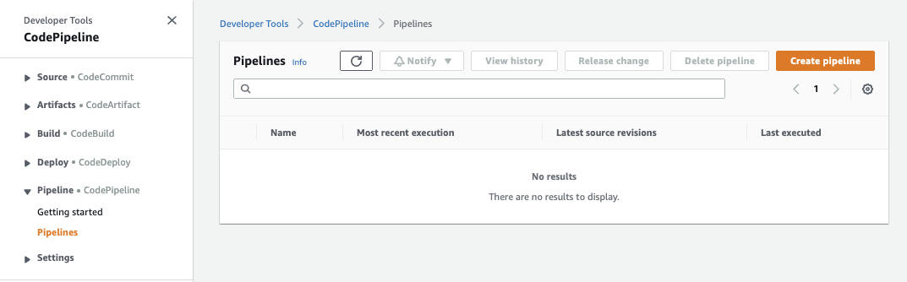

After giving the pipeline a name, select **Next** and choose **Github (Version 2)** as the **source provider**.

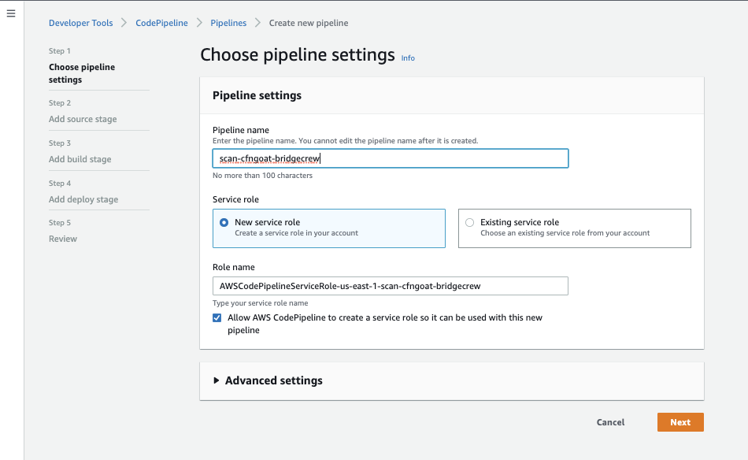

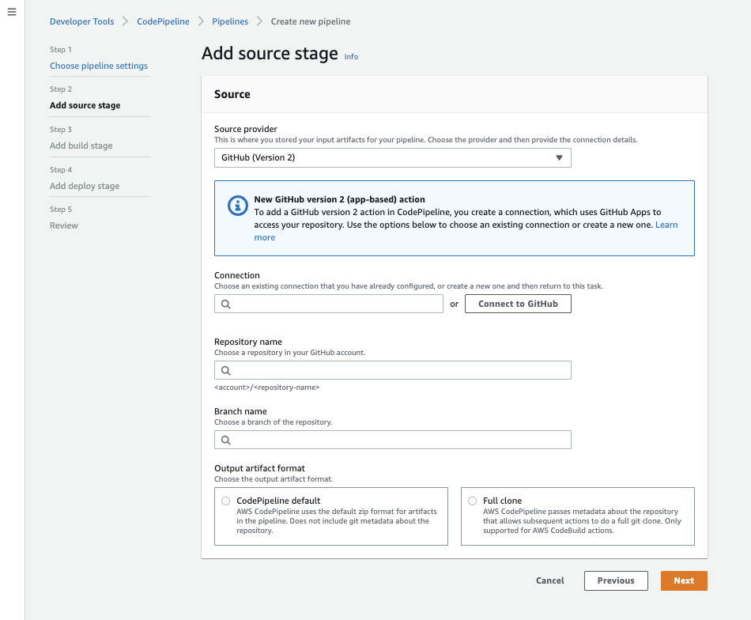

As CodeBuild and CodePipeline are different tools, you'll also need to authorize CodePipeline to your GitHub account, select **Connect to Github** and follow the authorization redirects in the popup window.

Give the Github Connection a name:

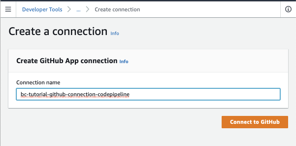

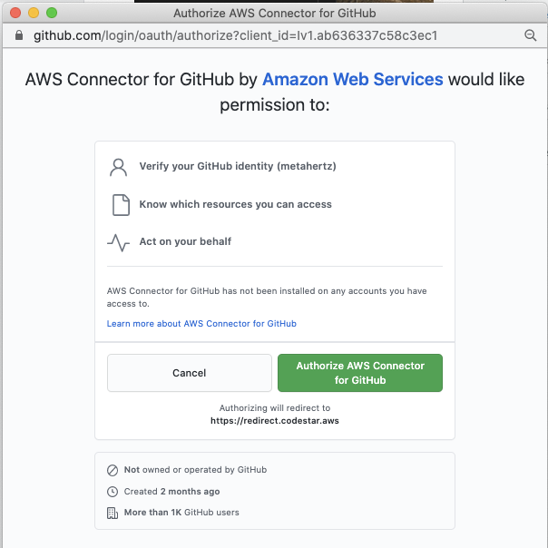

Select which Github Repositories you want CodePipeline to receive events for, in this case, i've just selected the `CfnGoat` repository.

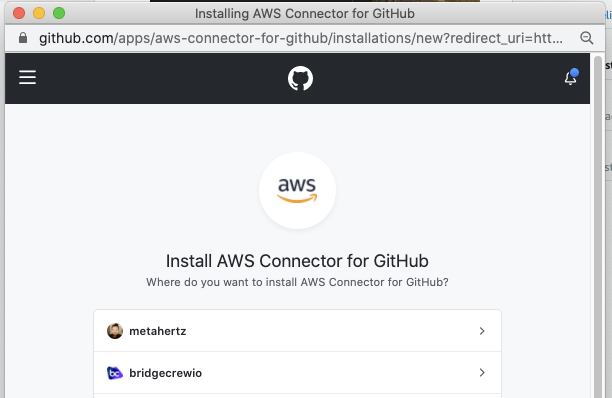
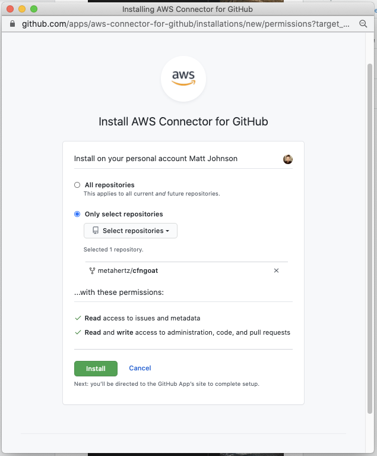

Once you’ve authorized GitHub, select **Install a new app** to finalize the GitHub integration and select **Connect**:

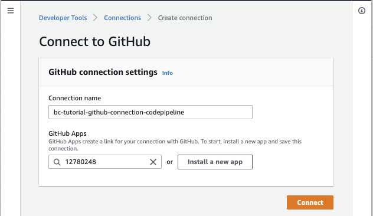

The CodePipeline screen should refresh with a green **Sucessfully connected to GitHub** message:

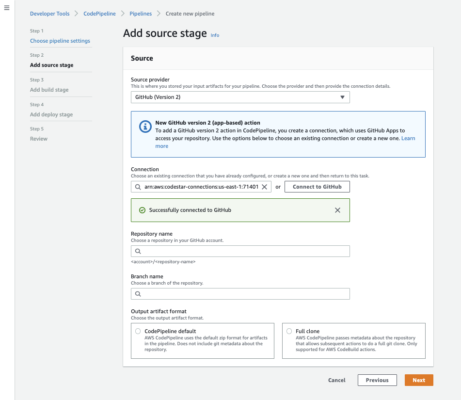

Now that CodePipeline has access to our GitHub repository, we can select it as the pipeline source. Select the **master** (or **main** branch) to have our pipeline run when commits to this branch occur:

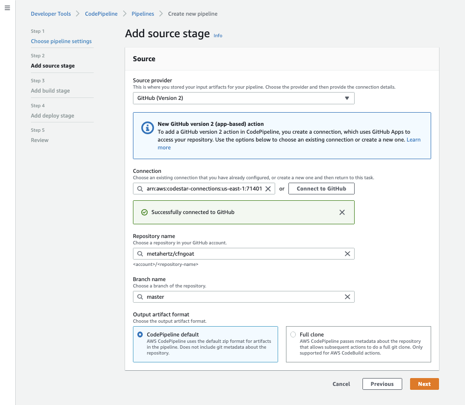

## Instruct CodePipeline to trigger our CodeBuild

When CodePipeline sees a new commit in our GitHub repository, it will trigger a build action. To set this to be our CodeBuild commands, select the same region as the CodeBuild project, then select the CodeBuild project, **bridgecrew-tutorial**.

Leave the default of **Single Build** selected and select **Next**

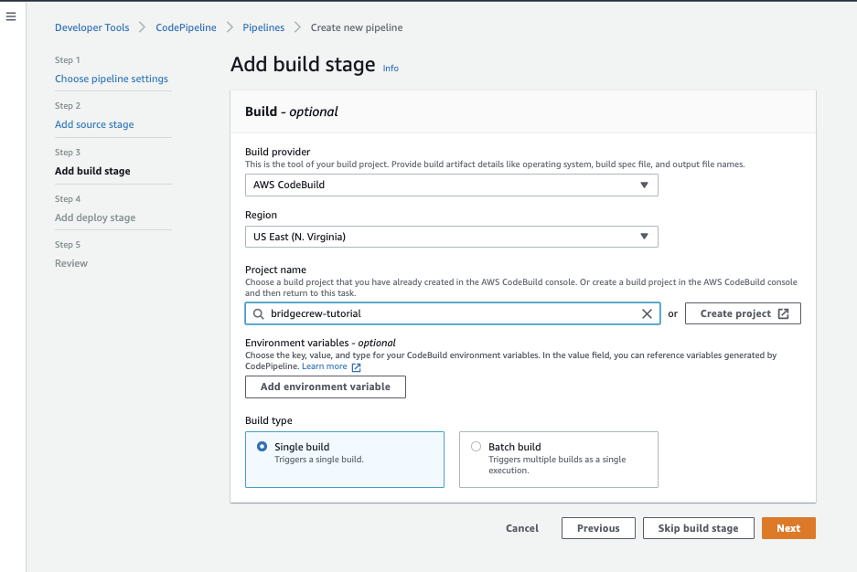

On the next screen, select **Skip deploy stage**. We don’t want to deploy our CfnGoat CloudFormation to AWS as we’re just highlighting how to stop a build from progressing if there are security violations!

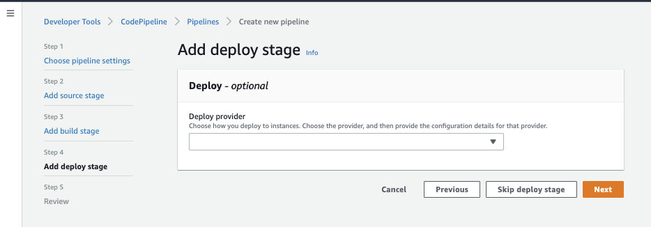

Finally, select **Create pipeline** on the review page, which will trigger your new CodePipeline to immediately run against the latest commit in our CfnGoat repository:

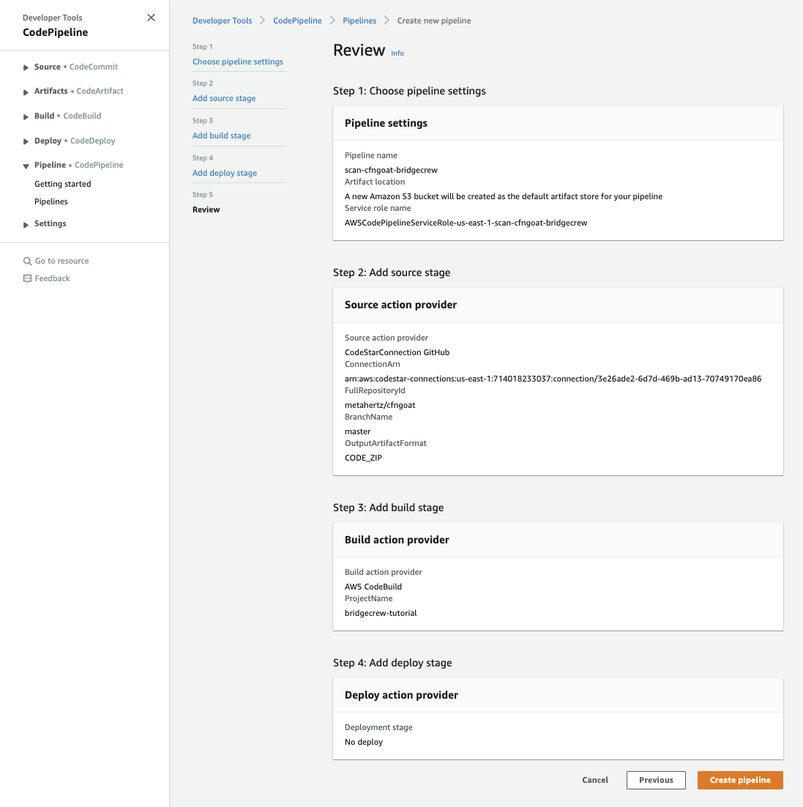

**Now we don’t need to manually run the Bridgecrew CLI; your developers will get a Bridgecrew scan every time they commit!** 
