## Automate Fixes Through Pull Requests

By adding another Intgration into Bridgecrew, we can generate automated Pull Requests (PR's) into your Github repository, to update your CloudFormation manifests and fix security issues!

To do this, we'll use the "Github" Source Control integration within the [Bridgecrew Dashboard](https://www.bridgecrew.cloud/integrations/Github/?utm_source=aws_workshop), allowing Bridgecrew to raise pull requests (and also, scan incoming pull requests automatically for issues!) 

Just like the previous AWS Github authorization, you can choose which repositories to give Bridgecrew permission to access. In this case, a minimum of your CFNGoat fork is required if you're following along with the workshop!

Once authorized, we will Bridgecrew will scan your Infrastructure as Code manifests in the repositories for CloudFormation, AWS CDK, Terraform, Serverless Framework, ARM, and Kubernetes manifests, adding issues found to the *Incidents* page and Dashboards 

You may need to check your filters on the incidents page to see all relevant scanning sources. In the following filter, i've selected the information source coming from our `bridgecrew-tutorial` CodePipeline, and also the newly added `metahertz/cfngoat` source from the Github integration.

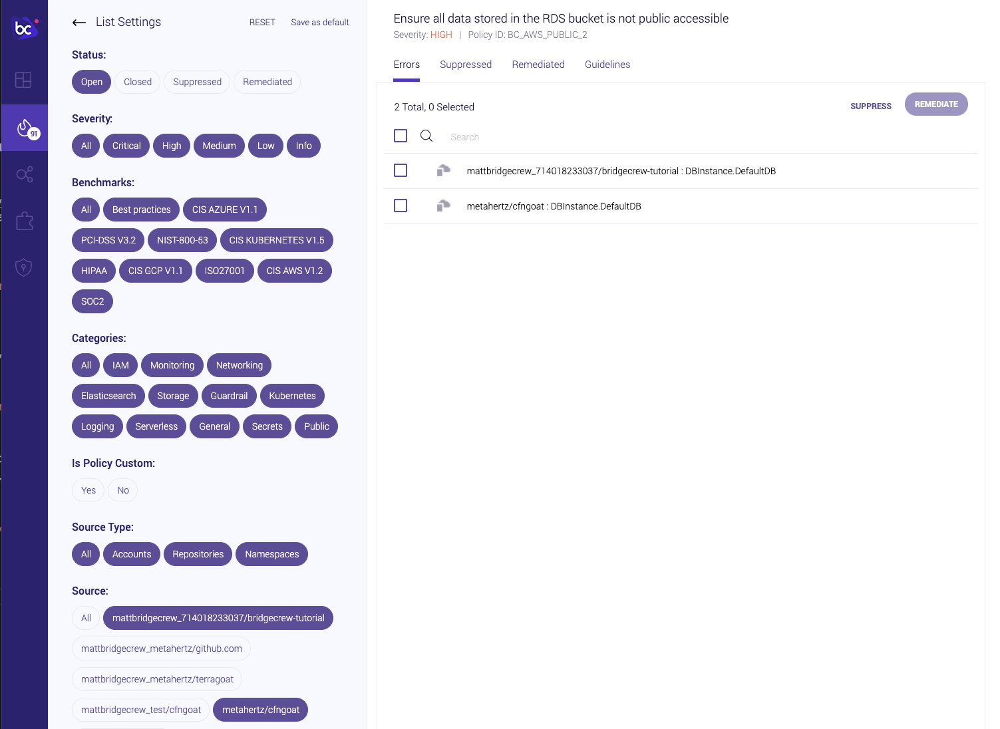

You will now see the same violation alerting from two sources, the source Github repository itself, and the latest CodePipeline run, from [Module Two of this workshop](../20_module_two.html)!

Find the *Ensure S3 bucket has 'restrict_public_bucket' enabled* violation in your dashboard, as in the example below: 

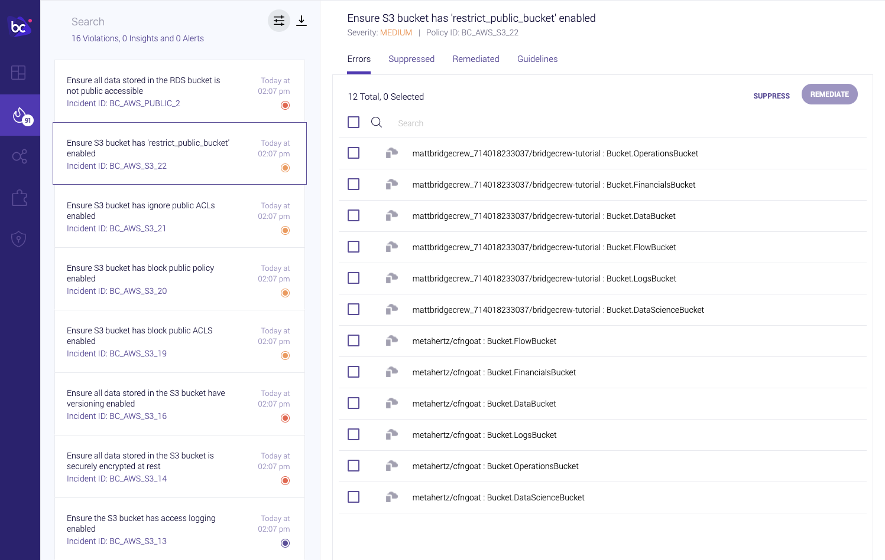

When we click on one of the Github-integrated violations, we'll see the platform recommending an automated fix in the form of a visual *diff*, lets fix the Financials bucket, click on `<yourgithubusername>/cfngoat: Bucket.FinancialsBucket` as shown below:

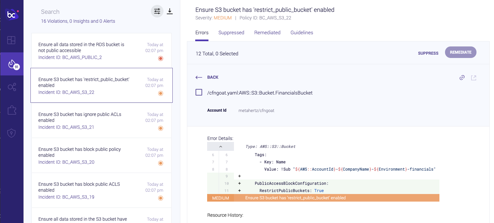

If you are happy with the proposed fix (See our guidelines tab for more developer-friendly context if needbe) you can **tick the resource name above the diff**, and click **Remediate**.

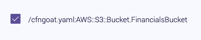

The remediation popout shows there will be a Pull Request raised against your Github repository, hit *REMEDIATE*.

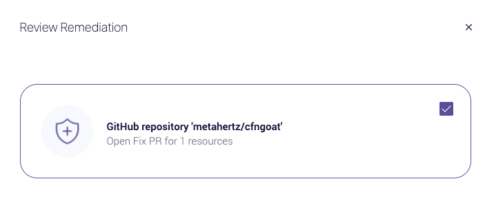

After a couple of seconds, you'll be taken back to the Incidents screen, with a message confirming the Pull Request has been sucessfully raised, you'll also see the remediation has had the effect of hiding the issue from the Incidents list (*other buckets are listed, but Financials is gone*).

**However, notice the issue is still present from our CodePipeline source, so we're not secure yet!**

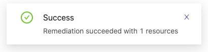

Over at our CFNGoat repository in Github, we will see a new PR under "Pull Requests", which the development team can review:

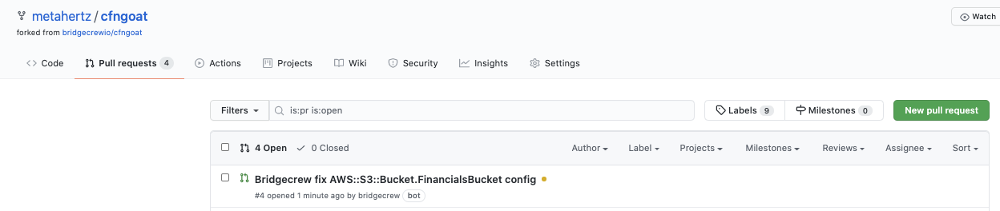

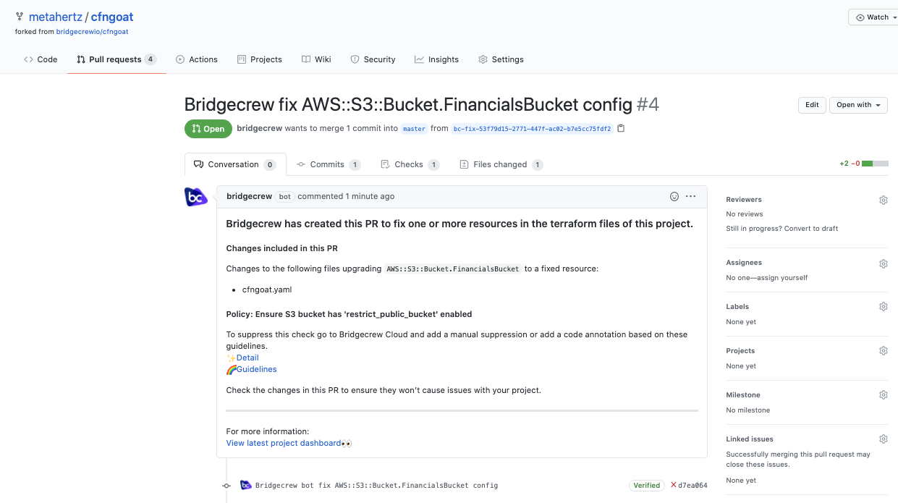

And Merge!

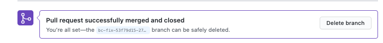

### Bringing it all together.
Why have two reports of the same issue? One from Git and one from our CodePipeline run?

**It's important to track security posture at multiple steps in the DevOps lifecycle, and Bridgecrew lets us do just that!**, 

Merging our Pull Request in Github triggers our CI/CD deployment in AWS CodePipeline from Module Two.... 

You may be able to tell where this is going!

Notice our merged pull request commit has triggered the Pipeline: 

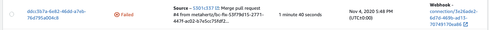
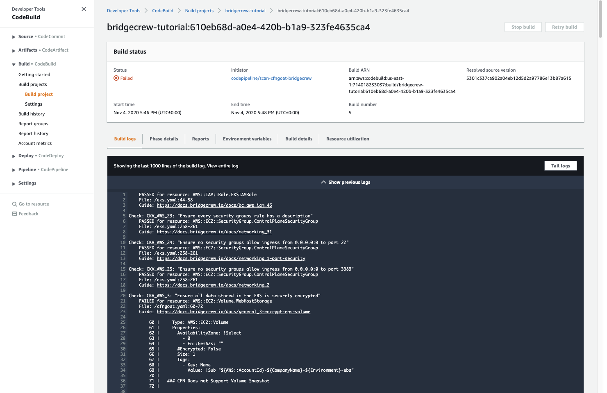

The scan will still fail, as there are more than one security issues affecting the CFNGoat repository, However! Lets go and look at our Bridgecrew dashboard again!....

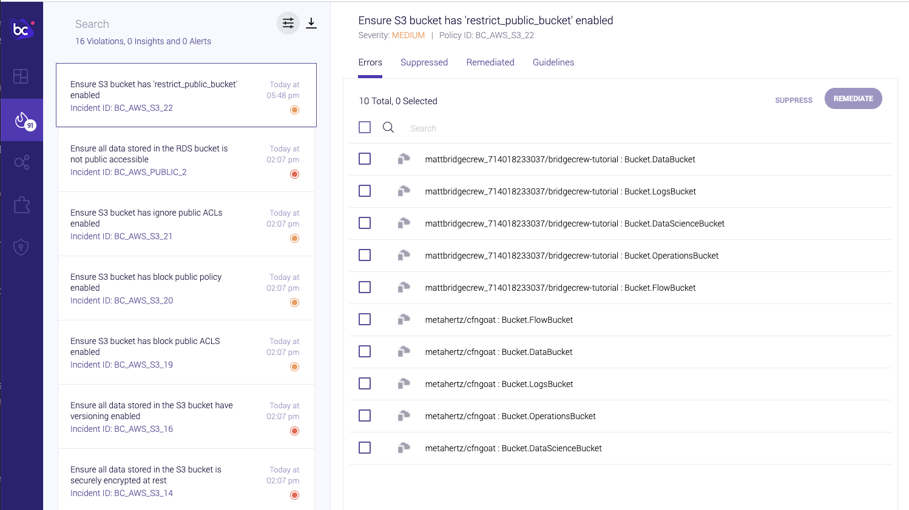

The AWS Codepipeline integration has also seen the change and removed the alert for our `FinancialsBucket`, 
**Now we know that the issue is not only fixed at source, but that the fix has also made it through the CI/CD pipeline into production!**

## Congratulations!
You've built an automated Infrastructure as Code scanning solution, in a live environment, and automated the fixing of an exposed S3 bucket! Maybe it's time for a victory coffee?