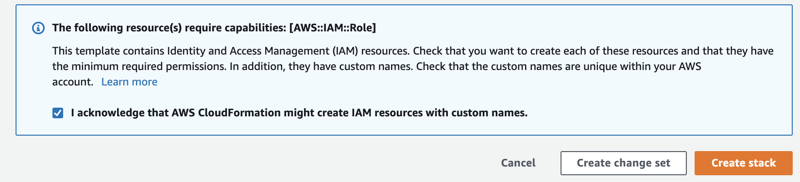

## Runtime Scanning of Vulnerable Infrastructure

Last but definitley by no means least, lets answer the remaining question:

 - What about infrastructure that wasnt deployed by CloudFormation?

Greenfield Infrastructure as Code deployments are a luxury not many of us have, with many objects in our AWS accounts often historical, created manually, or managed by a team that has not yet made the DevOps move to automation.

Scanning objects directly in the AWS environment we call *"Runtime Scanning"*, compared to *"Build time"* scanning of CloudFormation or Terraform manifests in git or as part of the CI/CD pipeline as we've already seen.

Bridgecrew allows Runtime scanning via an AWS integration, allowing full coverage of Infrastrucure security, both before and after deployment.

### AWS Runtime Integration

To enable runtime scanning of your AWS account, goto the [Bridgecrew Dashboard](https://www.bridgecrew.cloud/integrations?utm_source=aws_workshop) and chose the Integrations menu.

Then, Select **AWS Read Only** under the **Cloud Providers** section. 

{}

Read only access is scoped as minimally as possible in order to give the Bridgecrew platform necessary access to scan your AWS accounts. We constantly revise the necessary IAM permissions, and review against our own IAM rightsizing features which we'll cover in just a moment!

{}

Click **Add Account** then **Launch Stack** to enable the integration: 

You will be taken to your AWS account to authorize the integration:

**Check the checkbox** to approve the IAM permission creations via our CloudFormation stack, and click **Create Stack**

You can track the progress of the stack creation within your AWS account, once completed, you'll see the integration turn green in the Bridgecrew dashboard!

Creation Complete:

Sucessful Integration: 

Thats it for connecting your AWS account to Bridgecrew, super simple!

### Exploring Runtime Violations
With the runtime AWS account added, lets quickly edit our filters in the Violations page to show only the new account.

In the filters option payne, select your **AWS Account Number** from the available sources, you'll also see our CodePipeline and Github repositories from the earlier modules.

Make Sure **All* alert types are selected at the top of the filter payne.

{}

Unlike the rest of this workshop, the information displayed in your Bridgecrew Dashboard will be different than some of the output we display below, as we will all have different things configured within our AWS accounts (where as for modules one and two, everything was based off a common set of security issues within the CFNGoat project!)

{}

After setting our filter, we can browse through violations detected in our live AWS account, in the example below, we can see our S3 bucket is not encrypted at rest, **clicking on a resource** from the right hand side list of resource for this violation will produce much more information, including a Terraform representation of the AWS object in question:

Further context on the issue and remediation options is available in the **Guidelines** tab for a given issue.

### Feature Highlight - IAM Insights
One of the features we are really proud of within Runtime Scanning is called *IAM Insights*, it can recommend remediations of old, unused and badly sized (granting too many permissions) IAM users, roles and policies.

You can use the **filter payne** to only show **Insights**, highlighting IAM specific issues:

IAM Insights will even provide a re-written, rightsized IAM policy document with only the permissions your applications are requesting of the role or policy, this reduces scope for abuse from a missconfigured or exploited application!

### Automating fixes at Runtime.

Just as we did with our Pull Request fixes in Module Two, Bridgecrew allows immediate remediation of runtime resources by reconfiguring your objects via the AWS API's.

However, this requires extra permissions than we grant with the default *AWS Read Only* integration, trying to remediate using this integration will highlight the permissions issue and prompt you to configure remediation permissions if preferred!

We can see this below, remediating an unused IAM role, flagged from the *IAM insights* violations

We also alert on account-wide settings, such as user password policies, and informational best practices, such as tagging each resource with ownership or purpose information:

##### Untagged Items in Account

##### Weak Account Password Policy

## Congratulations!
You've integrated runtime security alerting and remediation into your **DevSecOps** automation! 

Feel free to explore more of the Bridgecrew Dashboard, and try inviting more of your team to view and collaborate on the same security dashboard from the [**User Management** page](https://www.bridgecrew.cloud/settings/userManagement?utm_source=awsworkshop)

That brings us to the end of the Bridgecrew workshop!
We hope you've enjoyed automating your way to better Infrastructure Security with us! We'd love to hear your feedback and would be happy to answer any further questions you may have!

You can find us [@bridgecrewio](https://twitter.com/bridgecrewio) on twitter, or say *hi!* in our [#CodifiedSecurity slack channel here!](https://slack.bridgecrew.io/?utm_source=awsworkshop)

