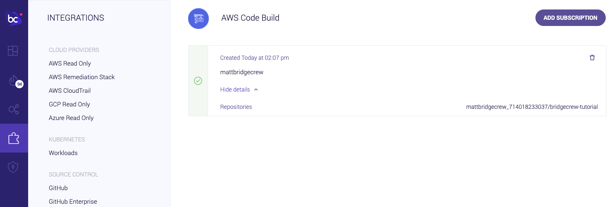
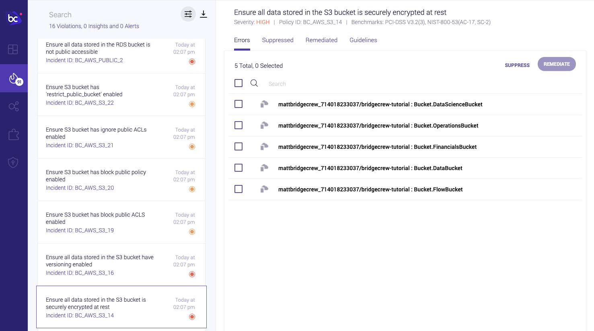
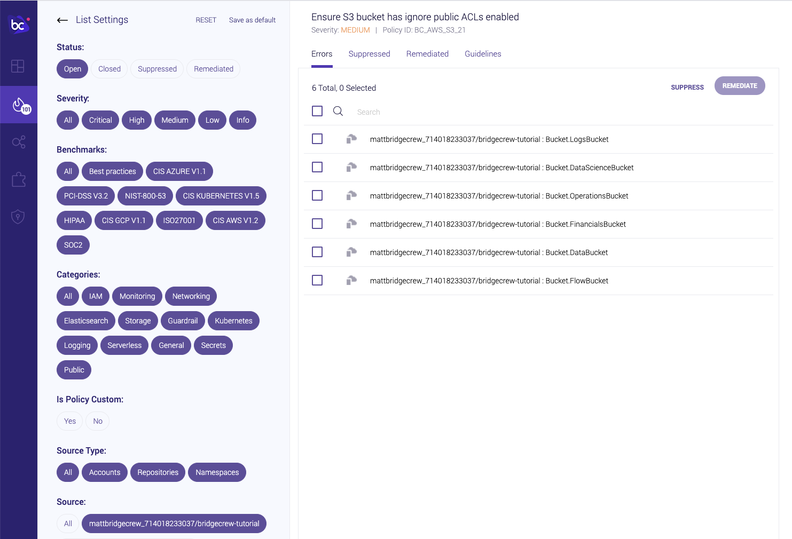
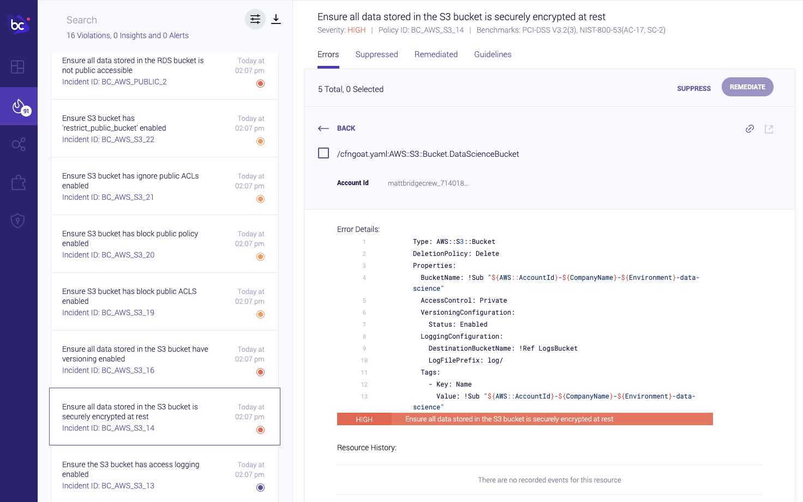
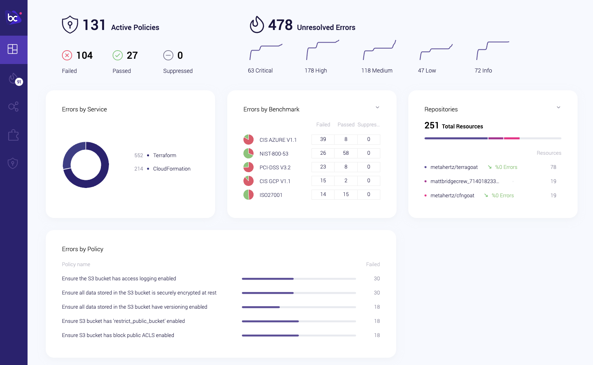

## Investigating security violations in Bridgecrew

While the output from your CodeBuild run is very useful for quickly getting a sense of why your build failed, you may also want to visualize issues over time with a given repository or group objects affected by the same issue for clearer understanding.

If your developers don’t have direct access to the AWS account, the provided logs may be constrained.

For all those reasons and more, Bridgecrew provides reporting, monitoring, alerting, and visualizations for individual runs and across your entire infrastructure.

Heading back to Bridgecrew, you’ll notice, our AWS CodeBuild integration has gone green showing that we’ve received data. You can also see the AWS account ID and the name of our CodeBuild pipeline received from our CodeBuild job!

Navigating to the **Incidents** tab, you’ll see a list of all of the issues previously reported in the CodeBuild logs. If you select an item on the left-hand side, you’ll see all of the CloudFormation resources impacted by that issue. 

You can also filter issues by severity, benchmarks, categories, and by source: 

Selecting a specific resource, you will see metadata such as commit details and a historical timeline, which includes all actions and changes made to the resource. Bridgecrew also shows the code configuration and lines that need to be addressed:

Refresh the dashboard to see updated historical trends and collated information from all of your monitoring sources:

Bridgecrew goes a step further, making it easy for teams to investigate issues and get visibility into their cloud security posture. Hit next to learn how to address issues fast with automated security-as-code fixes!