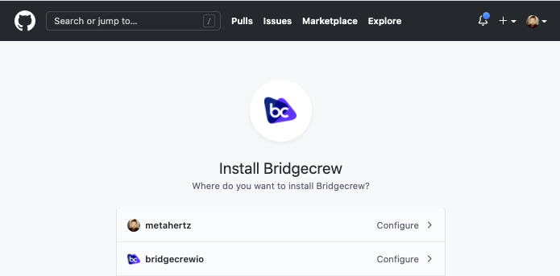

## Integrating Bridgecrew with GitHub
By adding another Bridgecrew integration, you can generate and push automated pull requests (PRs) back into your GitHub repository to update your CloudFormation code and fix security issues.

Head back to the [Bridgecrew **Integrations**](https://www.bridgecrew.cloud/integrations/Github/?utm_source=aws_workshop)Bridgecrew **Integrations** tab and select the GitHub under the **Source Control** section. 

Just like we did for the AWS CodePipeline GitHub authorization, choose which accounts and repositories to grant Bridgecrew access to. 

Once you’ve connected Bridgecrew to your CfnGoat demo repository, Bridgecrew will scan your CloudFormation code directly from GitHub again and bring the results into Bridgecrew.

To see all issues across your two scanning sources—your bridgecrew-tutorial CodePipeline and your newly integrated GitHub repository—you may need to check your filters on the **Incidents** page. 

You will now see the same violation alerting from two sources.  Although this may seem redundant, it’s actually an important feature for tracking security posture at multiple steps in the DevOps lifecycle.