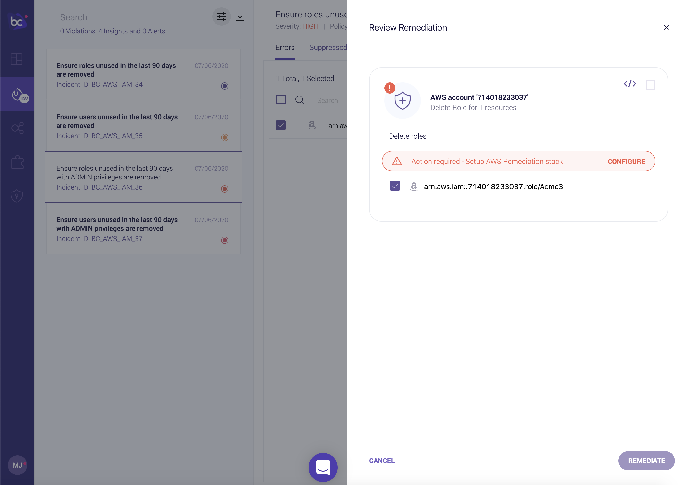
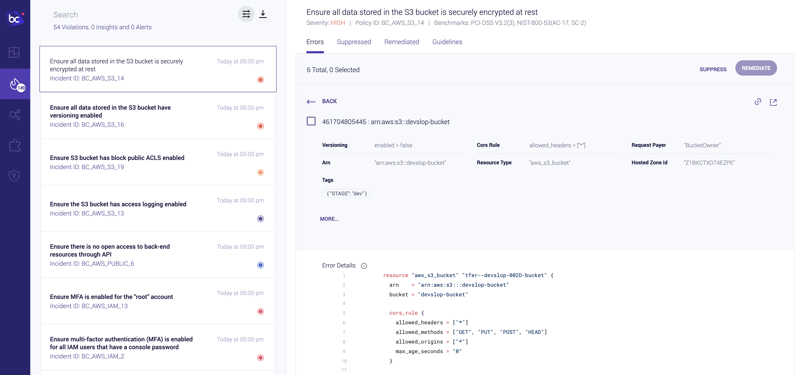
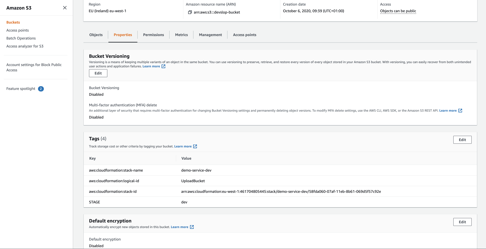
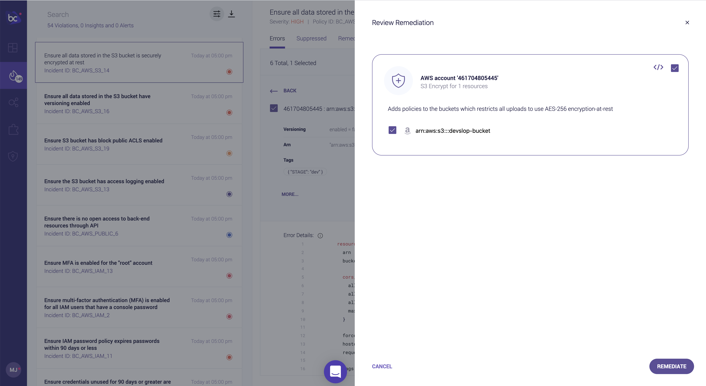

## Automating fixes in runtime

Similar to what we did with pull request fixes in the previous module, Bridgecrew allows for immediate remediation of issues in runtime by reconfiguring your objects via the AWS APIs.

Implementing automated remediations does require extra permissions than previously granted with the default AWS Read Only integration. When you attempt a runtime remediation without the correct permissions, you’ll be prompted to configure the AWS Remediation Stack: 

Adding the AWS Remediation stack follows the same workflow as the previous read-only AWS integration:

Select **Create Stack** and return to Bridgecrew, you will now be able to Remediate runtime resources:

## Fixing an unencrypted S3 bucket

Continuing with the example of the unencrypted S3 bucket from the previous page, the **Remediate** button will now allow runtime changes to the S3 configuration:

For the sake of this workshop, we can use the AWS Console to confirm the selected bucket is currently unencrypted:

Back in Bridgecrew, review the remediation, and select **Remediate** a final time.

Bridgecrew will now use AWS API's to ensure encryption is turned on for the selected resource:

Checking the resource once more in the AWS Console, you will see that encryption is now enabled:

The violation will also have been marked resolved in the Bridgecrew **Incidents** page.

## Congratulations! 
You've integrated runtime security alerting and remediation into your **DevSecOps** automation! 