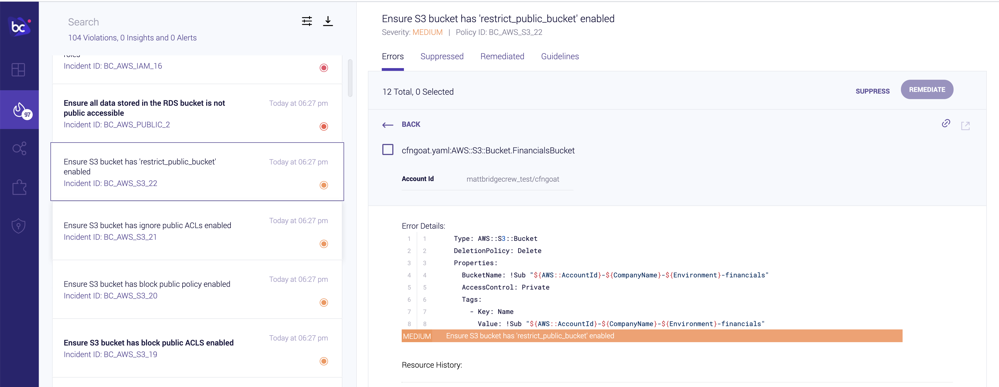

## Viewing results in Bridgecrew

In the previous section, we scanned our demo CloudFormation repository locally with both standalone CLI and the Checkov VSCode plugin, and sent the results to the [Bridgecrew platform](https://bridgecrew.cloud) for investigation and remediation. 

To explore the reported issues we saw in the CLI output, click on the link at the end of the output or head to the [Projects tab](https://www.bridgecrew.cloud/projects) in your Bridgecrew account.

Bridgecrew comes with hundreds of out-of-the-box policies to help you adhere to cloud security best practices as defined by the Center of Internet Security (CIS). Bridgecrew policies also correspond to popular compliance frameworks such as PCI-DSS V3.2, NIST-800-53, SOC2, and more. 

The Projects page comes chock full of features like filters, git blame integrations, dependency mapping, and an audit history.

For example...

From here, we can drill down into a specific violations, or click on the lightbulb icon to see additional details about the policy. We’ll cover how to implement remediations in more depth a little later!

Now that we have a feel for the kinds of IaC security issues Bridgecrew is equipped to find, let's add some DevSecOps magic.
