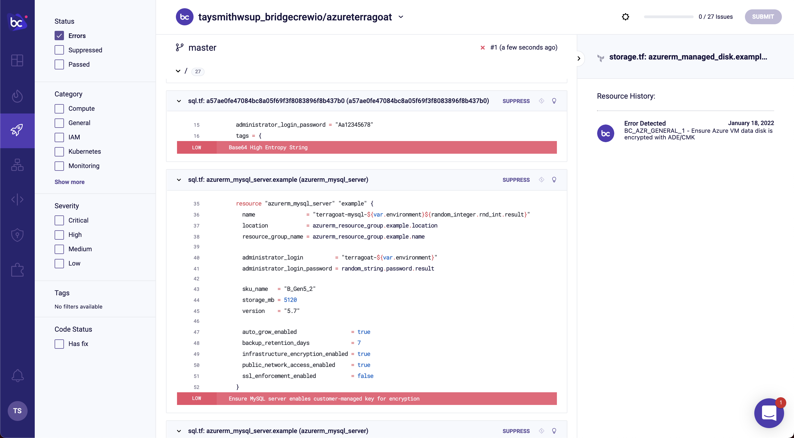

## Viewing results in Bridgecrew

You just scanned your Terraform templates locally using Checkov. If you included your API key, the results were sent to the [Bridgecrew platform](https://bridgecrew.cloud) for further investigation. You may have noticed the URL at the end of the CLI scan. That’s a direct link to the results in Bridgecrew.

Click on that link to bring up that scan’s [Projects page](https://www.bridgecrew.cloud/projects), which is an aggregated view of the different Code Reviews across all scan types. This is a list of all of the misconfigurations identified from that CLI scan with filters, severity ratings, and more. We'll discuss this page in more detail later.

