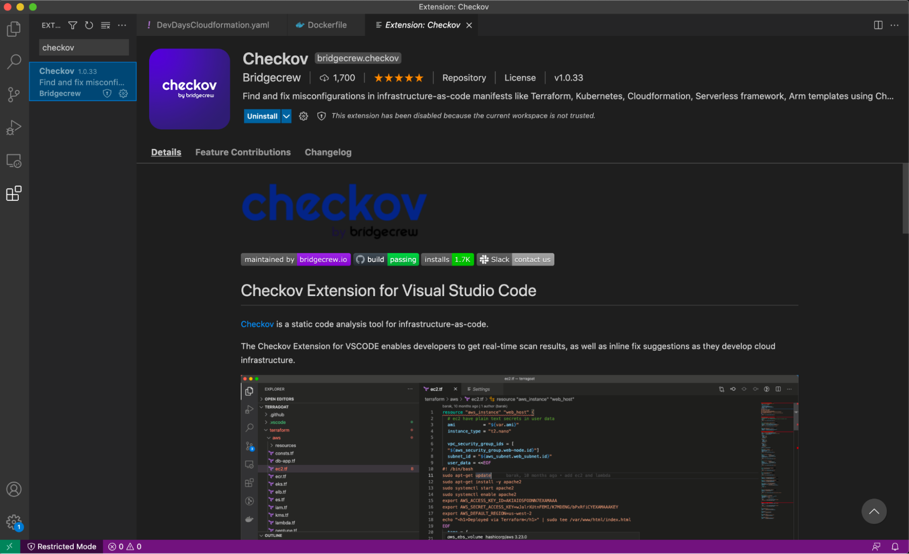
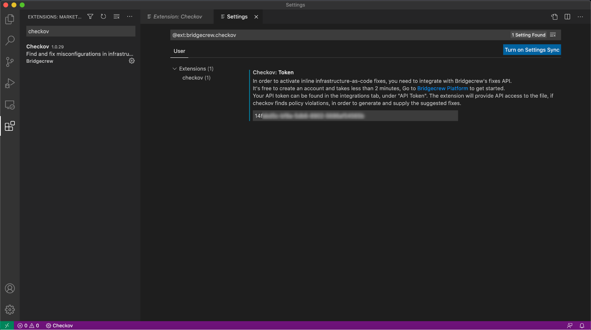
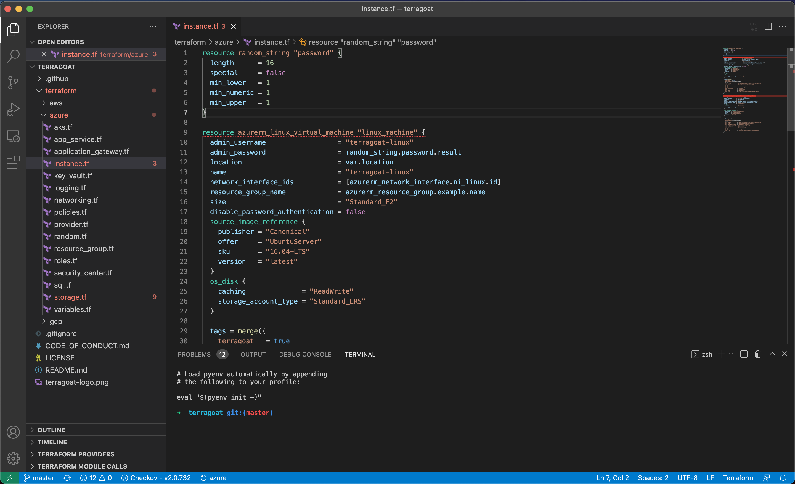
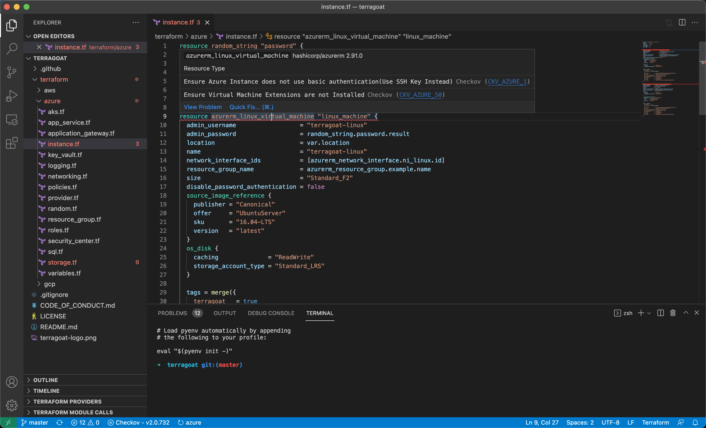
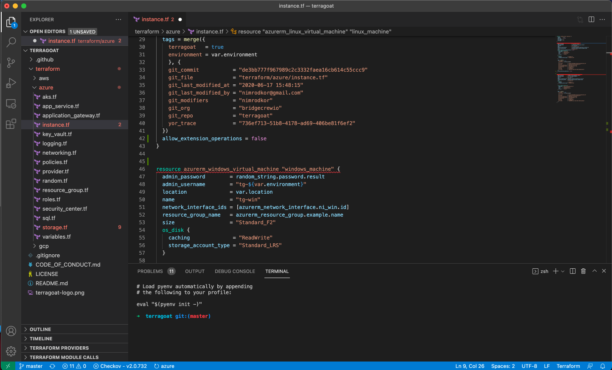

## Run Checkov in your IDE

You can get feedback directly in your integrated development environment (IDE) using Bridgecrew’s Checkov Visual Studio Code [extension](https://marketplace.visualstudio.com/items?itemName=Bridgecrew.checkov). The tool highlights misconfigurations inline and in development environments—like spell check for IaC misconfigurations.

First, you need to install the extension. In VS Code, go to Extensions and search for `Checkov`. Click Install.

Next, go to the Checkov **Extension Settings** and paste the API Token from the Bridgecrew platform that we saved earlier.

Scan the TerraGoat `instance.tf` file using the extension. Go to File -> Add Folder to Workspace and navigate to the cloned TerraGoat directory. Add /terraform/azure to your VS Code workspace and open `instance.tf`.

Checkov will immediately start scanning and will highlight any identified misconfigurations, with red underline. Move your cursor over the second code block `resource azurerm_linux_virtual_machine "linux_machine"`. Checkov has identified multiple misconfigurations, including “Ensure Virtual Machine Extensions are not Installed."

You can learn more about the policy by selecting “View Problem” or select “Quick Fix” to do exactly that. By selecting “Apply fix for - Ensure Virtual Machine Extensions are not Installed” you automatically patched your codebase for a common misconfiguration.

Now you can commit that code to your repository with the patch and improved posture.

**Now that we know what Bridgecrew is scanning for and what the results look like, let’s automate it!**