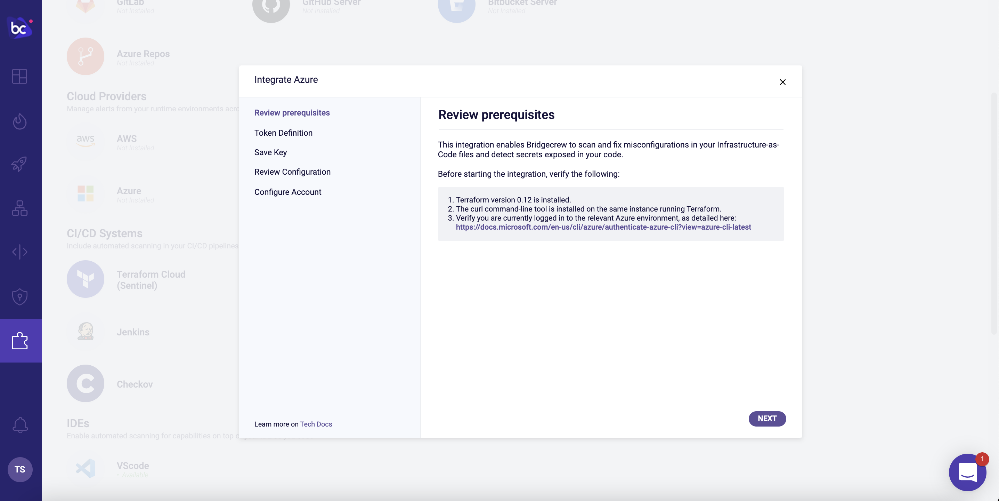
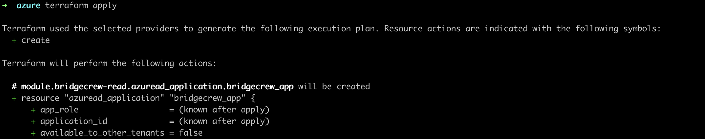
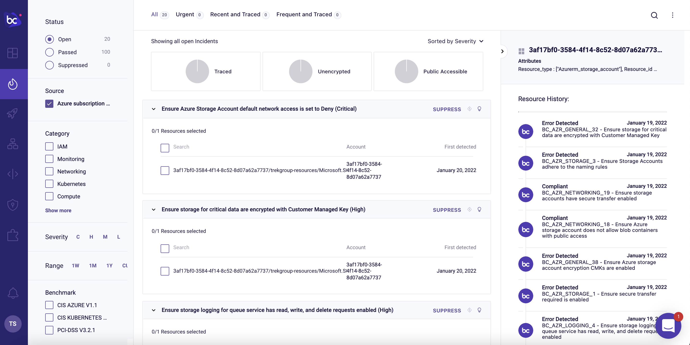
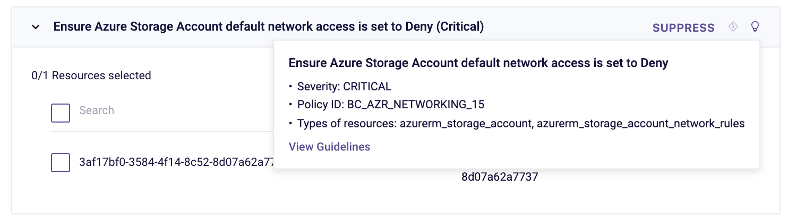

## Scanning runtime resources for vulnerable infrastructure

Let’s switch gears to address infrastructure that wasn't deployed by Terraform.

Greenfield infrastructure as code deployments are a luxury not many of us have. In reality, our Azure accounts have objects that were created manually for one reason or another. Transitioning to IaC is rarely a one-and-done affair, so you may have objects in your Azure accounts that are managed by a team that has not yet made the switch.

That’s why it’s important to scan objects directly in your Azure environment in addition to scanning your Terraform templates in git or as part of the CI/CD pipeline, as we’ve already shown.

Bridgecrew provides runtime scanning via an Azure integration, allowing full coverage of infrastructure security both before and after deployment.

### Azure runtime integration

To enable runtime scanning of your Azure account, go to the [**Integrations Tab**](https://www.bridgecrew.cloud/integrations/catalog/azure-api-access) and select "Azure" under the **Cloud Providers** section. Make sure your computer meets the requirements and click "Next."




{}
<p style='text-align: left;'>
Read-only access is scoped as minimally as possible in order to give Bridgecrew only the necessary access to scan your Azure accounts.
</p>
{}

Give your token a name like `azure token`, then click "Create." We don't need to save that key, so click "Next."

Copy that code to be added to an existing Terraform file or, in our case, a new one. In a new folder, add that code to a file called `bc.tf` with a blank azure provider block, so it will looke like this:

```hcl
provider "azurerm" {
   features {}
}

module "bridgecrew-read" {
  source                     = "bridgecrewio/bridgecrew-azure-read-only/azurerm"
  org_name                   = "example"
  bridgecrew_token           = "27bd647e-ea89-47be-adea-EXAMPLE"
}
```

In your terminal, move to that directory and run `terraform init`. After initialized, run `terraform apply`.




That’s all it takes to connect your Azure account to Bridgecrew for continuous cloud security monitoring and compliance benchmarking.

### Exploring runtime violations

With the Azure account connected, you'll start to see runtime violations in the [Incidents](https://www.bridgecrew.cloud/incidents) page.

{}
<p style='text-align: left;'>
Unlike the rest of this workshop, the information displayed in your Bridgecrew Dashboard may differ from the images below, as no two Azure accounts will have the same content.
</p>
{}

We can browse through all the security and compliance violations detected in our live Azure account. We can filter based on Status, Source, Category, Severity, Time Range, Benchmarks, and Tags. We can leverage traced resources to tie cloud to code. There are "low hanging fruit" filters for unencrypted resources and publicly accessible resources.

In the example below, we can see a Storage Account that failed the "Ensure Azure Storage Account default network access is set to Deny" policy:



Further context on the issue and remediation options is also available by clicking on the lightbulb and on the "Guidelines" link.



Next, we'll look at Drift Detection.