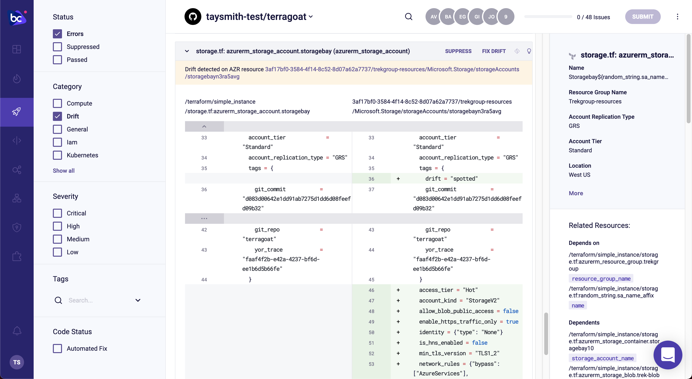

## Drift Detection between Azure and Terraform Cloud state using Bridgecrew

In this final section, you’ll switch gears and detect drift. Drift occurs when the infrastructure deployed in the cloud is different from what was defined in the IaC template. You call what the infrastructure should be the “state” saved in files locally or in Terraform Cloud. For example, if the infrastructure in Azure may have different configurations than the Terraform template defined.

This usually occurs during a major incident, where DevOps and SRE teams make manual changes to quickly solve the problem, such as opening up ports to larger CIDR blocks or turning off HTTPS to find the problem, or if there are knowledge or access control gaps that make fixing an issue in the cloud directly the easier option. If these aren’t reverted, they present security issues and it weakens the benefits of using IaC.

### Create drift

Make sure you've applied the Terraform resources from the [Test Pull Request](https://workshop.bridgecrew.io/terraform/40_module_two/2005_kickoff_pr.html) section.

Confirm in your Azure console that your new Storage Account is up. Go to the [Storage Account console](https://portal.azure.com/#blade/HubsExtension/BrowseResource/resourceType/Microsoft.Storage%2FStorageAccounts) and confirm that there is a new Storage Account running.


Next, let's add a tag and increase the encryption requirement for the Storage Account. Select the Storage Account and go to "Tags." Add a tag with the key `drift` and value `spotted`. 


Then, go down to "Configuration" under "Settings" and bump up the Minimum TLS version to `Version 1.2` and click "Save."


Bridgecrew scans your cloud configurations periodically, but to speed up the process, you can use the following API call in your terminal with your Bridgecrew API key from the earlier steps.

```
curl -X POST -H "Authorization: $YOUR_BC_API_KEY" https://www.bridgecrew.cloud/api/v1/scans/integrations
```

That will force start a scan of your environment that will find misconfigurations and identify drift from your Terraform state. After a few moments, head back over to the [Projects](https://www.bridgecrew.cloud/projects) page of Bridgecrew. Select your repository (`<organization>/terragoat`) and filter by "Drift." Here you can see the difference in Azure versus the state saved in Terraform Cloud or your VCS.



You found drift! From here, you can either run `terraform apply` to bring your cloud instances back in line with the state saved locally or in Terraform Cloud, or make the changes to your Terraform templates to match the changes made in production and update the state in Terraform Cloud. Alternatively, in the Projects page, you will find **Fix Drift** that will open a pull request on your behalf to make the change to match code to cloud.