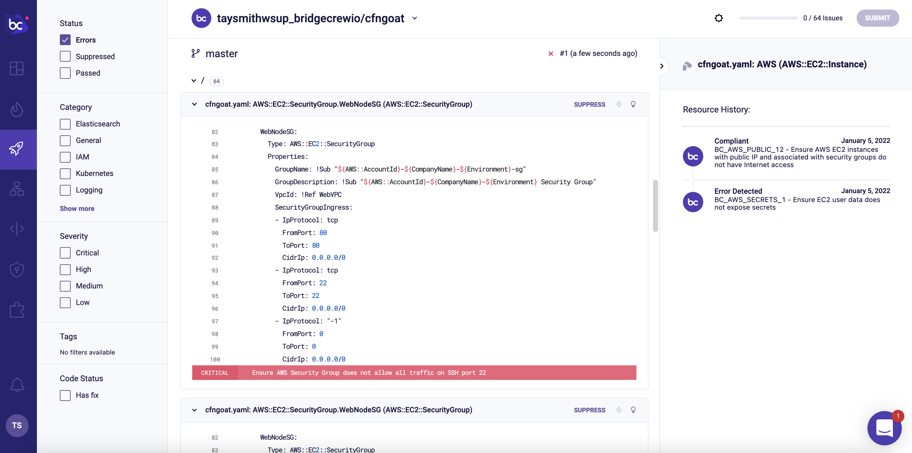
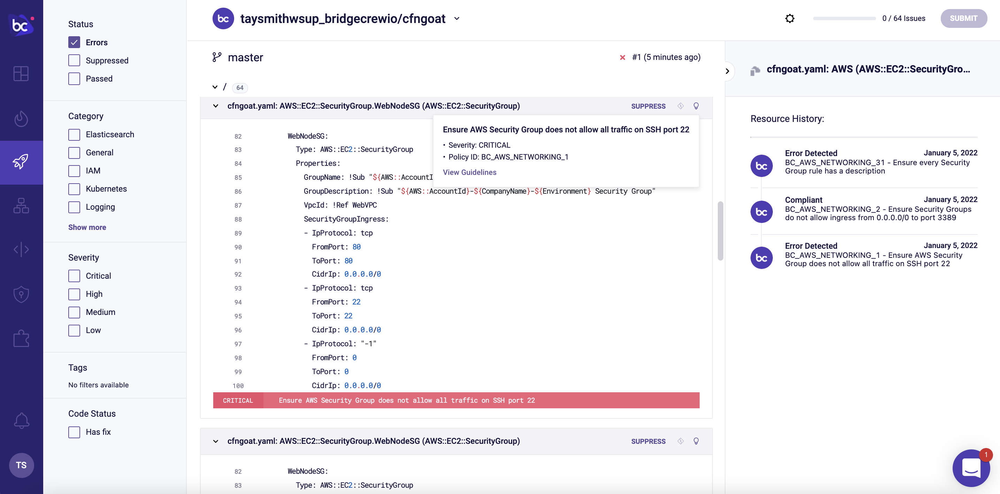

## Viewing results in Bridgecrew

In the previous section, we scanned our demo CloudFormation repository locally and sent the results to the [Bridgecrew platform](https://bridgecrew.cloud) for investigation and remediation. 

To explore the reported issues we saw in the CLI output, head to the [Incidents tab](https://www.bridgecrew.cloud/incidents) in your Bridgecrew account.

Bridgecrew comes with hundreds of out-of-the-box policies to help you adhere to cloud security best practices as defined by the Center of Internet Security (CIS). Bridgecrew policies also correspond to popular compliance frameworks such as PCI-DSS V3.2, NIST-800-53, SOC2, and more. 

Clicking into one of the violations will show all the violating resources found in our vulnerable-by-design CfnGoat codebase.

For example...

From here, we can drill down into a specific CloudFormation object to see the relevant piece of code along with a suggestion for fixing the error. We’ll cover how to implement remediations in more depth a little later!

Now that we have a feel for the kinds of IaC security issues Bridgecrew is equipped to find, let's add some DevSecOps magic.
