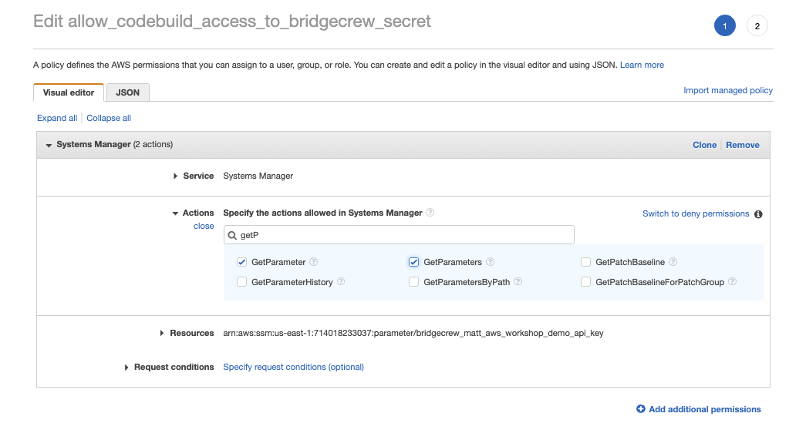
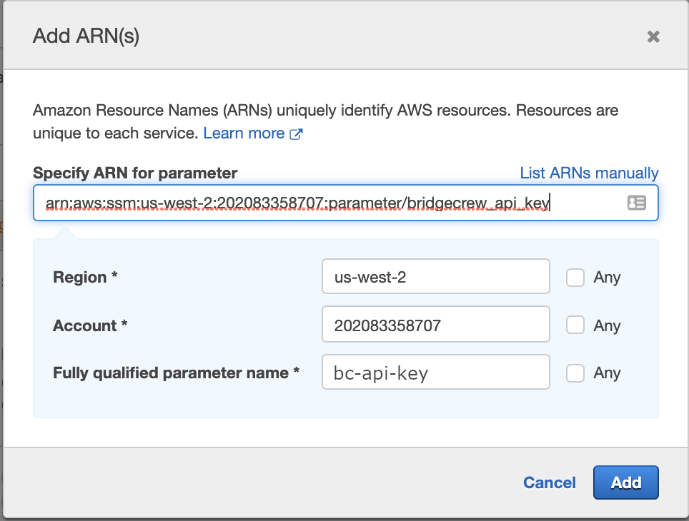
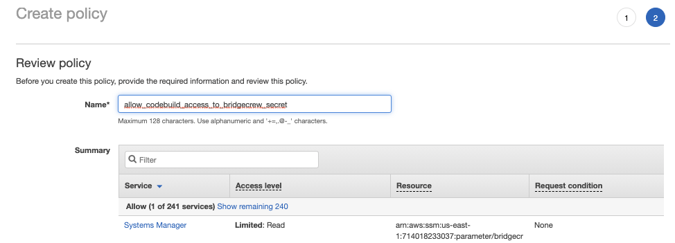

## Edit AWS IAM permissions to enable CodeBuild

To give CodeBuild access to our Bridgecrew API secret we stored in AWS System Manager, we’ll need to add more permissions to the default IAM role created for new CodeBuild environments.

In the [AWS IAM Dashboard](https://console.aws.amazon.com/iam/home), find the role called `codebuild-bridgecrew-tutorial-service-role`

Select the role, then click select  **Add Inline Policy** from the right hand side.

This will bring up the "*create policy visual editor*", for **Service**, select **Systems Manager** in the search box, then chose the **GetParameters** and **GetParameter** Actions.

Under **Resources**, choose **Specific** and select **Add ARN**. Fill in the same region you’ve created your CodeBuild project and leave the account number as the default. Type `bc-api-key` as the parameter name to match the name we gave the key in the `aws` CLI command we used earlier.

You could also use the `cli` command `aws ssm get-parameter --name bc-api-key` to get the whole ARN and paste it into the ARN field.

Select **Add** then select **Review Policy**.

On the next page, name the policy `allow_codebuild_access_to_bridgecrew_secret` and select **Create policy**:

We’re now ready to tie this all together with AWS CodePipeline!
