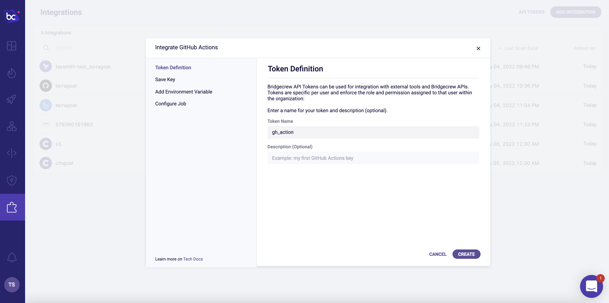
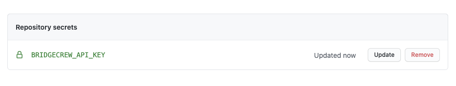

## Setting up GitHub Actions for our CloudFormation repository.
If your existing CI/CD Pipeline runs in GitHub Actions, this can also be configured to scan the CloudFormation templates before deployment, allowing us to fail the build job and halt a deployment if there are any security violations in our CloudFormation code.

As with AWS CodeBuild, we’ll also automatically send the results to Brigecrew to maintain a view across all of our infrastructure projects and share visibility throughout our organization.

{}
Generally speaking, you wouldn't configure both CI/CD solutions for a single repository, consider this page informational only if you have followed through the AWS CodeBuild and AWS CodeDeploy sections, the observability provided into the Bridgecrew platform will be similar.
{}

As with other Integrations, the GitHub Actions CI/CD integration page at [https://www.bridgecrew.cloud/integrations/githubActions](https://www.bridgecrew.cloud/integrations/githubActions) allows us to setup GitHub Actions. Give the API key a name like `gh_action` and then click "Create" and "Next."



The integration provides steps to enable GitHub actions, which we'll walk through below.


Firstly, just like we created an API token for CodeBuild integration, we do the same for GitHub Actions.

Remember we then stored the Bridgecrew API secret in `aws ssm put-parameter` for CodeBuild, allowing the CI/CD run to securely access the secret, we do the same with GitHub Actions, by creating a GitHub secret, this prevents our API key being exposed in the configuration (which is stored in our codebase).


Go to your **fork of CFNGoat on GitHub**, select **Settings**


Then select **Secrets** from the left, and click **New Repository Secret**


Name the secret `BC_API_KEY` as instructed in the Bridgecrew integration details above.

Copy and paste your API Token from the Bridgecrew integration details page into the `value` field.


Select **Add secret**, the secret will then be listed by name in the **Settings > Secrets** page you'll be taken back too.



### Adding the automated workflow.

{}
Github Actions are defined as *workflow* files, within your code repository under the `.github/workflows` directory. To create an action, we'll be adding a new file to this directory. If you already have workflows, and are familiar with the workflow file format, you could add the bridgecrew `step` section to your own workflows for the same results.
{}

To create a new workflow, select **Actions** within your CFNGoat forked repository, then select **New Workflow** button.


Select **set up a workflow yourself** to create a new, blank workflow.

**Name the new file** `bridgecrew.yaml` and replace the entire contents with the workflow template provided below, 
This takes the `jobs` section provided by the Bridgecrew integration instructions and wraps it in a fully functional GitHub Actions definition.

```
name: Bridgecrew
on:
  push:
    branches:
      - master
jobs:
  scan:
    runs-on: ubuntu-latest
    strategy:
      matrix:
        python-version: [3.8]
    steps:
    - uses: actions/checkout@v2
    - name: Run Bridgecrew 
      id: Bridgecrew
      uses: bridgecrewio/bridgecrew-action@master
      with:
        api-key: ${{ secrets.BC_API_KEY }}
```
The result should look like this, select **Start commit**


Finally, save the new workflow file into your code repository by selecting **Commit new file**


The GitHub Action will immediatley start running the Checkov CLI against the latest commit in your GFNGoat Repository.

You can see this by selecting the **Actions** page within your CFNGoat forked repository in GitHub.

You will see a new workflow, titled *Bridgecrew* and a job about to run automatically because of the new commit (of the workflow file)

 

Selecting this *job* will allow you to view the status and logging output from the pipeline, where the Checkov CLI will run and output any violations found in the CFNGoat codebase.

 

Rather than digging through the job logs, the action also outputs annotations for each violation found into the **Summary** page of the action.

 


{}
If you want your GitHub Action to soft-fail and just act as an observability tool, add "soft_fail: true" under "api-key" in the YAML. 
{}

## Congratulations!
You’ve just automated security scanning of your infrastructure as code into a developer-friendly CI/CD pipeline.

In the next module, we’ll look at how to investigate and fix the issues arising from the automated scans, as well as providing more tips for integrating security into the developer workflow without causing friction.

