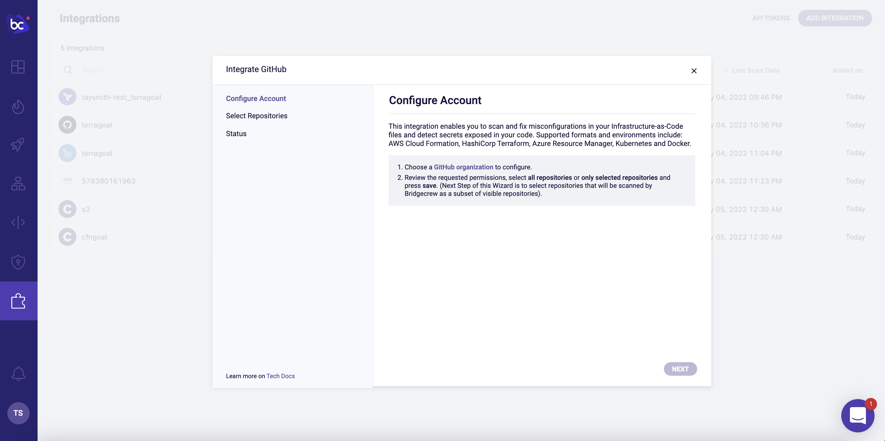
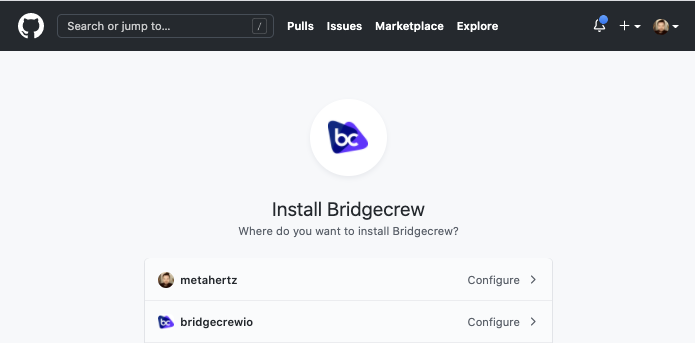
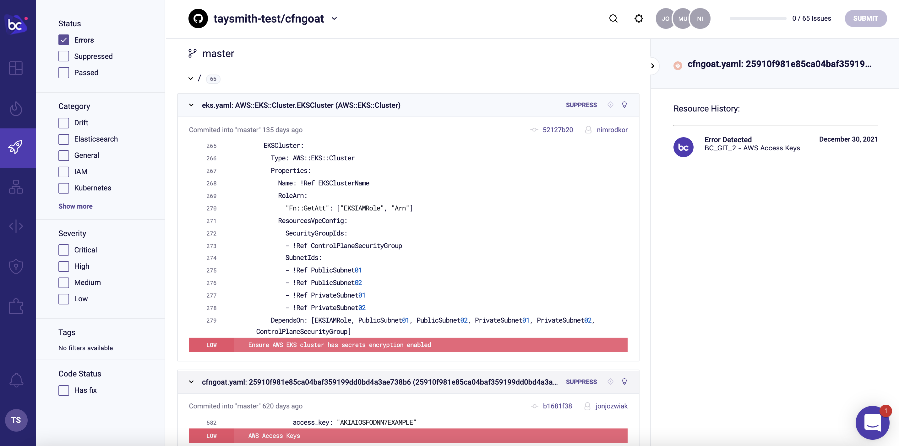

## Integrating Bridgecrew with GitHub
By adding another Bridgecrew integration, you can generate and push automated pull requests (PRs) back into your GitHub repository to update your CloudFormation code and fix security issues, as well as gain automated scanning of incoming community pull requests with bot generated comments for misconfigurations.

Head back to the [Bridgecrew **Integrations**](https://www.bridgecrew.cloud/integrations/Github/?utm_source=aws_workshop) tab and select **GitHub** under the **Code Repositories** section. Click on the "GitHub organization" link to grant Bridgecrew access to your organization.

Just like we did for the AWS CodePipeline GitHub authorization, choose which accounts and repositories to grant the Bridgecrew github integration access too. 

In the next screen, select the relevant repos (make sure to select cfngoat) and click "Next" and "Done." Once you’ve connected Bridgecrew to your CfnGoat demo repository, Bridgecrew will scan your CloudFormation code directly from GitHub again and bring the results into Bridgecrew.

To see all issues across your scanning sources— your bridgecrew-tutorial CodePipeline and your newly integrated GitHub repository—head over to the [Projects page](https://www.bridgecrew.cloud/projects). You may need to change the drop down to cfngoat.

You will now see all of the violations across the repo. You can also switch the top drop down to your CodeBuild integration to see the same violations.  Although this may seem redundant, it’s actually an important feature for tracking security posture at multiple steps in the DevOps lifecycle.