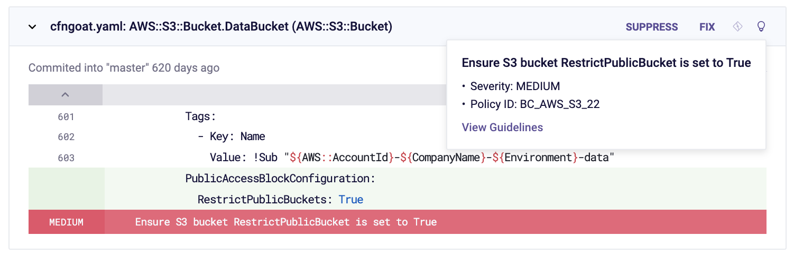
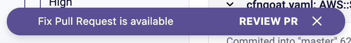
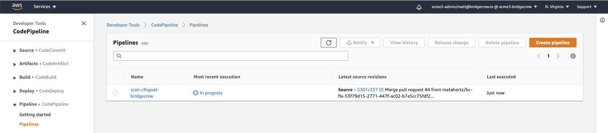
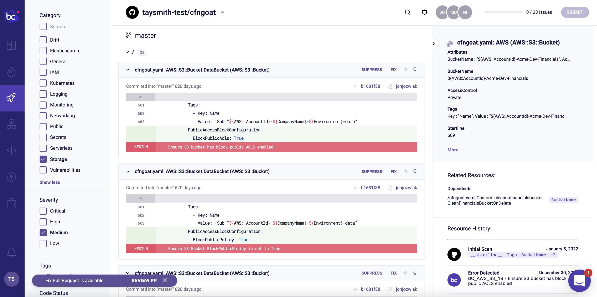

## Automating fixes through pull requests

Now that you’ve pulled in multiple infrastructure sources, you might be getting overwhelmed at the prospect of fixing the several dozen issues Bridgecrew has identified. To help you implement fixes as fast as possible, Bridgecrew generates and pushes fix pull requests back into your GitHub repository. 

Let’s walk through the process with one of the policies we looked at earlier, **Ensure S3 bucket has ‘restrict_public_bucket’ enabled**:

You can see that this issue has a suggested fix available (green for new lines added). We can click on the lightbulb icon and follow the "View Guidelines" link to see the docs for that misconfiguration.

Let's open a pull request. Select the **FIX** button then **Submit** in the upper right corner.

The remediation modal shows there will be a pull request fix raised against your GitHub repository.

After you select **Submit**, you’ll see a message confirming the pull request has been successfully raised with a link to the PR in GitHub. You’ll also see the remediation has had the effect of hiding the issue from the Projects list; other policy violations are listed, but the one we addressed is gone.

You’ll also notice, however, that the issue is still present from our CodePipeline source, so we’re not secure yet!

Over in our CfnGoat repository in GitHub, we’ll see a new PR under the Pull requests tab, which is ready for review:

Digging into the changed files, you’ll see the updated code that will soon be merged.

### Bringing it all together.

Merging our pull request in GitHub triggers our CI/CD deployment in AWS CodePipeline that we previously set up.

You may be able to tell where this is going!

Notice our merged pull request commit has triggered the build:

Of course, the scan will still fail as there are several other security issues affecting the CfnGoat repository, but if we head back to Bridgecrew, the issue we just fixed is gone:

Now we know that the issue is not only fixed at source, but also that the fix has also made it through the CI/CD pipeline into production!

#### Congratulations!
You’ve built an automated IaC scanning workflow in a live environment and automated the fixing of an exposed S3 bucket! 
