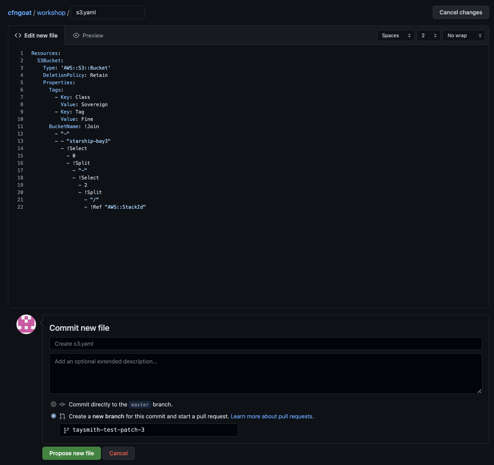
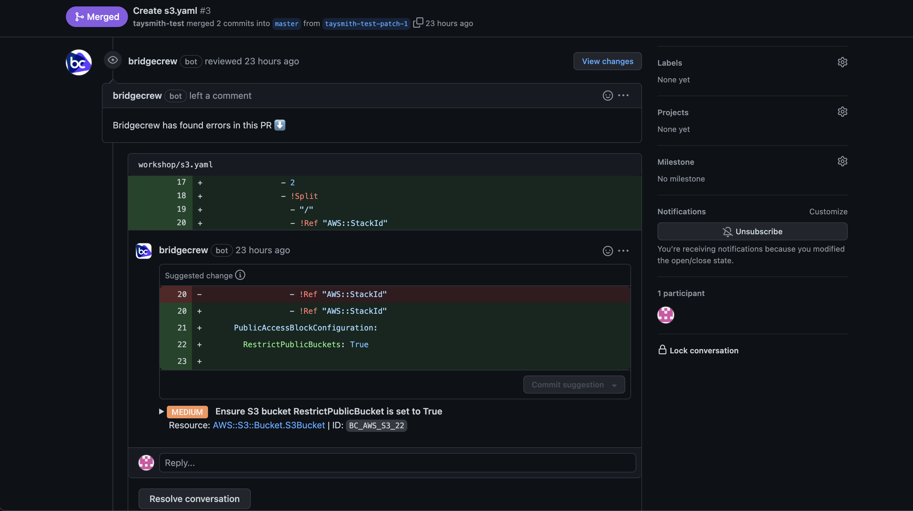

## Example pull request

Now that we have a full pipeline, let's try it out! Go to GitHub and your CfnGoat fork. Select **Add file** and **Create new file**. Make the file path `workshop/s3.yaml`. Then copy and paste this CloudFormation code.

```yaml
Resources:
  S3Bucket:
    Type: 'AWS::S3::Bucket'
    DeletionPolicy: Retain
    Properties:
      Tags:
        - Key: Class
          Value: Sovereign
        - Key: Tag
          Value: Fine
      BucketName: !Join
        - "-"
        - - "starship-bay3"
          - !Select
            - 0
            - !Split
              - "-"
              - !Select
                - 2
                - !Split
                  - "/"
                  - !Ref "AWS::StackId" 
```

Then, scroll to the bottom and choose **Create a new branch for this commit and start a pull request.**.



You will notice a few bot comments helping you identify and remediate issues in the template added.



Go ahead and merge it anyway. Then head back to AWS CodePipeline and watch the pipeline kick off. You should again see some findings in the CodeBuild phase, but since we made it a soft-fail, it should pass anyway and deploy.


## Drift Detection

Now that our S3 bucket is deployed, let's test out Drift Detection. Find the S3 bucket you just deployed, go into your settings and make some changes such as adding encryption or a new tag.

Go back to Bridgecrew and the Projects page. In the menu in the upper right side, select **Scan now**. Give it a few minutes, then head to your repository in Bridgecrew and filter for **Drift**.

**There you have it! You have a full, operational CloudFormation DevSecOps CI/CD pipeline!**