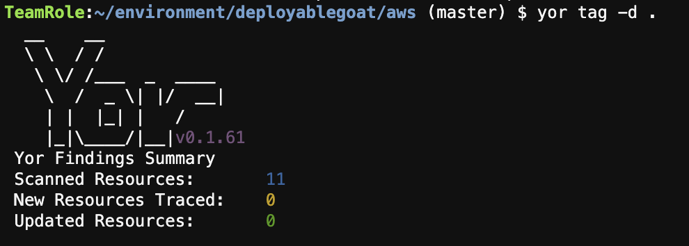

## Using the Yor CLI

We're going to use the Yor CLI to add tracability tags to a deployable infrastructure-as-code repoistory.

## Installing Yor

We have already installed Yor into our Cloud9 environment at the beginning of this workshop, for other installation options (for example, to use Yor locally on your machine, see the options in the [Yor.io installation docs](https://yor.io/2.Using%20Yor/installation.html)

## Clone the sample repository

While we could use Yor to tag our `CFNGoat` repository, we would not want to deploy infrastructure with that many intentional security issues into our AWS accounts. Instead, we'll use a seperate sample repo, this time in Terraform.

This sample is designed with very low severity misconfigurations and policy violations only. 

```bash
git clone https://github.com/metahertz/deployablegoat.git
cd deployablegoat
```

## Run yor to tag our IaC resources

Simply run the following command within the `deployablegoat` directory for Yor to tag all of our Terraform with useful tags.

```bash
yor tag -d .
```

You can run a `yor list-tags` to find out which tags will be added by default:

```bash
git:(master) ✗ yor list-tags
```


## Commit our tagging changes

We can now commit the tagged resources into git. 

```
git add -A .
git commit -m "Tagged resources using yor"
```

If we now run Yor again, notice we have no changed tags or resources, Yor can ingore it's own tags so only real updates to the infrastructure code cause a change in the Yor tags, which is what we want.

```
yor tag -d .
```




## Deploying our tagged resources to AWS

Simply run a terraform init and apply to push our S3 resources, complete with Yor tags, to our AWS environment.

```
cd aws
terraform init
terraform plan
terraform apply
```
