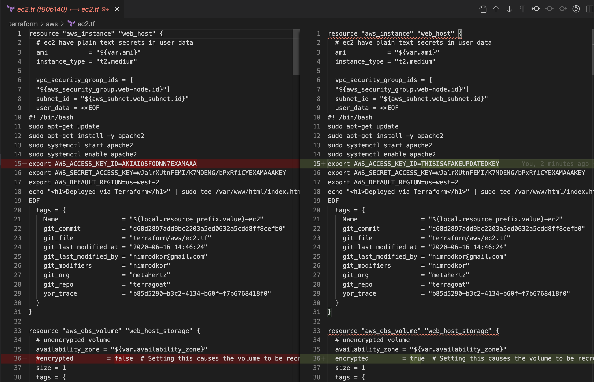
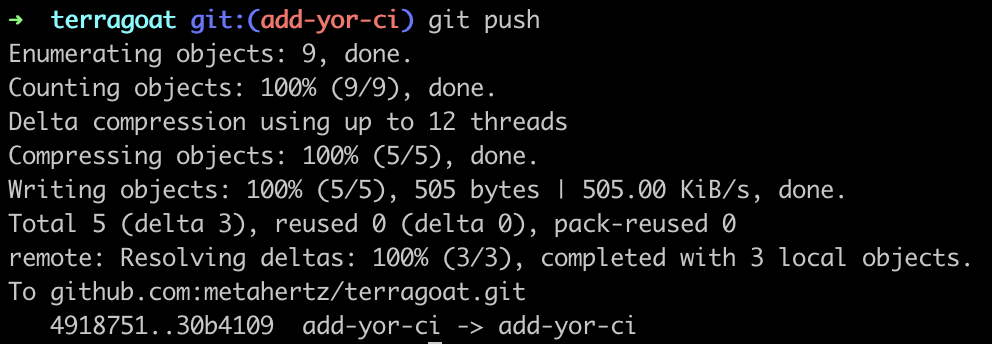
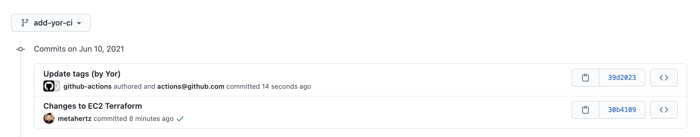
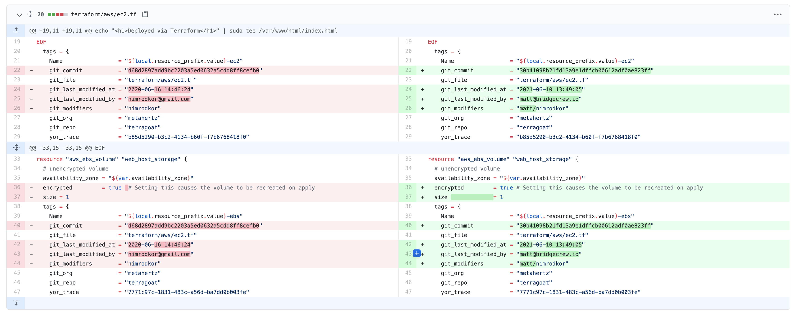

## Integrating Yor into your CI pipeline.
In the same way as Checkov can be used for both a quick local scan or automated as part of your CI pipeline, Yor is designed to do the same.

The following simple Github action will run Yor, auto-committing new tags on changed resources

```
name: yor
on:
  - push
  - pull_request

jobs:
  add-your-tags:
    runs-on: ubuntu-latest
    strategy:
      matrix:
        python-version: [3.7]
    steps:
      - name: Checkout repo
        uses: actions/checkout@v2
        with:
          fetch-depth: 0
      - name: Run yor action
        uses: bridgecrewio/yor-action@main
```

Lets take a look at this in action:

## Yor CI in action
We have added this action to our Terragoat repo, [Terragoat](https://github.com/bridgecrewio/terragoat) is intentionally vulnerable Terraform Infrastructure as Code, just like the CloudFormation CFNGoat we've been using up until now.

A developer then makes two changes to EC2 instances described in the terraform, as below:



When we commit and push this change, we will see Yor automatically update the tags for the changed resources, with it's own commit to the repo:



In the commit history, we now see our initial commit, and then a second commit by Yor's Github action, updating the tags to reflect our changes:



Inspecting the yor commit, we can see the relevant tags, such as commitID, last modified and list of authors for this object have changed:



Now we've seen howto tag resources, lets have a look at the power they give us in runtime!
