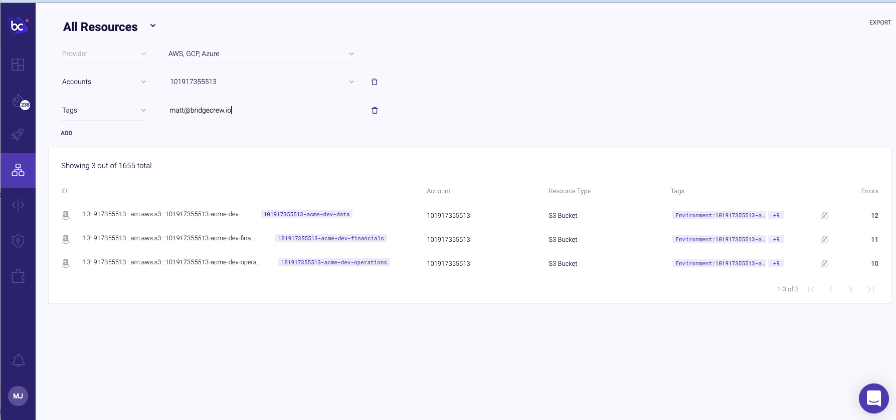
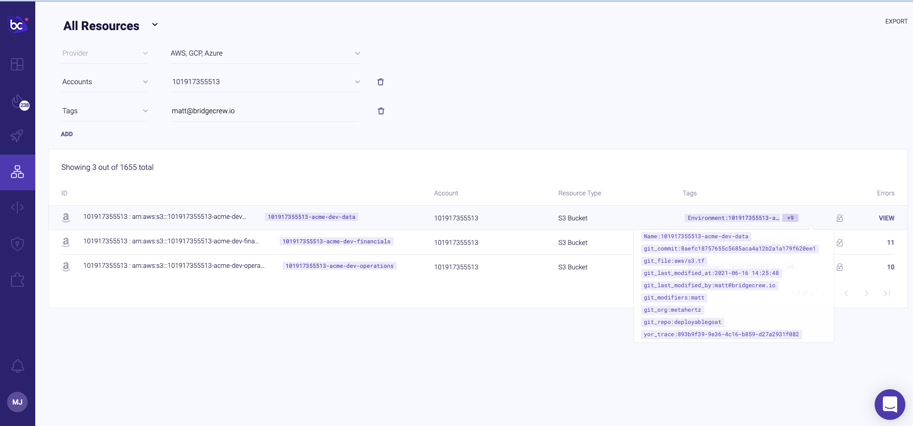
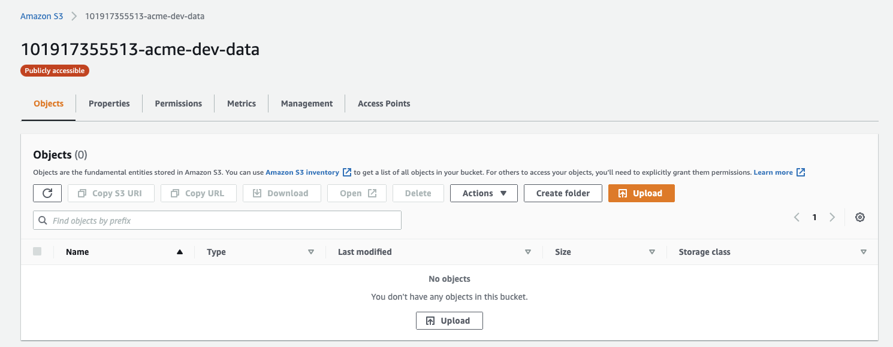
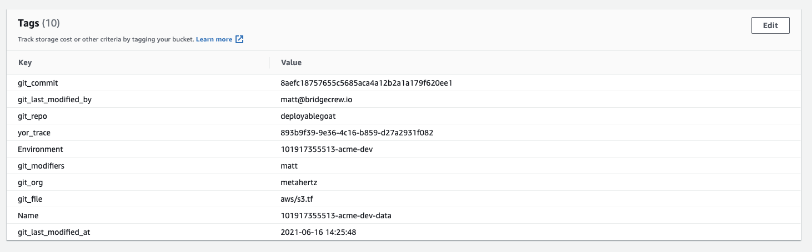
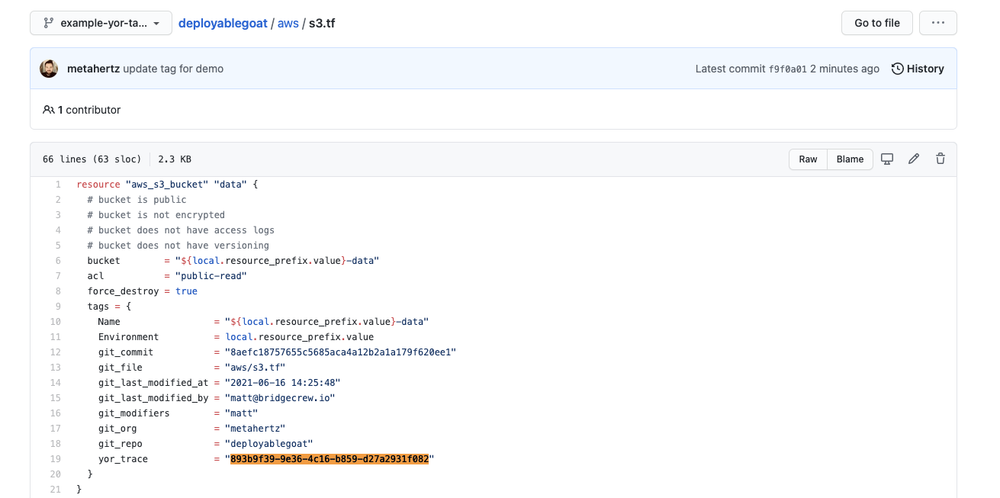

# Using Yor traces in runtime

## Easily find Cloud Resources based on git information

Once our resources are deployed, we now have multiple ways to find, link and correlate between the who and what of our IaC actions in git, and the real resources running in our cloud environment.

For example, we can use the bridgecrew dashboard resource explorer, to query for all runtime resources in our AWS account which were last modified by `matt-at-bridgecrew.io`:

Drilling down into the results, we'll see this easy searching for resources is powered by the Yor tags:

## Easily find an IaC object from the AWS dashboard

Equally, a specific item in AWS can be located in your IaC codebase using the unique Yor trace ID across your git repository:

By looking at the tags, we can use the unique `yor_trace` to search for the specific terraform object in git:

Easily finding the resource we need to fix:

# Learn more about yor!

For usecases from IAM management, tag based access controls to cost center management, check out [https://yor.io](https://yor.io)

