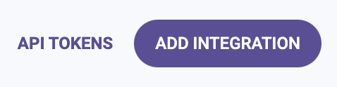

---
title: "Bridgecrew Setup"
chapter: false
weight: 13
pre: "<b>3.2 </b>"
---

You’ll need to sign up for a free Bridgecrew account to follow along with this tutorial. You can sign up for a free account [here](https://bridgecrew.cloud/?utm_source=awsworkshop).


## Checkov CLI
In this tutorial, we’re also going to use Checkov CLI. The CLI works on Windows, Mac, and Linux. You can install it with pip:

```bash
pip3 install checkov
```

If installing globally on your system (not in a python venv or pipenv) you may need to have permissions to write the libraries to the necessary locations, ie:

```bash
sudo pip3 install checkov
```

If you run into problems, try the [alternate install instructions](https://docs.bridgecrew.io/docs/ingesting-scan-data#installation?utm_source=awsworkshop).

## Yor CLI
We'll also be using a new Bridgecrew open source tool, Yor, to make tagging and tracing infrastructure between code and the cloud easier, to install into our linux environment, run the following:

```bash
wget -q -O - https://github.com/bridgecrewio/yor/releases/download/0.1.62/yor-0.1.62-linux-amd64.tar.gz | sudo tar -xvz -C /usr/bin
```

Now test we can run `yor`

```bash
$ yor
NAME:
   yor - enrich IaC files with tags automatically

USAGE:
   yor [global options] command [command options] [arguments...]

VERSION:
   0.1.61
```

## Bridgecrew API token

Throughout the tutorial, you’ll need to create Bridgecrew API tokens. You can access [them here](https://www.bridgecrew.cloud/integrations) via the **API TOKENS** button on the integration page.



