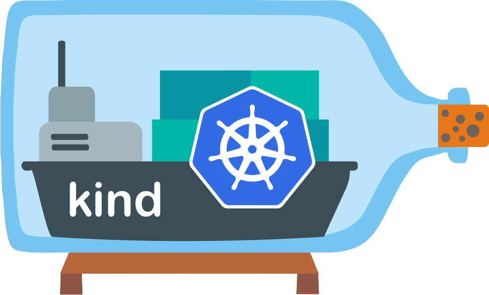
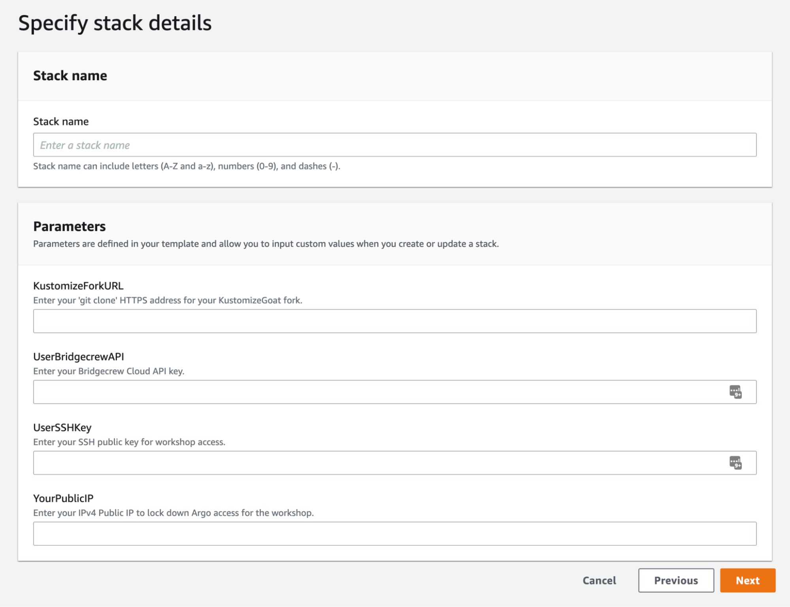
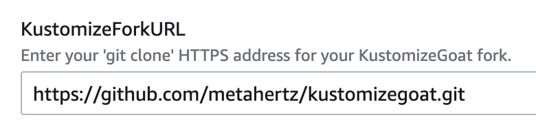
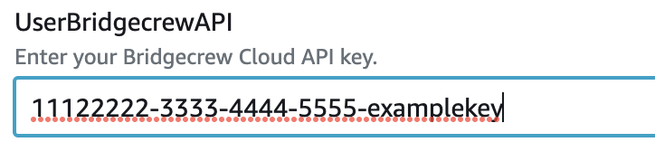
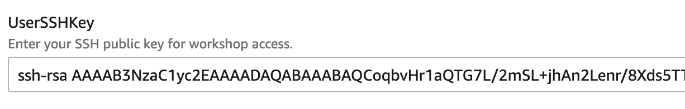
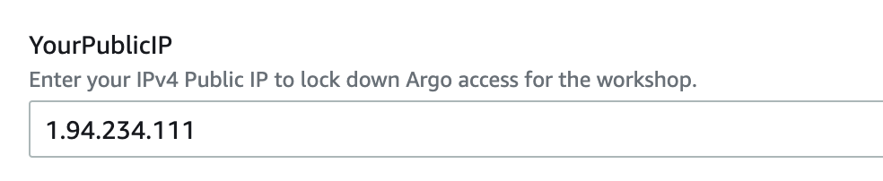

##  The Automated AWS Workshop Environment

Your workshop environment will drop you into an example development team, at the start of their journey through the DevSecOps world!

They already use ‘Infrastructure as Code’ to define their environments, and the deployment target is a Kubernetes cluster, which is also setup.

To pre-build this environment for each workshop attendee, we'll run some CloudFormation within our AWS account.

## An introduction to “kind”

[kind](https://kind.sigs.k8s.io/), or “Kubernetes in Docker” is a simple way to create local Kubernetes clusters for testing, experimentation and development.

As the name suggests, kind nests a Kubernetes cluster inside containers on your existing (Docker, Podman, ContainerD, etc) system.

We’ll be using KIND to ensure everyone has the same, repeatable Kubernetes configuration for this workshop, regardless of deployment location.

### Setting up the workshop environment via CloudFormation
	
1. Clicking the following link will open CloudFormation and pre-fill the template source from Amazon S3: [https://us-west-2.console.aws.amazon.com/cloudformation/home?region=us-west-2&skipRegion=false#/stacks/create/review?templateURL=https://kubernetes-workshop-cloudformation.s3.us-east-2.amazonaws.com/workshop-init-cloudformation.yaml&stackName=bridgecrew-workshop](https://us-west-2.console.aws.amazon.com/cloudformation/home?region=us-west-2&skipRegion=false#/stacks/create/review?templateURL=https://kubernetes-workshop-cloudformation.s3.us-east-2.amazonaws.com/workshop-init-cloudformation.yaml&stackName=bridgecrew-workshop)

2. Fill out the required parameters described below. these will enable CloudFormation to set up the environment without manual steps later in the workshop!

Fill in your git clone address for your fork of [https://github.com/bridgecrewio/kustomizegoat](https://github.com/bridgecrewio/kustomizegoat) in the `KustomizeForkURL` field. 

Enter your Bridgecrew API key from your free Bridgecrew account in the `UserBridgecrewAPI` field.

Enter any [**public** SSH key](https://helpdeskgeek.com/how-to/how-to-generate-ssh-keys-on-windows-mac-and-linux/) you wish to use (for which you own the private key). You will use this to log into the KIND machine. Paste this in full into the `UserSSHKey` field.

Finally, enter your current [public IP address](http://whatismyip.com/) from wherever you are attending this workshop. We will lock down certain public service access to this IP for security. You can edit this later if needed.

Add this IP into the ‘YourPublicIP’ field: 

5\. Select “NEXT”. There are no further configuration options needed, `select the checkbox` to confirm IAM roles will be created through this automation, then select `Create stack` Click through to create the stack.

### VSCode

We will also demonstrate security plugins for VSCode during this workshop. Security plugins for VSCode will help your development teams spot misconfigurations much earlier in the development process. To download VSCode for free, visit [https://code.visualstudio.com/download.](https://code.visualstudio.com/download)

