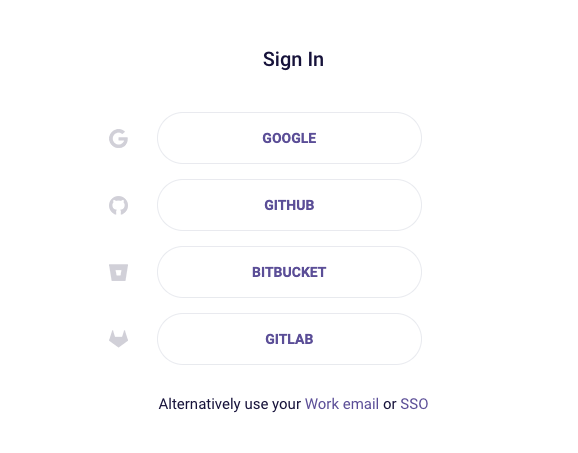
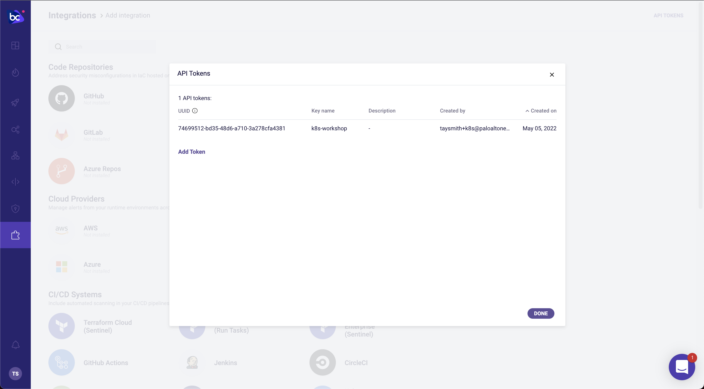
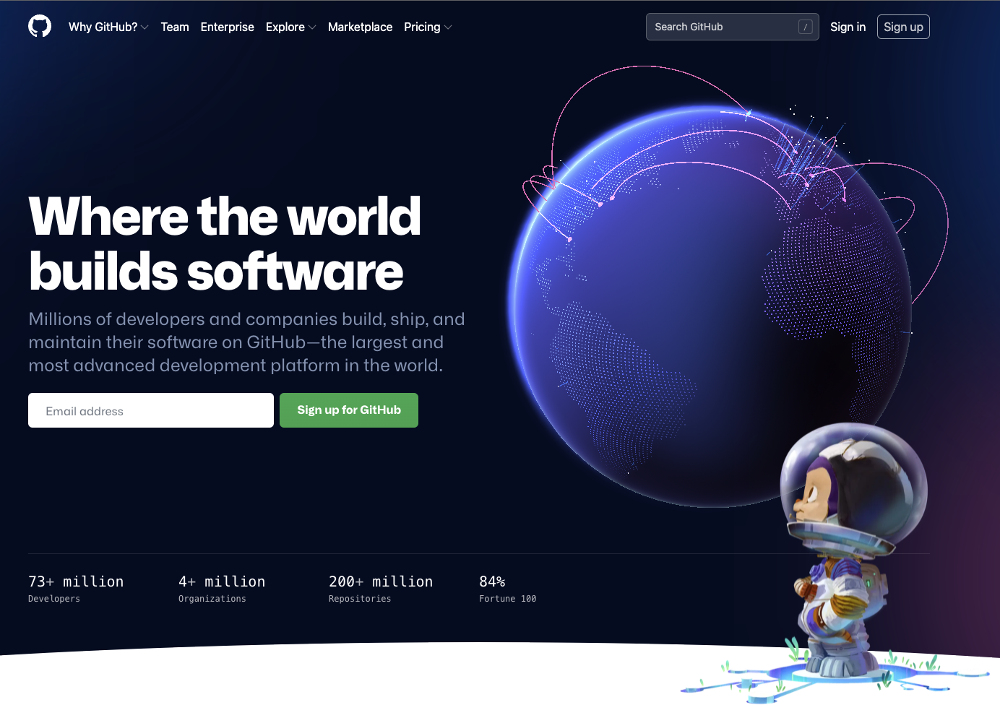
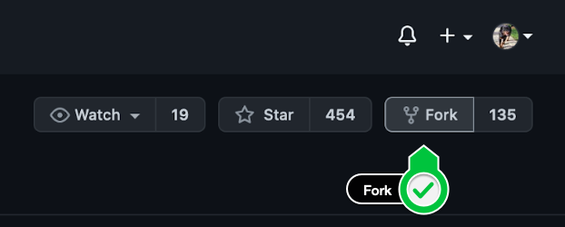
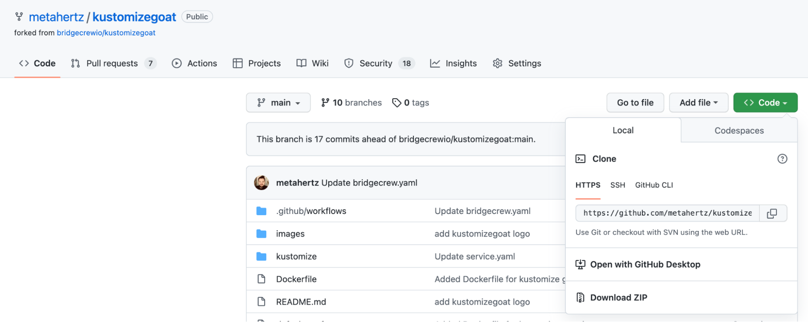

## A free Bridgecrew account

The Bridgecrew platform will give us visibility, solutions, and alerts from the first line of Kubernetes manifest all the way through to checking the running cluster’s security posture. Sign up or log in to an existing account at  [https://bridgecrew.cloud](https://bridgecrew.cloud)





### Generate a Bridgecrew API key

Throughout this tutorial, you’ll need to use the Bridgecrew API token. You can [access it here](https://www.bridgecrew.cloud/integrations/catalog) or in your Bridgecrew account by navigating to the Integrations tab and selecting API Token. Add a token for the workshop and save it in your notes for later use. 




## A free GitHub account

You will need a GitHub account to  fork and edit our example infrastructure as code (IaC) so that you can automate and fix any Kubernetes issues!

GitHub discourages individuals from having more than one account. If you already have a GitHub account you can follow along with this workshop without worrying about conflict with your private repositories.



### Fork KustomizeGgoat

This workshop uses our vulnerable-by-design Kubernetes & Kustomize project, [KustomizeGoat.](https://github.com/bridgecrewio/kustomizegoat/), This project gives us a base set of deployments we can explore, edit, and remediate without needing to integrate your own code.


#### Fork the KustomizeGgoat repository on GitHub

To set up your demo environment, we’re going to fork the KustomizeGoat repository.

Head over to the [KustomizeGoat](https://github.com/bridgecrewio/kustomizegoat/) repository and fork it using the button in the upper right corner.




If you have multiple organizations, GitHub will ask which of your orgs to fork into. Choose your personal account by selecting your GitHub username from the list. This will fork the repo.

Note down the URL for this new copy of the repository, also known as the “git clone address”, select “code” and copy the `HTTPS` address that is shown. The `HTTPS` address format is:

```
https://github.com/<your-github-user>/kustomizegoat.git
```




#### Verify Cloud9 environment access

Finally, lets check on the environment that CloudFormation has built for us. 
Click here: [https://us-east-2.console.aws.amazon.com/cloud9/home/shared?region=us-east-2](https://us-east-2.console.aws.amazon.com/cloud9/home/shared?region=us-east-2) to load the *Cloud9 Environments* within your AWS account. You will see a single `bridgecrew-workshop` environment which our automation has created!

Click *Open IDE*. You will be taken to an environment which we will use for the rest of the workshop.

* The file browser down the left hand side already has your fork of KustomizeGoat available.
* The terminal window along the bottom of the browser tab is within our kubernetes cluster, `kubectl`, `checkov` and other commands needed for the workshop will work out of the box.
* You can open/edit files by double clicking on a file within the file browser from the left, just like a locally installed IDE.

If you have any issues accessing this environment, let your workshop host know.

