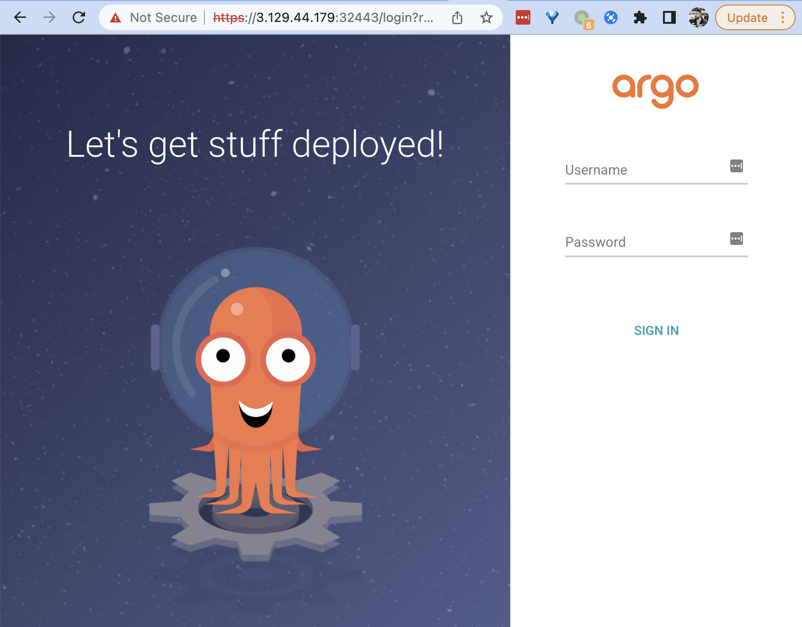
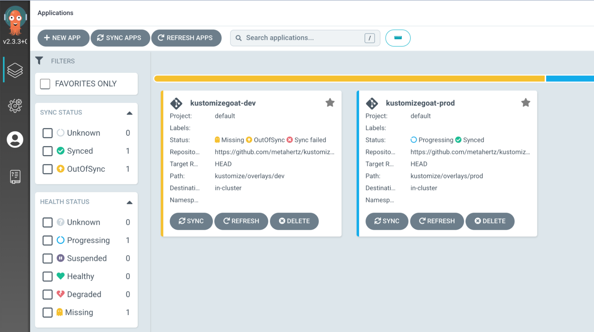
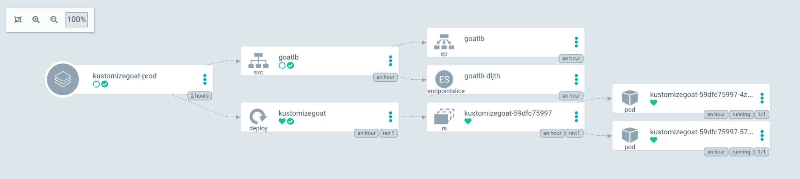
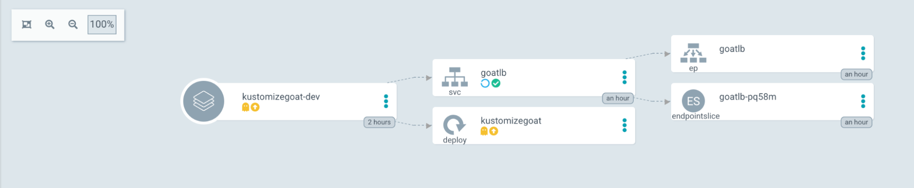
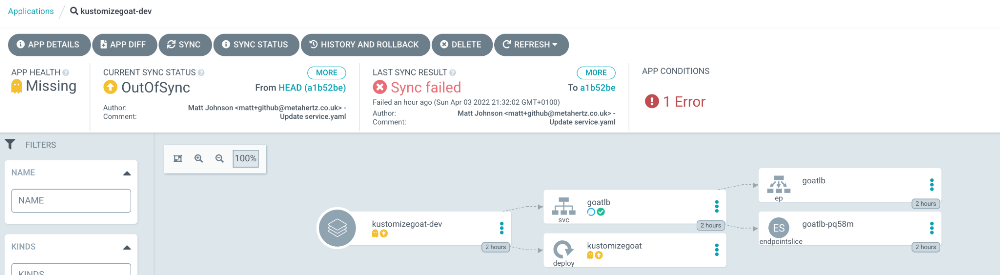
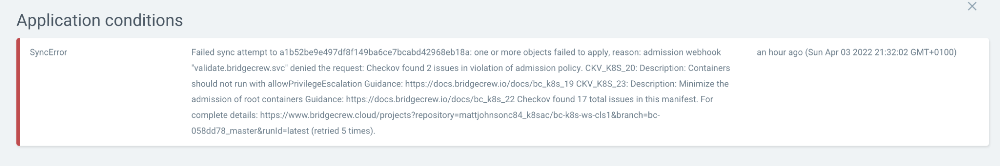

Using the public IP of your KIND kubernetes cluster, open `https://KIND CLUSTER IP>:30443` in your local browser to be prompted with the ArgoCD login screen, the admin credentials were already discussed in the workshop setup and are unique to your workshop environment. 

You can always ```cat .bcworkshop/.argo-password``` to reveal the password again from the KIND host console if needbe.

 



Log into the ArgoCD web interface to see the current state of our environment.





We can see that one of our environments, `kustomizegoat-prod` is healthy, it is “synced” between what we’ve declared in our infrastructure-as-code configuration, and what is running on our cluster.  

Lets take a look at the healthy prod environment in this visual manor, rather than digging through the kubernetes manifests for now.

Click anywhere on the “kustomizegoat-prod” box for a deeper look.


### kustomizegoat-prod





In this view, we can see a pretty simple deployment, a Kubernetes deployment, with a single ReplicaSet, running two Pods. Then a Service loadbalancer linking to the pods, great!

Now we’ll do the same with the dev environment to see what is going on there!


### kustomizegoat-dev





In dev, we see a different story, the service loadbalancer is created, but the Deployment has no children, no ReplicaSet and no Pods, we also see an error in the ArgoCD interface:




 Clicking on the “App Conditions: 1 Error” message, we see why this deployment hasn’t been successful.




It looks like the deployment was blocked from running on the cluster due to a number of security issues found by Bridgecrew’s Kubernetes admission controller, which the dev team had just installed.. But thats not the nicest way to view the error. 
 
Follow the `complete details` link at the bottom of the error message for a clearer view.
