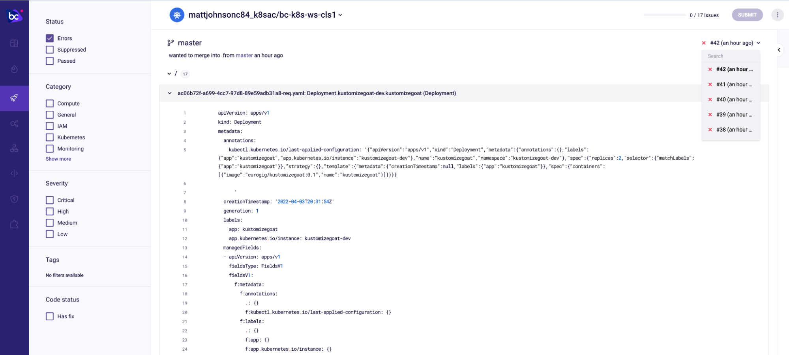
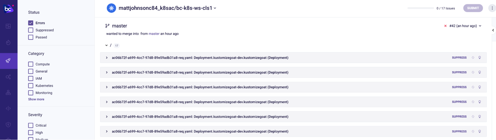
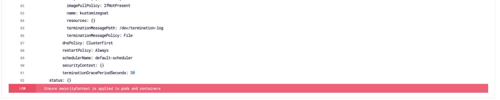
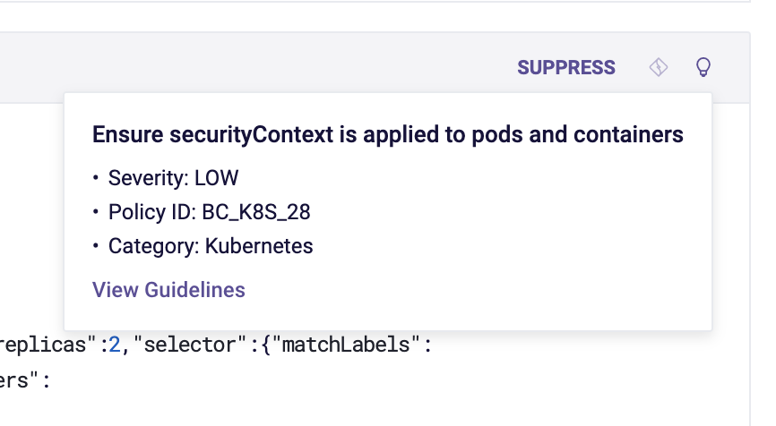
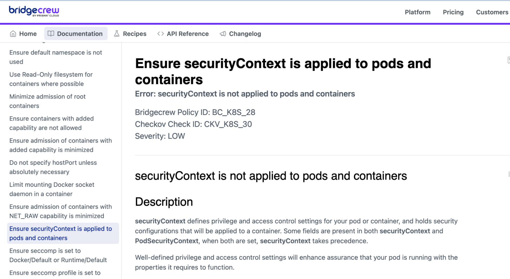

Every time ArgoCD had tried to deploy our Dev environment to the Kubernetes cluster, the cluster had been instructed to check the security posture of incoming kubernetes manifests with the Bridgecrew admission controller. 

Details of all the issues found with the dev deployment can be seen in this view, with filters for severity, tags, etc.

 \

It seems we have 17 detected issues on our Deployment object, and none on the Service object, which explains why this was successfully deployed in the dev environment, but the Deployment wasn't.

At the bottom of each item, we’ll see information as to which security issue caused the deployment not to make it into the cluster.

For example, one of the issues here is that we have no SecurityContext settings on our Pods or Containers within the Deployment.

We can bring up more information about the issue and guidance for each issue with the lightbulb symbol on the header of each issue.

Guidelines (in this case, linking to [https://docs.bridgecrew.io/docs/bc_k8s_28](https://docs.bridgecrew.io/docs/bc_k8s_28)) provide extra context for dev teams on each issue. 
 

