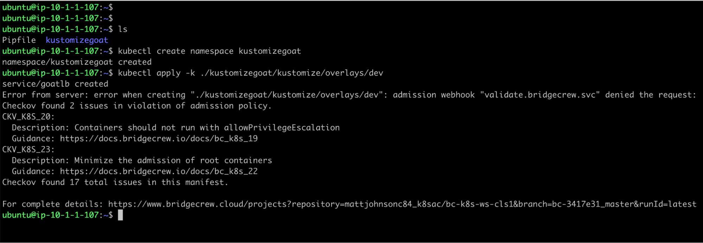
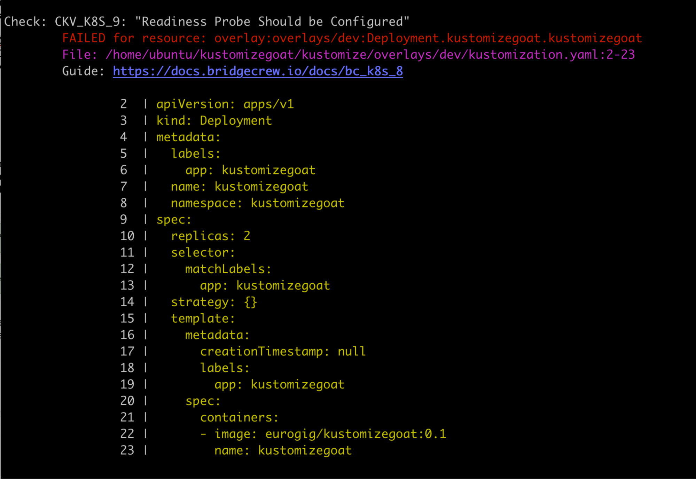
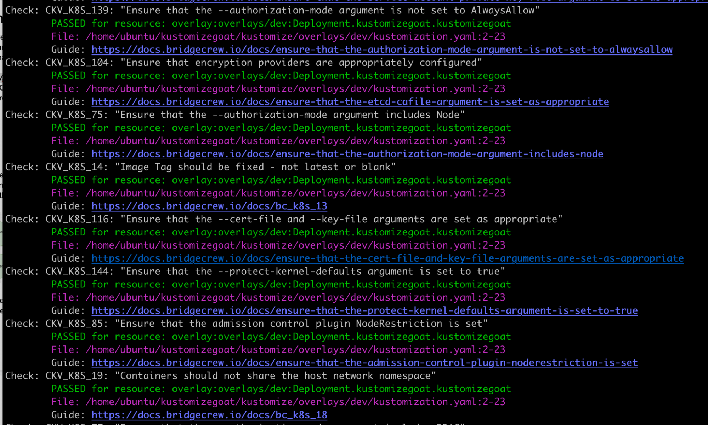

While doing things manually is *NOT* what we want for a DevSecOps pipeline, for the sake of understanding the current setup a little more, lets see what it looks like if the developer was to try and apply the dev environment directly to the kubernetes cluster using the CLI, `kubectl`.

This will render the kustomize template and pass it to the kubernetes API, we should see the same results from the API as we saw through Argo, with our admission controller rejecting the deployment…

```
kubectl create namespace kustomizegoat

kubectl apply -k ./kustomizegoat/kustomize/overlays/dev
```





## Unwrapping the Admission Controller: Checkov

As the admission controller is powered by our open source Infra-as-code scanning tool, checkov.io, we can simulate the failure even without having a kubernetes cluster, by having Checkov scan the local kustomize manifests.

To do this, try running `checkov -d ./kustomizegoat –framework kustomize` in the kustomize directory, you will see output on the CLI very similar to what we have already seen in Bridgecrew from the admission controller.

Here you will see *all* the policy results from Checkov for all of our overlays and base directories. The Admission controller has a configurable list of specific policies it rejects (high severity) where as this checkov output will show all severities!





