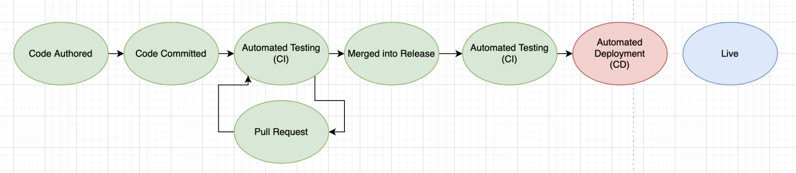
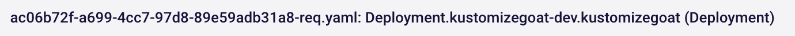

## Where are we now?

To summarize,  we now have a free admission controller installed into our Kubernetes cluster to prevent issues from being deployed. Let’s take a look at where all this is happening in the development cycle: 

So far, we’ve blocked the automated deployment (n the red oval). However, before we could block deployment, our team already spent a lot of time developing and testing the code we blocked. It would be great to spot issues earlier in the pipeline, so that we avoid the rework and duplicated efforts caused by the issues and blocked deployment.

Another thing to consider is that by the time we’re at the Kubernetes cluster, our alerts look like this:

That filename is produced by the Kubernetes admission controller rendering our template and checking it for errors. The output is not very developer friendly and loses a lot ofthe context of the original code repository. So, let's see what we can do to make the output more developer-friendly.