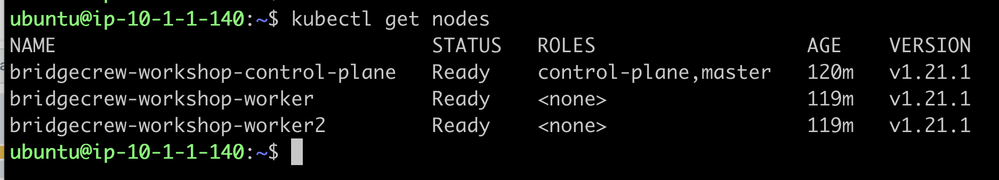
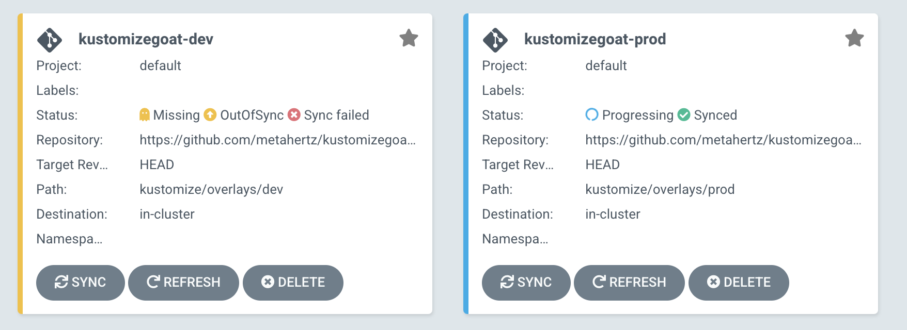
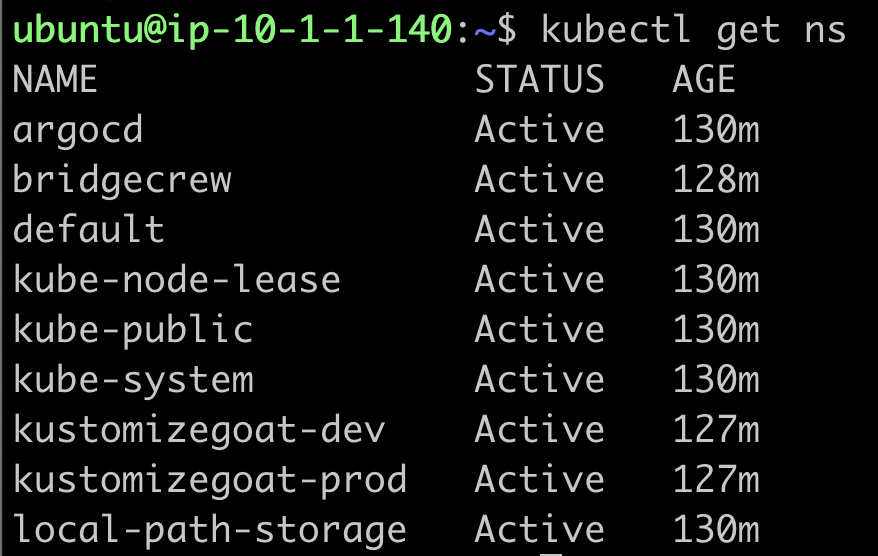
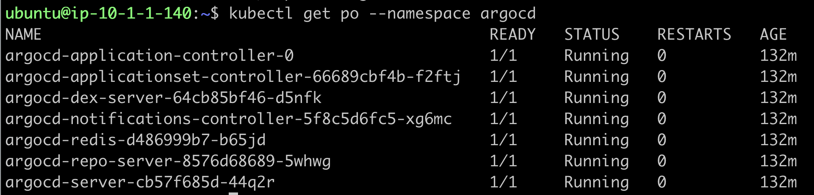
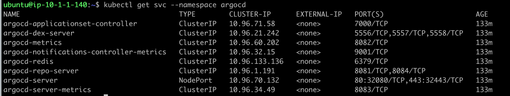

## The Scenario

Your workshop drops you into an example development team, at the start of their journey through the DevSecOps world! 

They already use ‘Infrastructure as Code’ to define their environments, and the deployment target is a Kubernetes cluster, which is also setup.





Their CD “Continuous deployment” tool is ArgoCD, which is configured to take any changes to in their main infrastructure GitHub branch, and apply those changes to the cluster, for both the Prod and Dev environments! \
 \




You have already briefly met the infrastructure as code repository holding these deployments, it’s the KustomizeGoat repository we all forked as part of the workshop setup, your fork is the thing powering these deployments into your cluster, so you can make your own changes as we dig deeper into this workshop.


## Let’s take a look around

### Kubectl 

You should already have access to your “KIND” Kubernetes cluster for this workshop, confirm that with the following command, showing our Kubenetes cluster nodes:


```

Kubectl get nodes

```


We can also take a look at the existing Namespaces running on our cluster: 

```

Kubectl get ns 
```





Here we can see a number of namespaces including one for our ArgoCD continuous deployment system, which itself is running on our cluster and monitoring our git repo for changes to our infrastructure configuration.

Lets take a look at the pods and services in that namespace

``` 
Kubectl get po –namespace argocd

```





Looks like argoCD is up and running, let's have a look at the services for howto access it: 




It seems the web interface “argo-server” has a NodePort configuration, which means we should be able to use the public IP of our KIND host on either HTTP port `32080` or HTTPS port `32443` to access the interface.

{}
<p style='text-align: left;'>
Access to these ports have been locked down to your public IP address provided during cloudformation setup, if your public IP has changed or if you cannot access the interface based on the details given in the workshop setup, please reach out to your workshop host.
</p>
{}


In the next step, we’ll go ahead and explore the ArgoCD setup.
