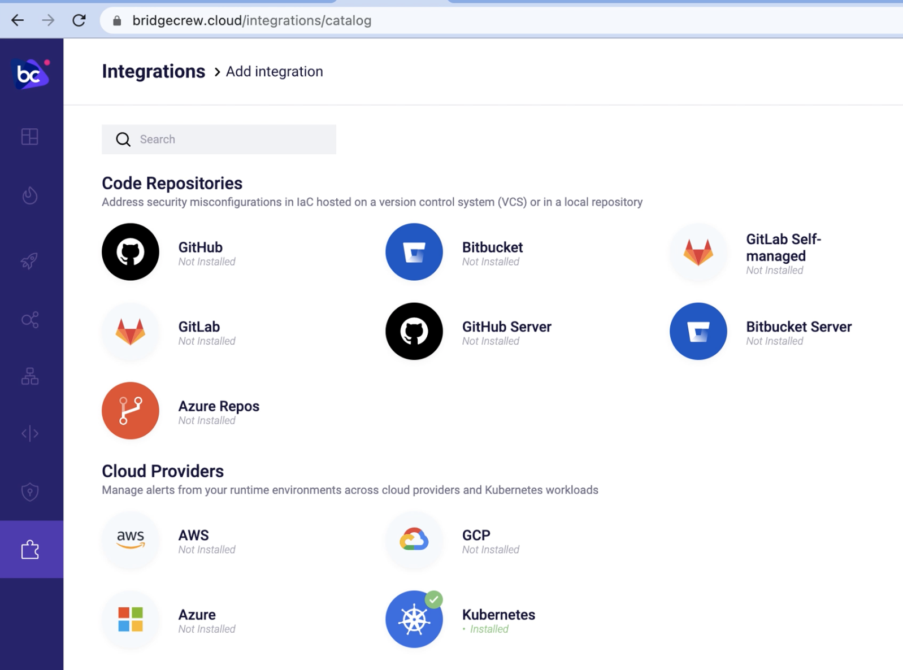
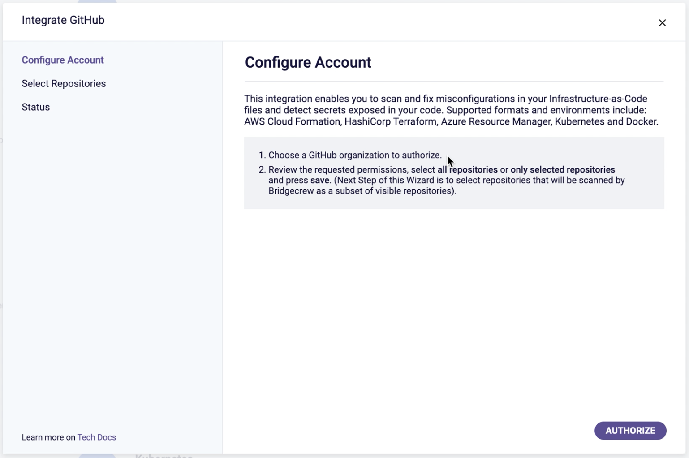
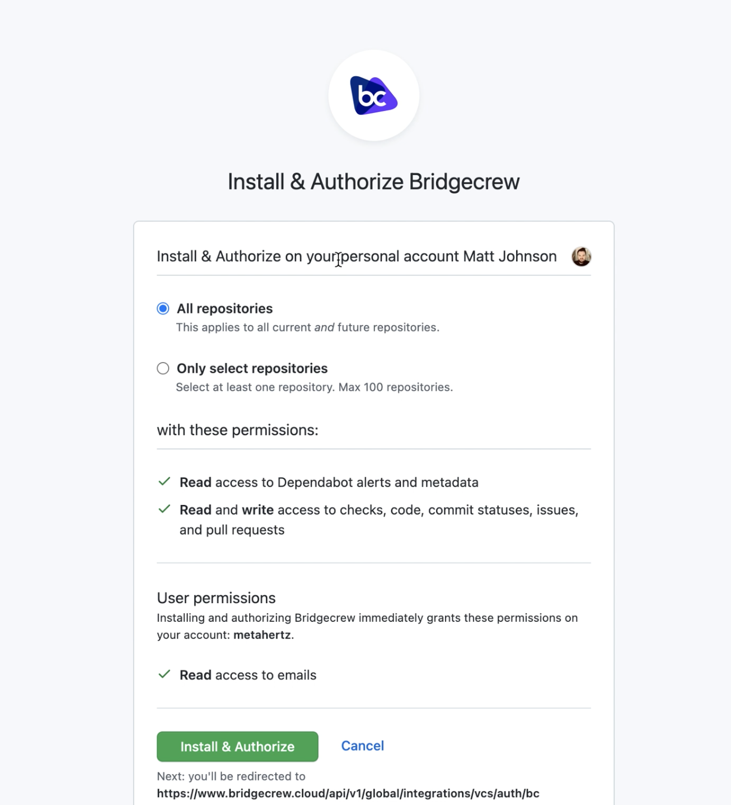
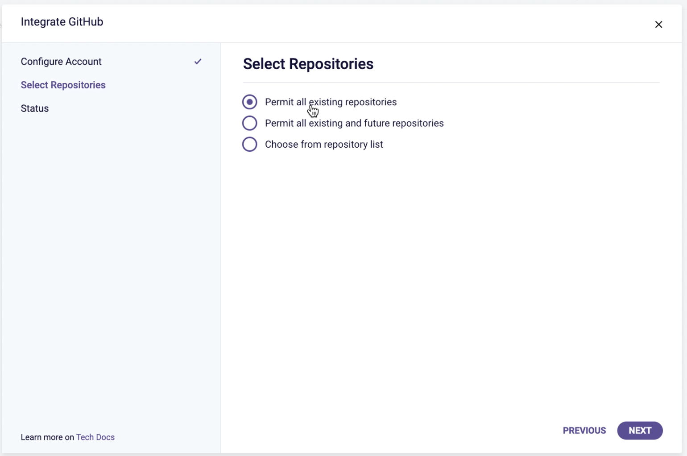
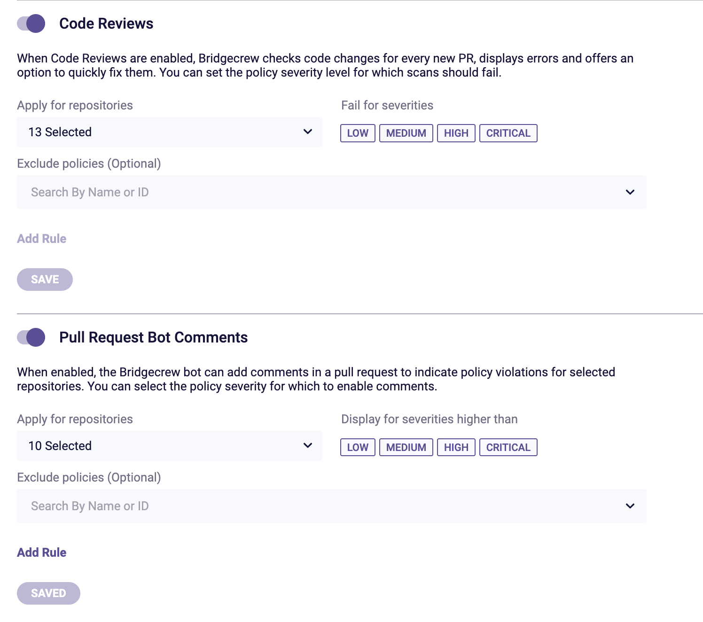

## Integrating Bridgecrew with GitHub

To enable automated PR scanning on your repositories, goto the **Integrations **page at the bottom of the icon bar on the left.

Then, click on **New Integration** and select **GitHub** from the **code repositories** options

A popout dialog will allow you to Authorize with your GitHub account and chose the repositories you want Bridgecrew to scan, click **Authorize **to be redirected to GitHub to complete this.

If you have access to multiple GitHub organizations, you’ll be asked to select the one you wish Bridgecrew to access, then will be able to select all or specific repositories.

You’ll then be redirected back to the Bridgecrew interface, where again you will be able to select specific subsets of repositories if needbe.

### 

Thats it, Bridgecrew is now configured to scan your Git repo’s for Infrastructure as Code issues, as well as automatically scan Pull Requests into your repo’s for potential issues. 

### Check PR tagging settings  

While we are here, click on your username in the bottom left of the Bridgecrew Dashboard, and select `Code Repository Settings` from the user options.

 
Here you will find a section called `Code Reviews` and `Pull Request Bot Comments`. Make sure both options are on in order to have Pull Requests automatically scanned and annotated, you can also select specific issue severity at a global level here for annotated PR’s. 

