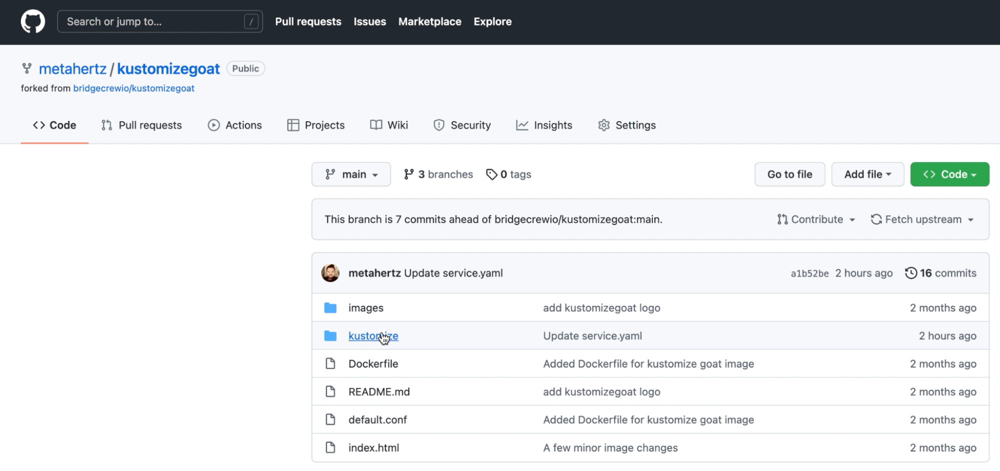
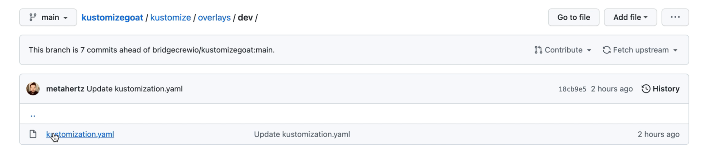
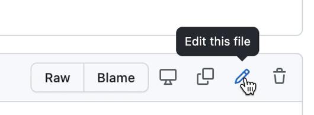
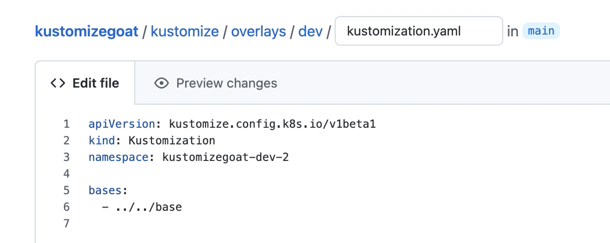
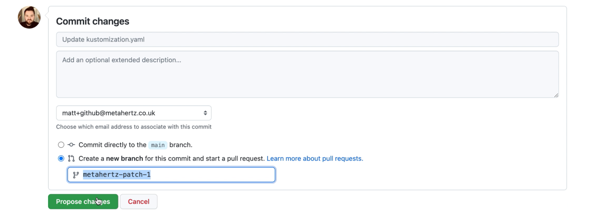
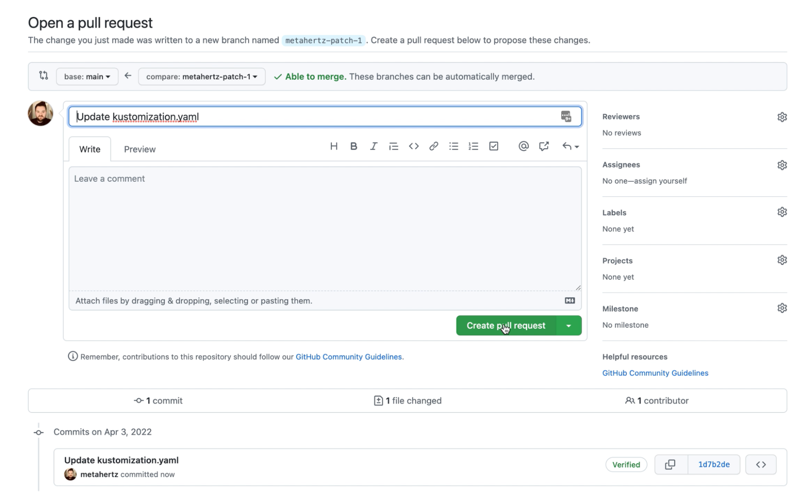
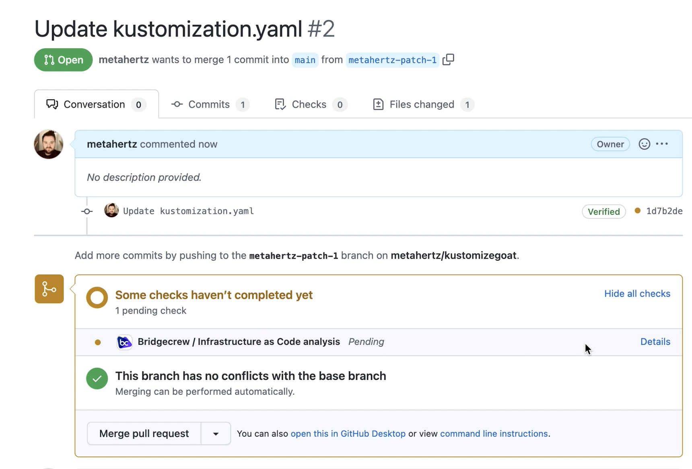

### Creating Infrastructure with a Pull Request!

To see our new security controls in action, let's create a pull request to modify our Dev environment configuration!

In GitHub, on your fork of **KustomizeGoat**, click into the **kustomize** > **overlays** and **dev** directories: 

Click on the **kustomization.yaml** file to open it in the GitHub web viewer, and click edit

Lets make a simple change right now, and modify the name of the dev Namespace

Ensure you select *Create a new branch for this commit* and propose the change.

This will automatically queue up a new pull request with your change included, on the next page, press *Create Pull Request*

The pull request will load, and you will immediately see Bridgecrew checks about to run against the proposed infrastructure changes. \

