##  PR scanning versus CI

Our pull request annotations give good collaborative team feedback to the development teams involved, however, without extra configuration, the feedback is ecactly that, just feedback.

CI pipelines allow us to actually block (by failing) a build or change from making it from a development branch, into a main or production branch, while these two types of scans overlap, it is worth showing how you can configure Bridgecrew to sit within any CI pipeline to perform this function.

As we are in a GitHub source control environment, we'll configure GitHub Actions to block builds, giving us another defensive checkpoint.


## Configure the Bridgecrew GitHub Action integration.

To enable automated PR scanning on your repositories, goto the **Integrations **page at the bottom of the icon bar on the left.

Then, select **New Integration** and select **GitHub Actions** from the **CI/CD Systems** section


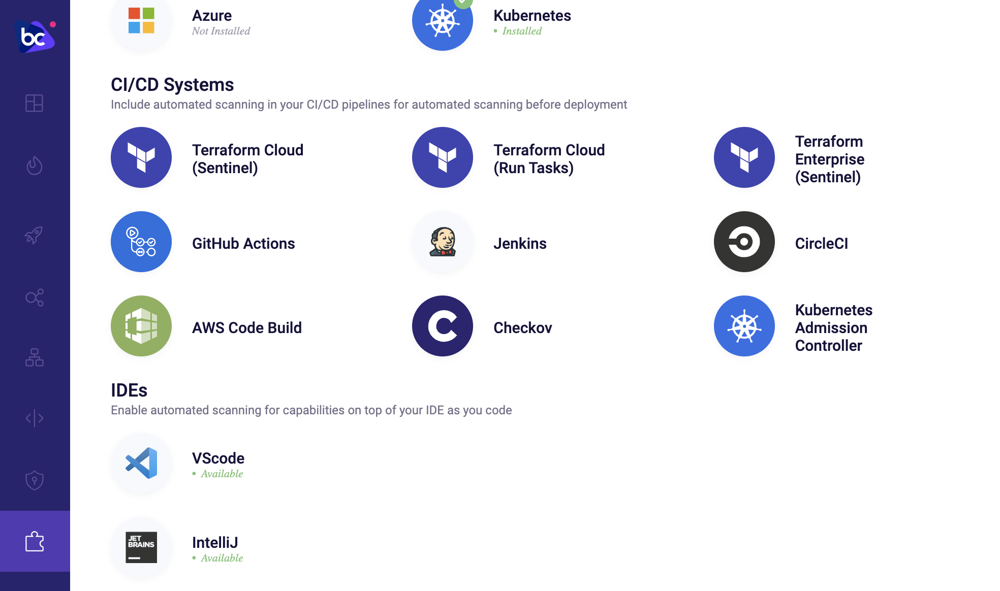


A pop-up dialog box will allow you to create a new Bridgecrew API token that GitHub Action will use. Give the token a name and click next twice.


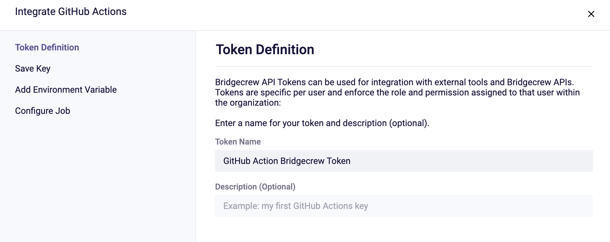


Follow the instructions on the “Add Environment Variable” page to ensure the API key is stored in our GitHub KustomizeGoat repository as a secret. 


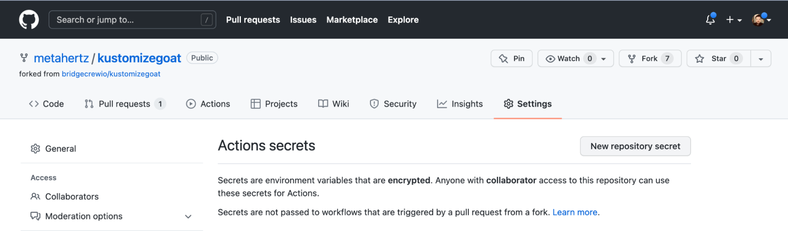


Within the GitHub repository settings, navigate to **Security > Secrets** and select **Actions**. From the **Actions secrets **page above, select **New repository secret** and fill in the relevant details.


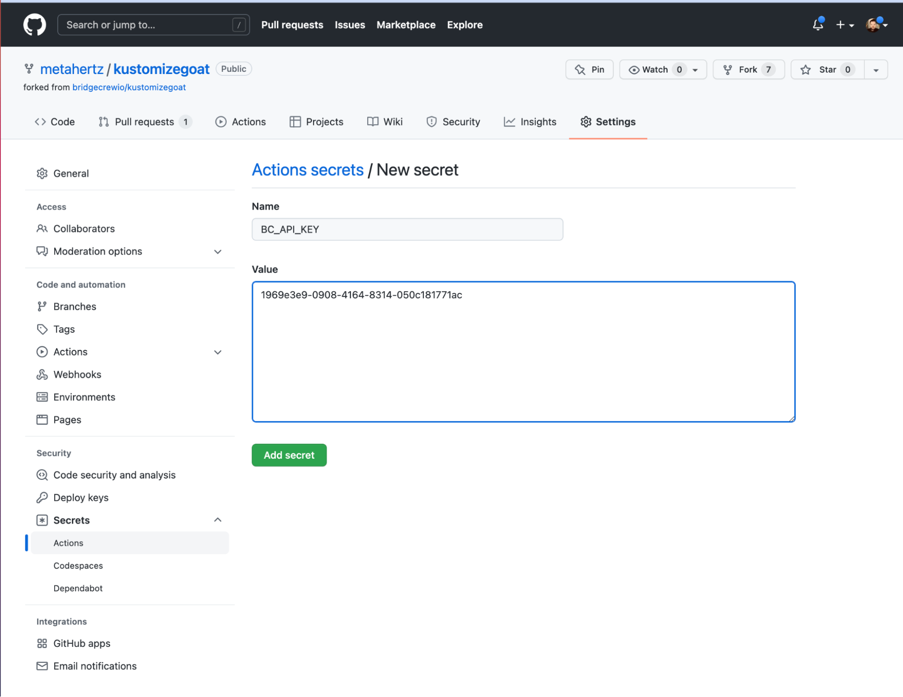


Finally, select **Add secret** and you will see the new secret listed in the **Actions secrets** page.


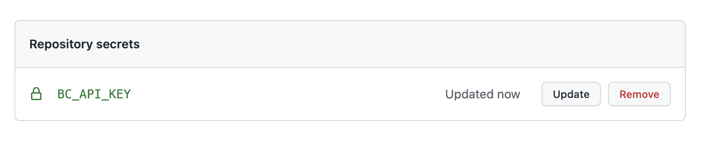


Back in Bridgecrew, select **Next** to access an example GitHub Action step. Then select **Done** to exit the new integration setup.


## Adding the action to our GitHub repository

GitHub Actions are workflow files within your code repository under the .github/workflows directory. To create an action, you’ll need to add a new file to this directory. If you already have workflows and are familiar with the workflow file format, you can add the Bridgecrew step section example we saw in the integration setup page to your own workflows for the same results.

To create a new workflow, select *Actions* within your *KustomizeGoat* forked repository, and then select *“set up a workflow yourself”* to create a new, blank workflow.


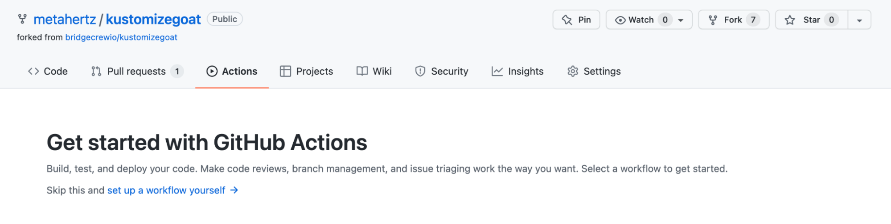


Name the new file bridgecrew.yaml.
 

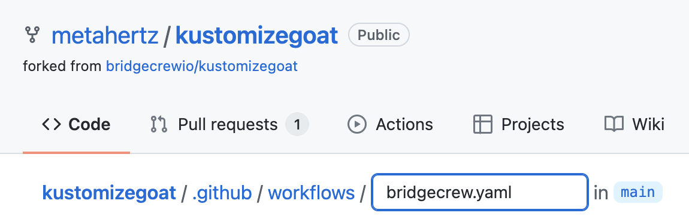
 


Now we’ll replace the sample contents with the workflow template provided below. This takes the jobs section provided by the Bridgecrew integration instructions and wraps it in a fully functional GitHub Actions definition.


```
name: Bridgecrew
on:
  pull_request:
  push:
    branches:
      - main
jobs:
  scan:
    runs-on: ubuntu-latest
    strategy:
      matrix:
        python-version: [3.8]
    steps:
    - uses: actions/checkout@v2
    - name: Run Bridgecrew 
      id: Bridgecrew
      uses: bridgecrewio/bridgecrew-action@master
      with:
        api-key: ${{ secrets.BC_API_KEY }}
```


Select *“Start commit”* at the top right once you’ve added the workflow file contents.


Finally, save the new workflow file into your code repository by selecting *Commit new file*.


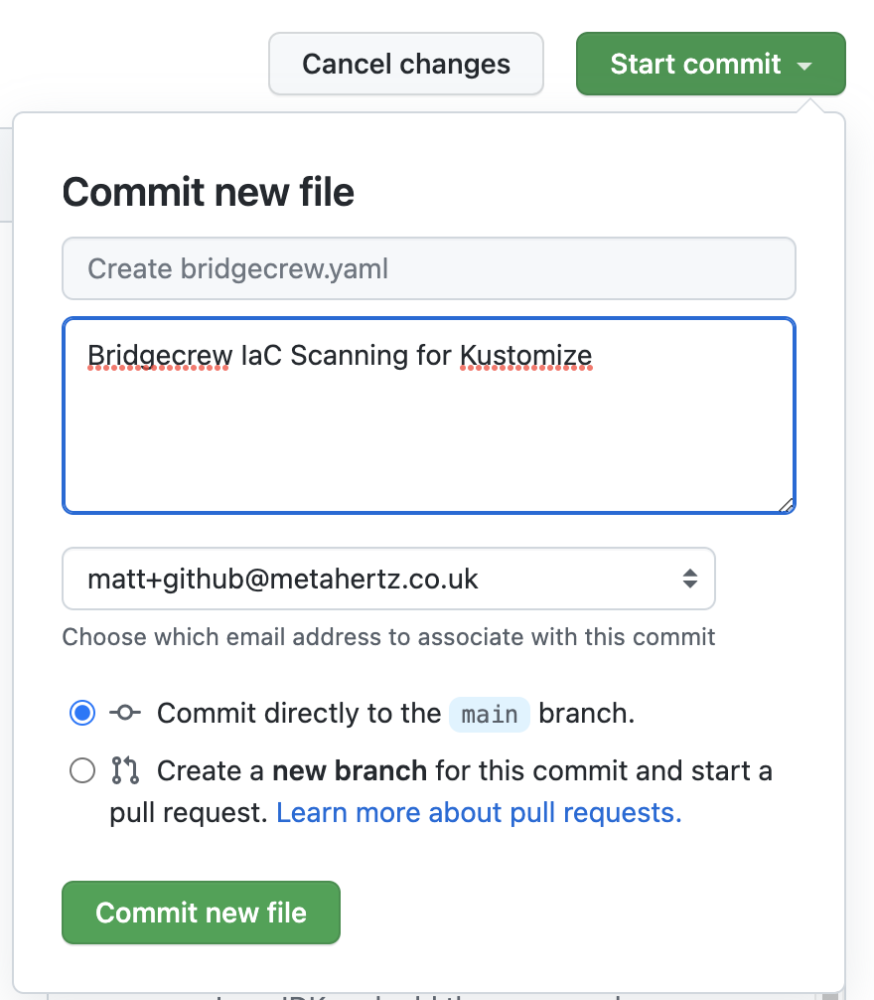


Notice how the action was configured for pull requests and the main branch?

The GitHub Action will start running Bridgecrew scans against the latest commit in your KustomizeGoat repository. You can see this by selecting the “Actions” page within your forked repository in GitHub. Now there's a new workflow, titled Bridgecrew, and the job that was kicked off by merging in the workflow yaml file.


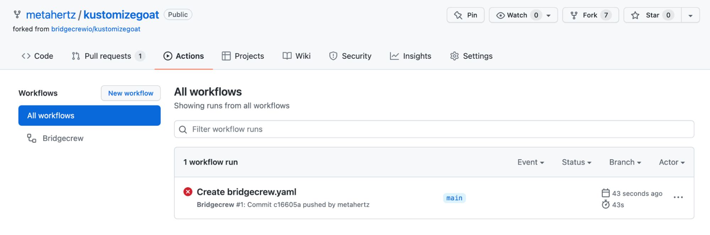


Selecting this job will allow you to view the status and logging output from the pipeline, where Checkov will output any violations found in the KustomizeGoat codebase.

Rather than digging through the job logs, the action also outputs security annotations for each violation found in the “*Security*” tab of the repository on GitHub. Now we get a much clearer view of the `main` branch:


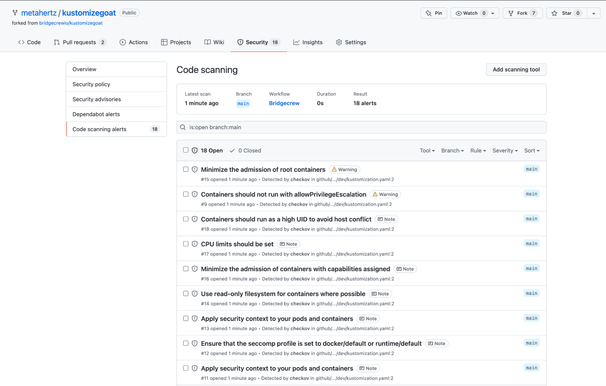


The full output can always be found in the *Actions* tab, by drilling down into a specific run.


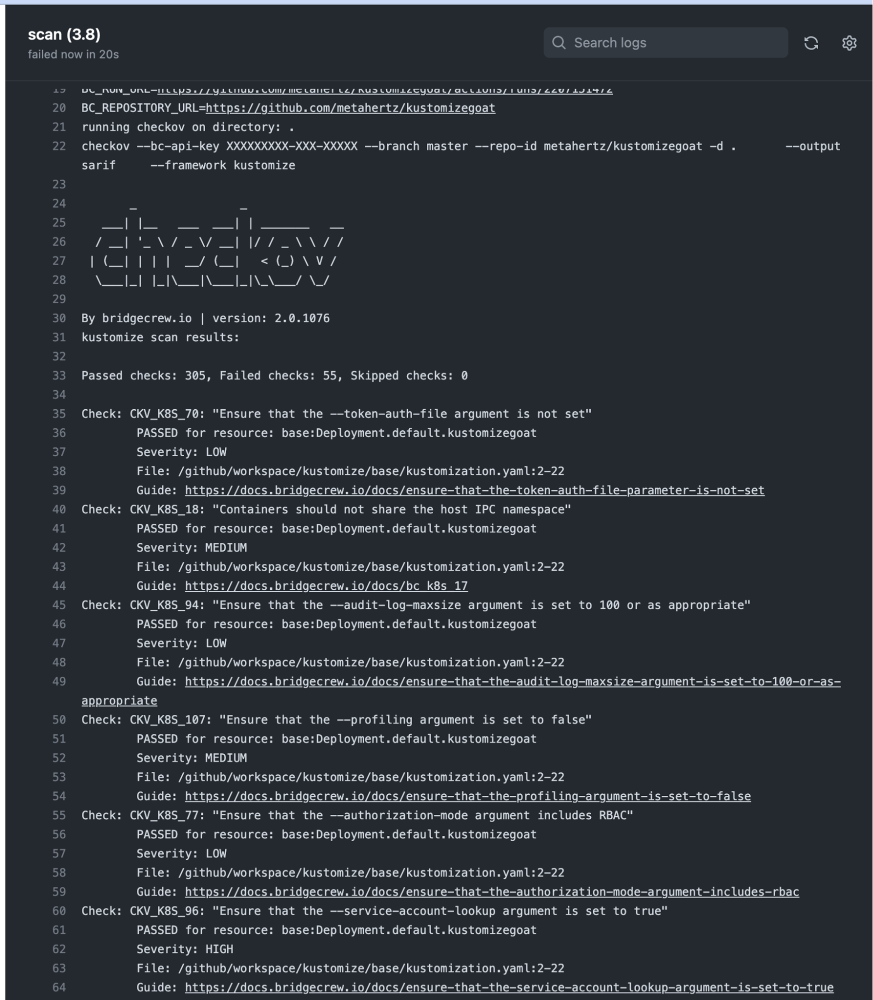


The Bridgecrew GitHub Action can either pass all builds or block builds based on policy violations. When Bridgecrew GitHub Action is configured to pass all builds, it serves as an alerting tool that increases visibility of policy violations. When it is configured to block builds that are violation of policies, Bridgecrew GitHub Action serves as guardrails to prevent misconfigured templates from entering the repository. You can change this to not fail a build by adding `soft_fail: true` setting in the `with` block.

All CI scans are also reported into the Bridgecrew dashboard as **Code Reviews:** 
 


We'll now block our CI pipeline from continuing if we have IaC policy failures.

