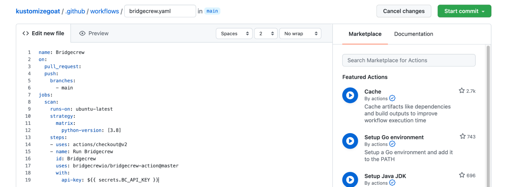
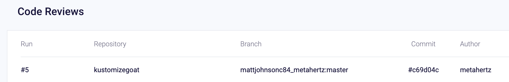

##  PR Scanning vs CI

Our pull request annotations give good collaborative team feedback to the development teams involved, however, without extra configuration, the feedback is ecactly that, just feedback.

CI pipelines allow us to actually block (by failing) a build or change from making it from a development branch, into a main or production branch, while these two types of scans overlap, it is worth showing how you can configure Bridgecrew to sit within any CI pipeline to perform this function.

As we are in a GitHub source control environment, we'll configure GitHub actions to block builds, giving us another defensive checkpoint.


## Configure the Bridgecrew GitHub action integration.

To enable automated PR scanning on your repositories, goto the **Integrations **page at the bottom of the icon bar on the left.

Then, click on **New Integration** and select **GitHub Actions** from the **CI/CD Systems** section


A popout dialog will allow you to create a new Bridgecrew API token to be used by the GitHub Action, give the token a name and click next, twice.


Follow the instructions on the “Add Environment Variable” page to ensure the API key is stored in our Github KustomizeGoat repository as a secret. 


Within the GitHub repository settings, find **Security > Secrets** and select **Actions** then from the **Actions secrets **page above, select **New repository secret** and fill in the relevant details.


Finally, click **Add secret**, you will see the new secret listed in the **Actions secrets** page.


Then back in Bridgecrew, click **Next** to access an example GitHub Action step, then click **Done** to exit the new integration setup! 


## Adding the action to our github repository.

Github Actions are defined as workflow files within your code repository under the .github/workflows directory. To create an action, you’ll add a new file to this directory. If you already have workflows and are familiar with the workflow file format, you could add the Bridgecrew step section example we saw in the integration setup page to your own workflows for the same results.

To create a new workflow, select *“Actions”* within your *KustomizeGoat* forked repository, and then click on *“set up a workflow yourself”* to create a new, blank workflow.


Name the new file bridgecrew.yaml  
 


 


Now we’ll replace the entire example / documentation contents shown by default with the workflow template provided below. This takes the jobs section provided by the Bridgecrew integration instructions and wraps it in a fully functional GitHub Actions definition.


```
name: Bridgecrew
on:
  pull_request:
  push:
    branches:
      - main
jobs:
  scan:
    runs-on: ubuntu-latest
    strategy:
      matrix:
        python-version: [3.8]
    steps:
    - uses: actions/checkout@v2
    - name: Run Bridgecrew 
      id: Bridgecrew
      uses: bridgecrewio/bridgecrew-action@master
      with:
        api-key: ${{ secrets.BC_API_KEY }}
```


Select *“Start commit”* at the top right once you’ve added the workflow file contents.





Finally, save the new workflow file into your code repository by selecting *Commit new file*.


Notice how the action was configured for Pull Requests and the main branch?

The GitHub Action will start running Bridgecrew scans against the latest commit in your KustomizeGoat repository. You can see this by selecting the “Actions” page within your forked repository in GitHub. You will see a new workflow, titled Bridgecrew, and that the job that was kicked off by merging in the workflow yaml file.


Selecting this job will allow you to view the status and logging output from the pipeline, where checkov will run and output any violations found in the KustomizeGoat codebase.

Rather than digging through the job logs, the action also outputs security annotations for each violation found in the “*Security*” tab of the repository on github, here we get a much clearer at-a-glance view of the `main` branch:


The full output can always be found through the *Actions* tab and drilling down into a specific run.


The Bridgecrew GitHub Action can either pass all builds or block builds based on policy violations. The first acts as just an observability and alerting tool, the second as guardrails for developers to prevent misconfigured templates from making it into the repository. You can change this to not fail a build by adding `soft_fail: true` setting in the `with` block.

As with all Bridgecrew integrations, all CI scans are also reported into the Bridgecrew dashboard as **Code Reviews:** 
 




Thats it, We'll now block our CI pipeline from continuing if we have IaC policy failures.

