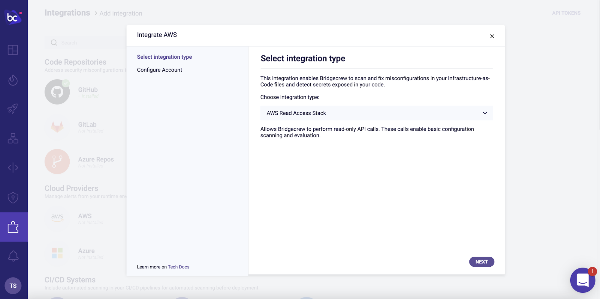
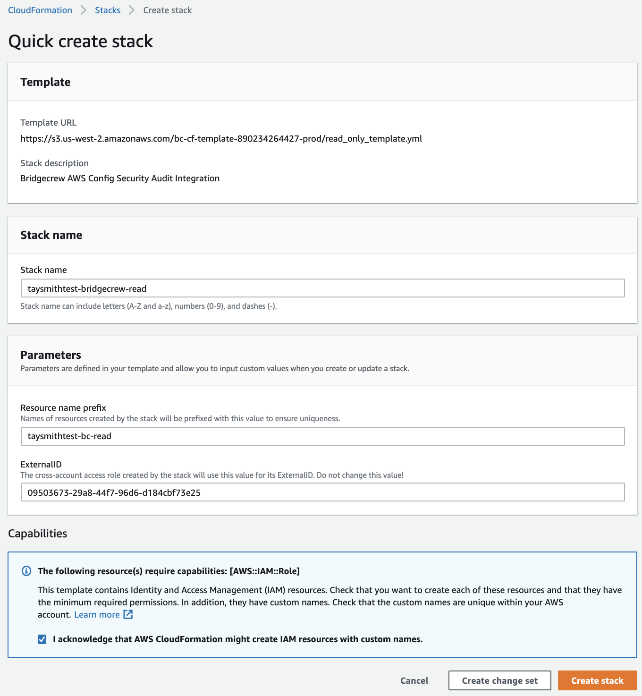
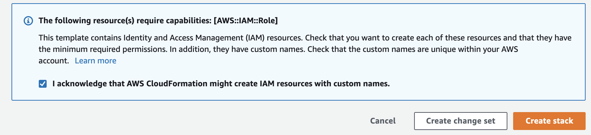
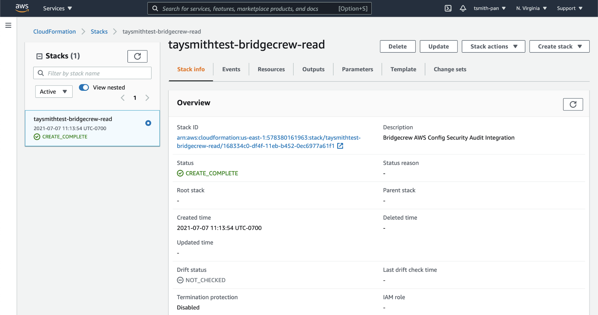
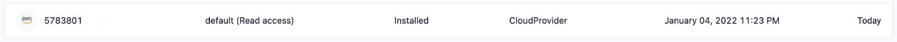
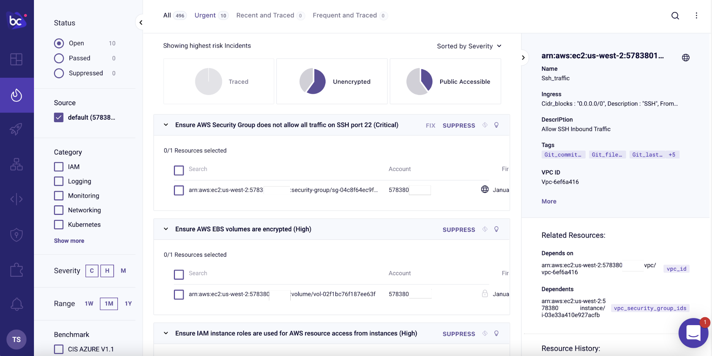
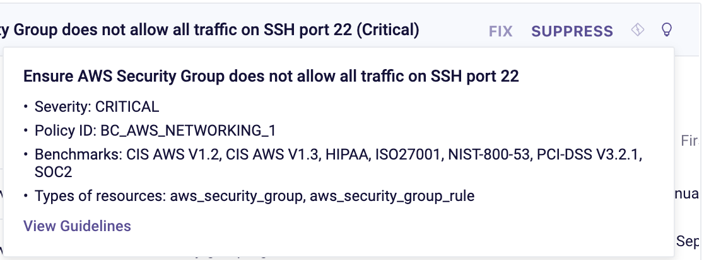
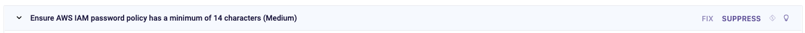
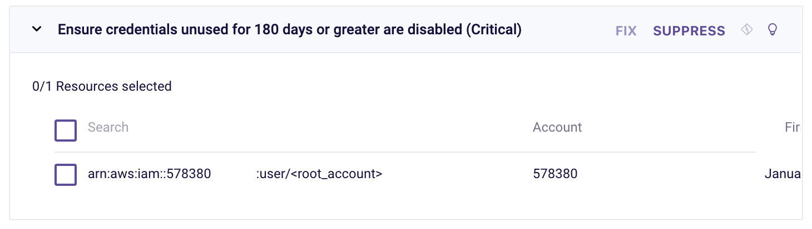

### AWS runtime

Greenfield infrastructure as code deployments are unfortunately not very common. In reality, AWS accounts typically have objects that were created manually. Transitioning to IaC is rarely a one-and-done affair, so you may have objects in your AWS accounts that are managed by a team that has not yet made the switch to IaC.

That’s why it’s especially important to scan objects directly in your AWS environment and your Terraform templates in Git or as part of the CI/CD pipeline, as shown earlier.

Bridgecrew provides runtime scanning via an AWS integration, which provides full coverage of infrastructure security both before and after deployment.

#### AWS runtime integration

To enable runtime scanning of your AWS account, go to the [Integrations Tab](https://www.bridgecrew.cloud/integrations/catalog/aws-api-access) and select “AWS” under the Cloud Providers section. Choose the `AWS Read Access Stack` and click *“Next”*.

Read-only access is scoped as minimally as possible in order to give Bridgecrew only the necessary access to scan your AWS accounts.

Click *Launch Stack* to enable the integration.

You will be redirected to your AWS account to spin up the CloudFormation stack to authorize the integration:

Check the checkbox to approve the IAM permission creations via our CloudFormation stack, and click Create Stack:

You can track the progress of the stack creation within your AWS account.

Once completed, you’ll see the integration in the Bridgecrew Integrations dashboard:

That’s all it takes to connect your AWS account to Bridgecrew for continuous cloud security monitoring and compliance benchmarking.

## Exploring runtime violations

With the AWS account connected, you’ll start to see runtime violations in the [Incidents](https://www.bridgecrew.cloud/incidents) page.

Unlike the rest of this workshop, the information displayed in your Bridgecrew Dashboard may differ from the images below, as no two AWS accounts will have the same content.

We can browse through all the security and compliance violations detected in our live AWS account. We can filter based on Status, Source, Category, Severity, Time Range, Benchmarks, and Tags. There are “low hanging fruit” filters for traced resources, unencrypted resources and publicly accessible resources.

In the example below, we can see a security group with an open port 22 to all traffic:

Further context on the issue and remediation options is also available by clicking on the lightbulb and on the **Guidelines** link.

Bridgecrew sends alerts on account-wide settings such as user password policies. The platform also sends alerts on informational best practices, such as tagging each resource with ownership or weak account password policies:

#### Identity and Access Management (IAM) Insights

Bridgecrew also analyzes AWS IAM roles, permissions, groups, and policies to identify unused and overly-permissive configurations. You can use the filter pane to only show IAM specific issues, for example:

