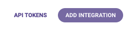
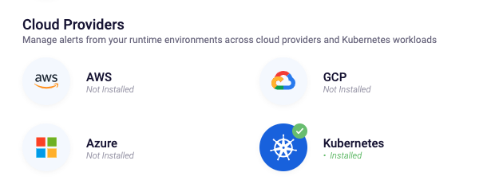
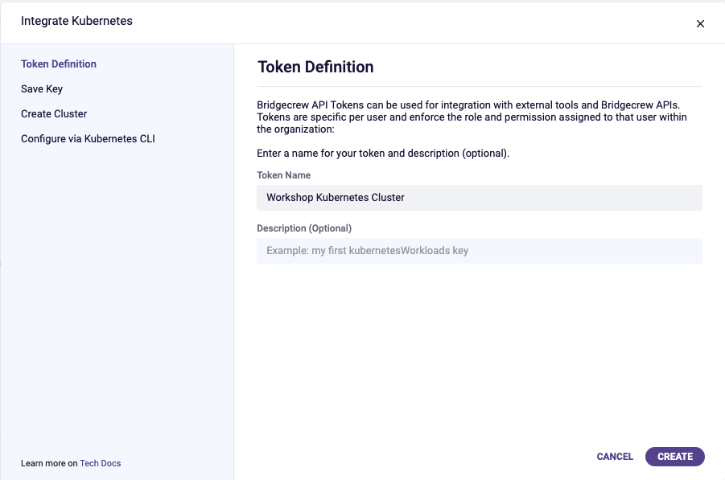
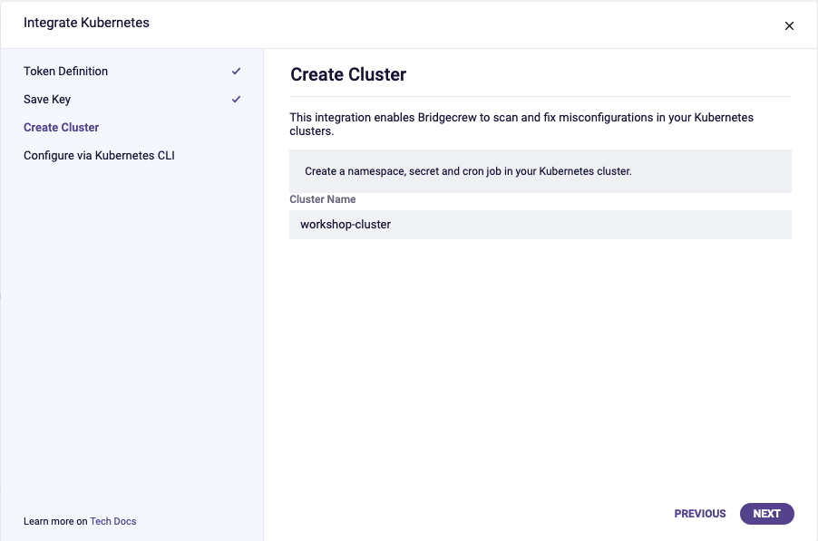
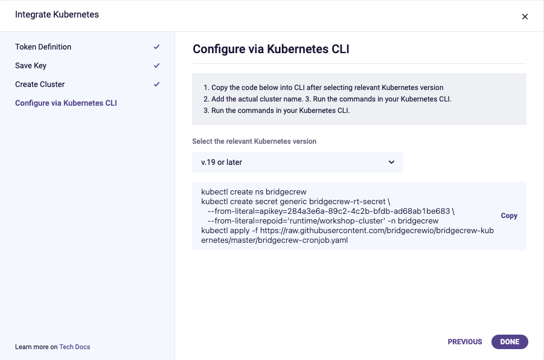
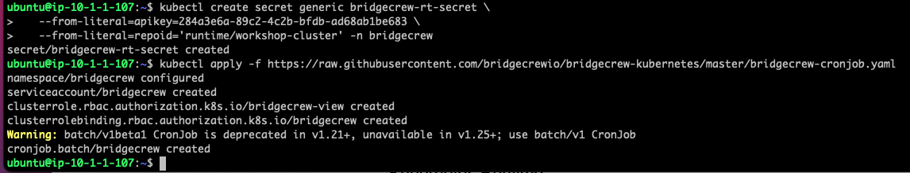
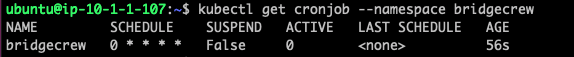
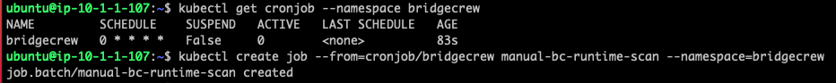
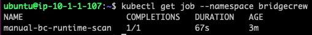
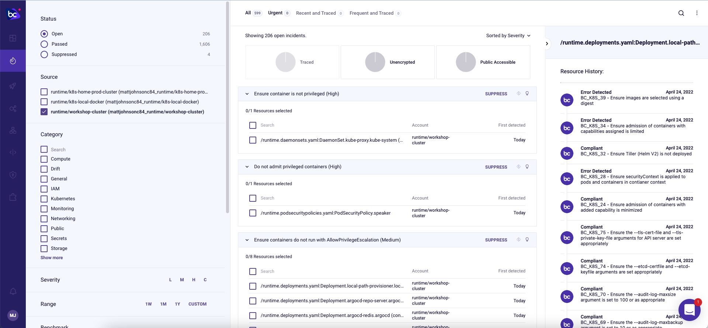

## Kubernetes Runtime

Now let’s add insights into our Kubernetes workloads that are already running.

In the integrations page, click *ADD INTEGRATION*

Then, from the *Cloud Providers* section, choose **Kubernetes**:

Create a new API key for the integration and click **CREATE**:

Give the cluster a name. This name is used to identify the Kubernetes cluster within Bridgecrew. For example, use `workshop-cluster`.

Next, select your Kubernetes version (>0.19 or &lt;0.19) and copy the provided kubectl commands:

Now, we simply run the kubectl commands provided to enable the runtime integration in our Kubenetes cluster: 

By running `kubectl get cronjob --namespace bridgecrew`, we can see the Bridgecrew runtime agent scheduled to run and keep Bridgecrew updated with the runtime posture of the cluster.

Instead of waiting for the first scheduled run, we can manually run the job the first time so we can see data in the Bridgecrew dashboard: 

`kubectl create job --from=cronjob/bridgecrew manual-bc-runtime-scan --namespace=bridgecrew`

We will now start to see data under the incidents tab in the Bridgecrew dashboard. You can check on the status of the job's instance with the `kubectl get job -n bridgecrew` command.

The **Incidents** tab covers runtime-related events. In this tab we can filter on our new cluster name, to see issues with the current running pods and services.

Some of these are core Kubernetes services which require more access than regular hosted applications, so we’ll be looking at how to create suppression rules for certain items. We'll also fix our buggy dev environment code in future modules.

### Runtime scanning is enabled. Congratulations!
