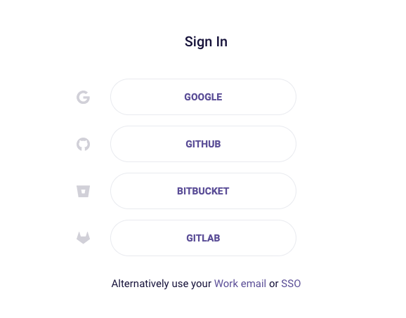
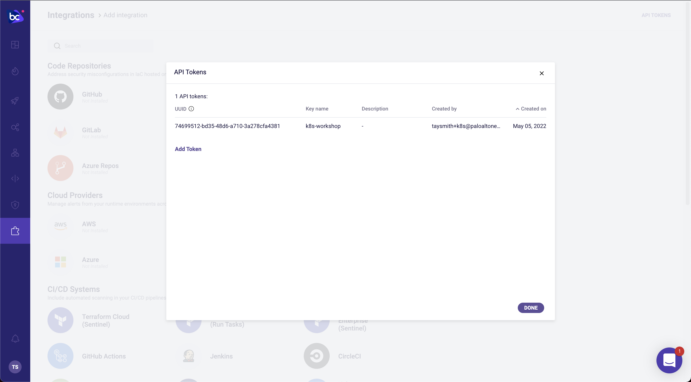

## A free Bridgecrew account

The Bridgecrew platform will give us visibility, solutions, and alerts from the first line of Kubernetes manifest all the way through to checking the running cluster’s security posture. Sign up or log in to an existing account at [https://bridgecrew.cloud](https://bridgecrew.cloud)

### Generate a Bridgecrew API key

Throughout this tutorial, you’ll need to use the Bridgecrew API token. You can [access it here](https://www.bridgecrew.cloud/integrations/catalog) or in your Bridgecrew account by navigating to the **Integrations** tab and selecting API Token. Add a token for the workshop and save it in your notes for later use. 

