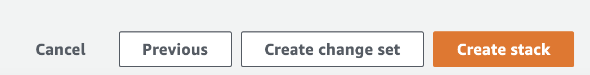

##  The automated AWS workshop environment

To pre-build this environment for each workshop attendee, we'll run some CloudFormation within our AWS account.

### Setting up the workshop environment via CloudFormation
	
1. Clicking the following link will open CloudFormation and pre-fill the template source from Amazon S3: [https://us-west-2.console.aws.amazon.com/cloudformation/home?region=us-west-2&skipRegion=false#/stacks/create/review?templateURL=https://kubernetes-workshop-cloudformation.s3.us-east-2.amazonaws.com/workshop-init-cloudformation.yaml&stackName=bridgecrew-workshop](https://us-west-2.console.aws.amazon.com/cloudformation/home?region=us-west-2&skipRegion=false#/stacks/create/review?templateURL=https://kubernetes-workshop-cloudformation.s3.us-east-2.amazonaws.com/workshop-init-cloudformation.yaml&stackName=bridgecrew-workshop)

2. Fill out the required parameters described below. these will enable CloudFormation to set up the environment without manual steps later in the workshop!

When prompted, simply enter your current [public IP address](http://whatismyip.com/) from wherever you are attending this workshop. We will lock down certain public service access to this IP for security. You can edit this later if needed.

Add this IP into the ‘YourPublicIP’ field: 

Enter your Bridgecrew API key from your free Bridgecrew account in the `UserBridgecrewAPI` field.

5\. Select “NEXT”. There are no further configuration options needed, `select the checkbox` to confirm IAM roles will be created through this automation, then select `Create stack` Click through to create the stack.

#### Verify Cloud9 environment access

Finally, lets check on the environment that CloudFormation has built for us. 
Click here: [https://us-west-2.console.aws.amazon.com/cloud9/home/shared?region=us-west-2](https://us-west-2.console.aws.amazon.com/cloud9/home/shared?region=us-west-2) to load the *Cloud9 Environments* within your AWS account. You will see a single `bridgecrew-workshop` environment which our automation has created!

Click *Open IDE*. You will be taken to an environment which we will use for the rest of the workshop.

* The file browser down the left hand side already has your fork of KustomizeGoat available.
* The terminal window along the bottom of the browser tab is within our kubernetes cluster, `kubectl`, `checkov` and other commands needed for the workshop will work out of the box.
* You can open/edit files by double clicking on a file within the file browser from the left, just like a locally installed IDE.

If you have any issues accessing this environment, let your workshop host know.
