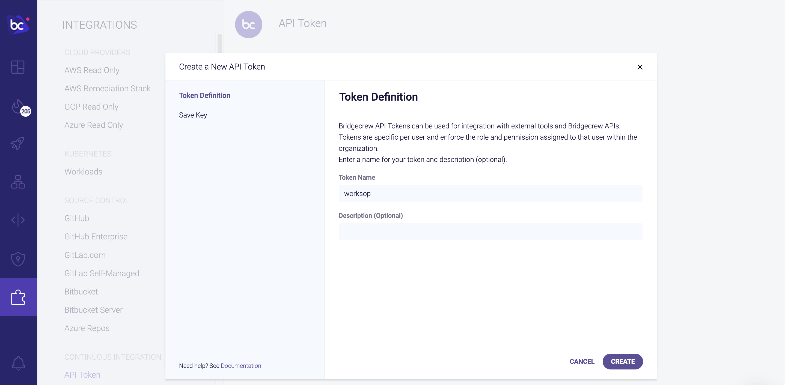

---
title: "Bridgecrew setup"
chapter: false
weight: 7
pre: "<b>3.3 </b>"
---


You’ll need to sign up for a free Bridgecrew account to follow along with this tutorial. You can sign up for a free account [here](https://bridgecrew.cloud).


### Checkov

In this tutorial, we’re also going to use [Checkov](https://www.checkov.io). Checkov works on Windows, Mac, and Linux. You can install it with pip:

```bash
pip3 install checkov
```

If installing globally on your system (not in a python venv or pipenv) you may need to have permissions to write the libraries to the necessary locations, ie:

```bash
sudo pip3 install checkov
```

If you run into problems, try the [alternate install instructions](https://docs.bridgecrew.io/docs/ingesting-scan-data#installation).


### Bridgecrew API token

Throughout the tutorial, you’ll need to use the Bridgecrew API token. You can access [it here](https://www.bridgecrew.cloud/integrations/api-token) or in your Bridgecrew account by navigating to the Integrations tab and selecting API Token.


