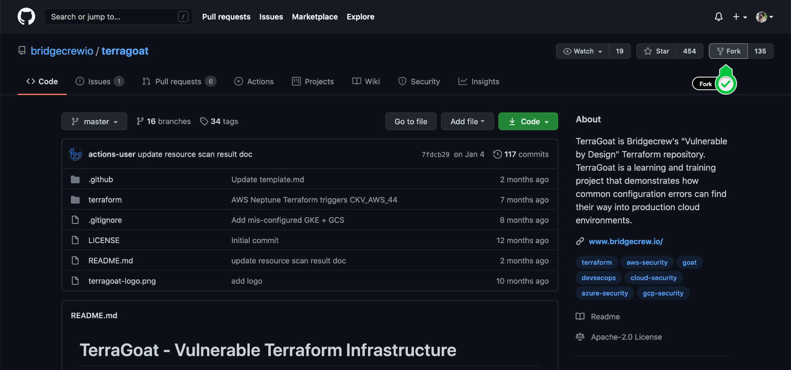
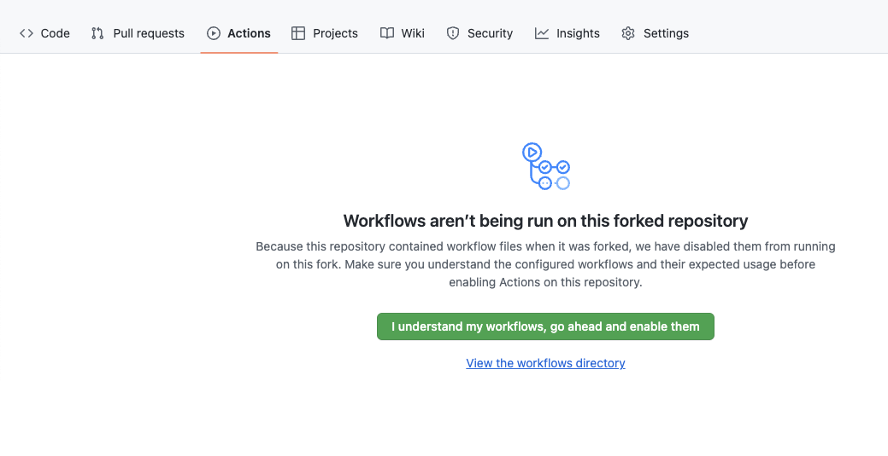
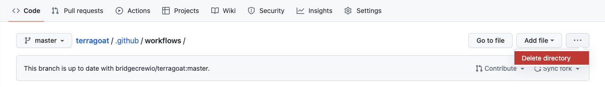
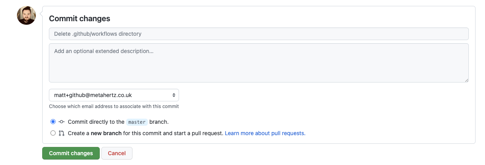

## Vulnerable-by-design demo repository setup

This workshop uses our vulnerable-by-design Terraform project, [TerraGoat](www.github.com/bridgecrewio/terragoat), so that you can scan and automate infrastructure code without the added friction of integrating your own code.

### Fork the TerraGoat repository on GitHub

To set up your demo environment, we're going to fork the TerraGoat repository.

Head over to the [TerraGoat](https://github.com/bridgecrewio/terragoat) repository and fork it using the button in the upper right corner.



If you have multiple organizations, GitHub will ask which of your orgs to fork into. Choose your personal account via your username in the list to fork the repo.


### Remove existing GitHub Actions

We will want to remove the existing GitHub actions which came over in the Fork, so that we can build our own CI pipelines in this workshop!

To do this, go to the `Actions` tab, then click on `Go to workflow directory`.


Finally, chose `Delete Directory` from the options on the right and commit the changes.





### Clone a local copy

To get a local copy of the TerraGoat repo, simply clone your fork:

```bash
git clone https://github.com/<your-organization>/terragoat.git
cd terragoat
git status
```

Sample output:

```bash
$ git clone https://github.com/bcworkshop/terragoat.git
cd terragoat
git status
Cloning into 'terragoat'...
remote: Enumerating objects: 10, done.
remote: Counting objects: 100% (10/10), done.
remote: Compressing objects: 100% (10/10), done.
remote: Total 581 (delta 2), reused 0 (delta 0), pack-reused 571
Receiving objects: 100% (581/581), 221.43 KiB | 4.26 MiB/s, done.
Resolving deltas: 100% (269/269), done.

On branch master
Your branch is up to date with 'origin/master'.

nothing to commit, working tree clean
```
