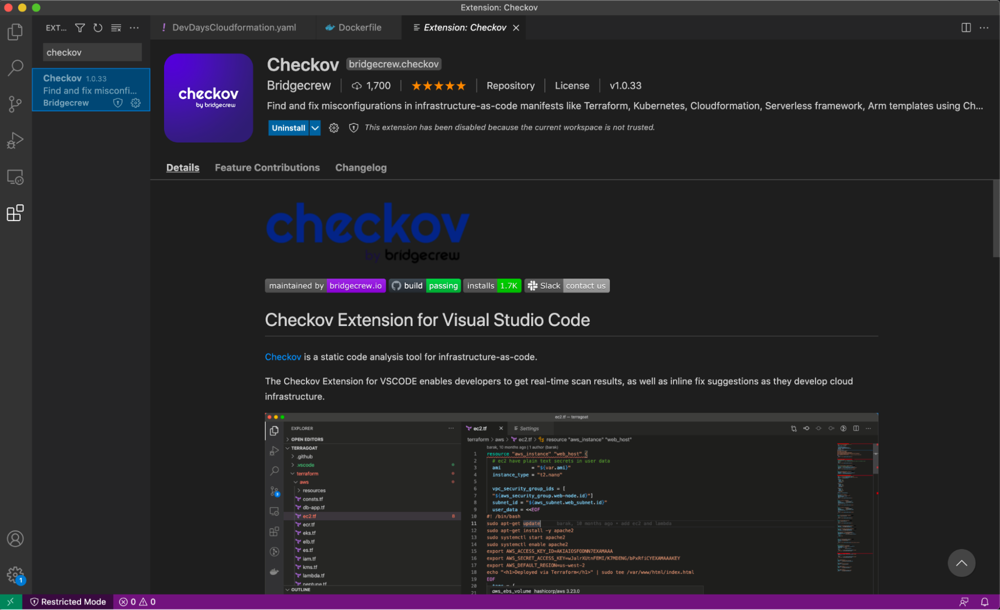
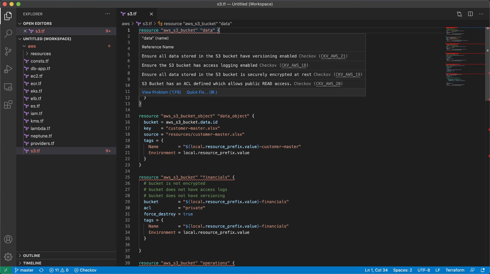

## Run Checkov in your IDE

You can get feedback directly in your integrated development environment (IDE) using Bridgecrew’s Checkov Visual Studio Code [extension](https://marketplace.visualstudio.com/items?itemName=Bridgecrew.checkov). The tool highlights misconfigurations inline and in development environments—like spell check for IaC misconfigurations.

First, you need to install the extension. In VS Code, go to Extensions and search for `Checkov`. Click Install.

Next, go to the Checkov **Extension Settings** and paste the API Token from the Bridgecrew platform that we saved earlier.

Scan your S3 bucket template using the extension. Go to File -> Add Folder to Workspace and navigate to the cloned TerraGoat directory. Add /terraform/aws to your VS Code workspace and open `s3.tf`.

Checkov will immediately start scanning and identifying multiple misconfigurations, underlining and highlighting their line in red. Move your cursor over the first code block `resource "aws_s3_bucket" "data"`. Checkov has identified multiple misconfigurations, including “Ensure all data stored in the S3 bucket have versioning enabled Checkov CKV_AWS_21."

You can learn more about the policy by selecting “View Problem” or select “Quick Fix” to do exactly that. By selecting `“Apply fix for - Ensure all data stored in the S3 bucket have versioning enabled”` you automatically patched your code base for a common misconfiguration.

Now you can commit that code to your repository with the patch and improved posture.

**Now that we know what Bridgecrew is scanning for and what the results look like, let’s automate it!**