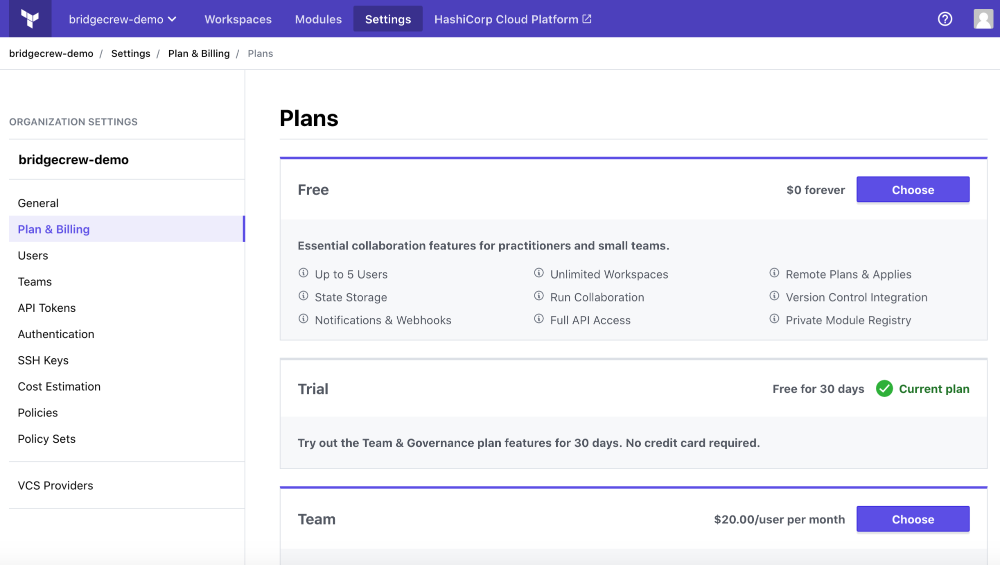
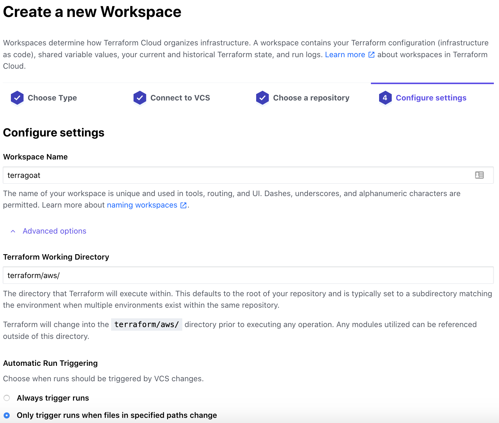
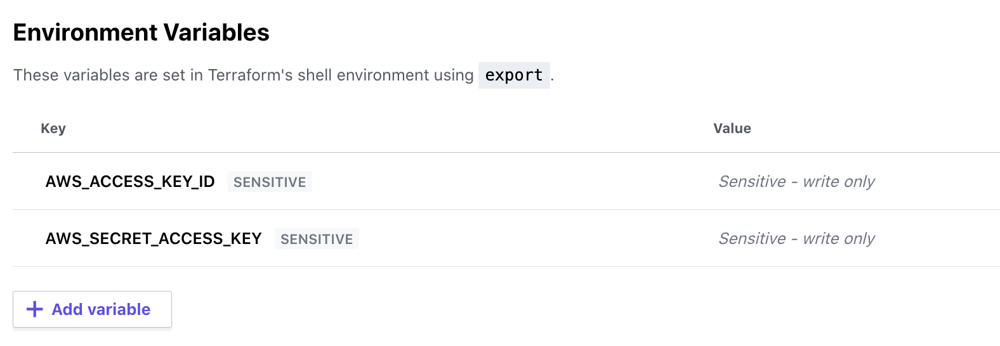
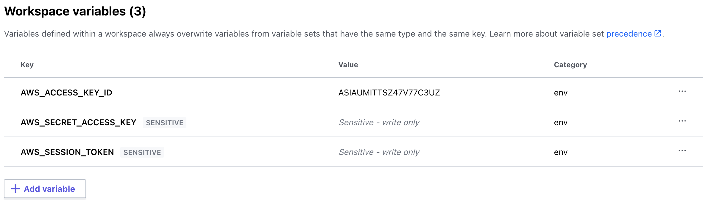
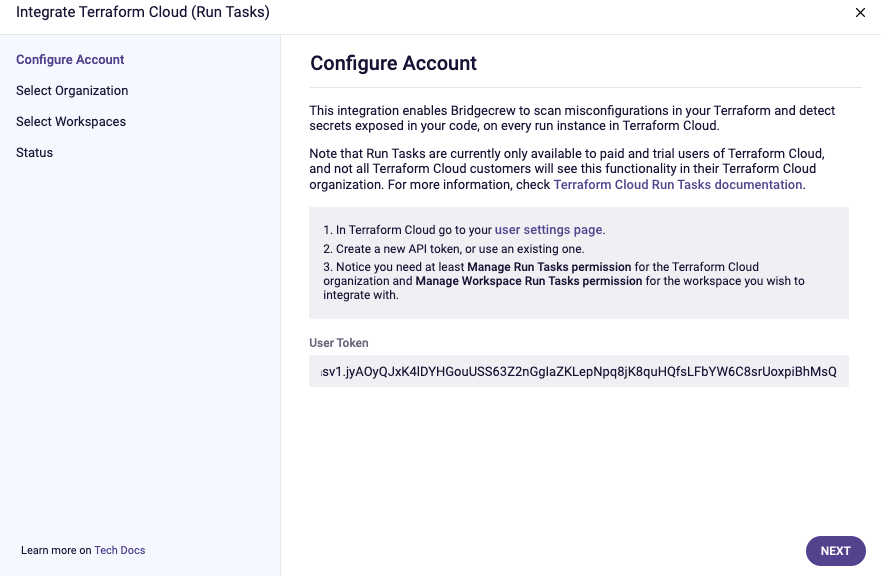
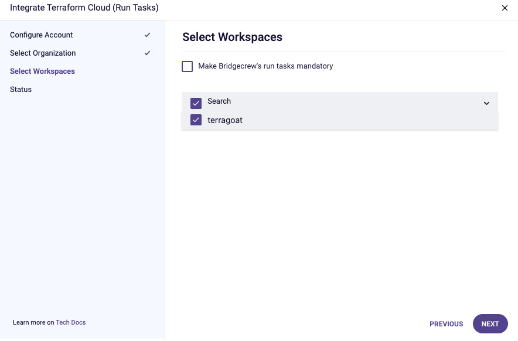
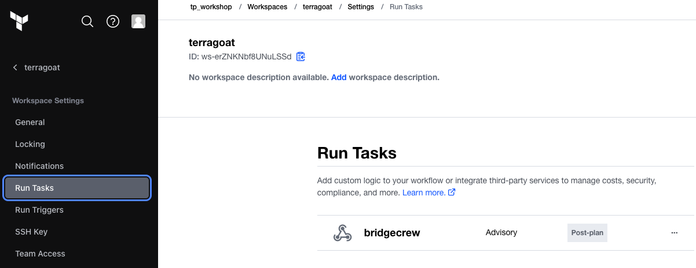
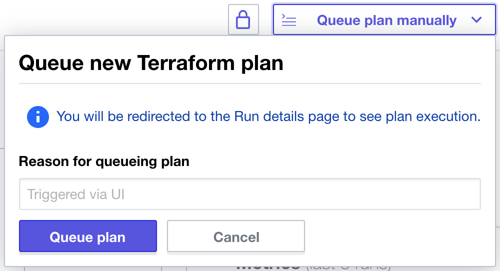

{}

There are two options to detect drift. You can either add the integration with Terraform Cloud or tag your resources with Yor. These don't conflict with each other so you can add both.

{}

## Leveraging Terraform Cloud and Run Tasks for Bridgecrew scans

Bridgecrew has a native integration with Terraform Cloud that leverages Run Tasks for policy controls. This means any commit that is pushed to Terraform Cloud will run through a Bridgecrew scan, identifying policy violations, blocking misconfigured builds, and detecting drift, all from the same place that you collaborate on Terraform templates, automate deployments, and store state.

{}
Run Tasks is a paid add-on. If you want to try this out for free, HashiCorp does offer a free trial. If you prefer not to sign up for the trial, feel free to skip this section and the "drift detection" section.
{}

To sign up for the free trial of Terraform Cloud’s Team & Governance plan, go to your Terraform Cloud instance. In the top navigation, select “Settings” and “Plan & Billing.” Choose the "Trial Plan" option. You should see Policies and Policy Sets show up in the left navigation menu.

You need to add your TerraGoat repository to Terraform Cloud. Go to “Workspaces” and select “Create one now.”

Select “Version control workflow”:

Select “GitHub," then "github.com," authorize access, and choose your TerraGoat repository we previously forked:

Name the workspace `terragoat` and open the “Advanced options” and add the directory `/terraform/simple_instance/` (we'll be adding that directory later). This will focus the scans to just the aws templates. Turn on "Automatic speculative plans" to create plans for pull requests. Select “Create workspace”:

Select “Configure variables” and under "Workspace variables" add your AWS Account and Access Keys as environment variables called `AWS_ACCESS_KEY_ID` and `AWS_SECRET_ACCESS_KEY`. If you are at an AWS event and using Event Engine, include your `AWS_SESSION_TOKEN`. If you aren’t sure where to find the keys, see [this guide](https://docs.aws.amazon.com/powershell/latest/userguide/pstools-appendix-sign-up.html).

For Event Engine, it will look like this:

Go to the Workspace Settings and select General. From this settings screen, grab your workspace ID for the next step.

{}
If each of the Variables does not say "Env" in the far right of the line, you've created the wrong type of variable. This is easy to do as "Terraform" variables are the default option when clicking on "Add environment Variable". You can delete them and re-create if necessary in the correct format!
{}

Grab the API token from Terraform Cloud for the integration. Go to the [API token menu](https://app.terraform.io/app/settings/tokens) (User -> Settings -> Tokens) and select “Create an API token.”

{}
Make sure you are in USER settings, there are three different settings tabs within Terraform Cloud, User settings, global org settings and workspace settings. Your screen should look as below, if there are multiple type of API key to chose from, you're in the wrong place!
{}

Copy that API token for the next step.

Next, you’ll add the Bridgecrew integration. Head over to the [Integrations](https://www.bridgecrew.cloud/integrations) screen in the Bridgecrew platform. Scroll down and select Terraform Cloud (Run Tasks). Enter the TFC API token from the previous step and choose "Next." Enter your Organization name, click "Next". Enter the Workspace name (terragoat) - you can leave the 'Make Bridgecrew's run tasks mandatory' unchecked for this workshop (NOTE: A Terraform Cloud run will fail if a Bridgecrew scan reports a failure and if the Run Task for the specific Workspace is configured as Mandatory - by default, and for this workshop, we will set run tasks to 'Advisory'). Click "Next" and upon succesful configuration click "Done".

 Head back to Terraform Cloud. Go to the terragoat workspace settings via the navigation bar and select “Run Tasks”.

Finally, go to your workspace's main page and under "Actions" select "Start new plan"; don't worry if it fails, this just primes the runs to be automated with future GitHub pull requests.

**Your Terraform Cloud integration is ready to go!**