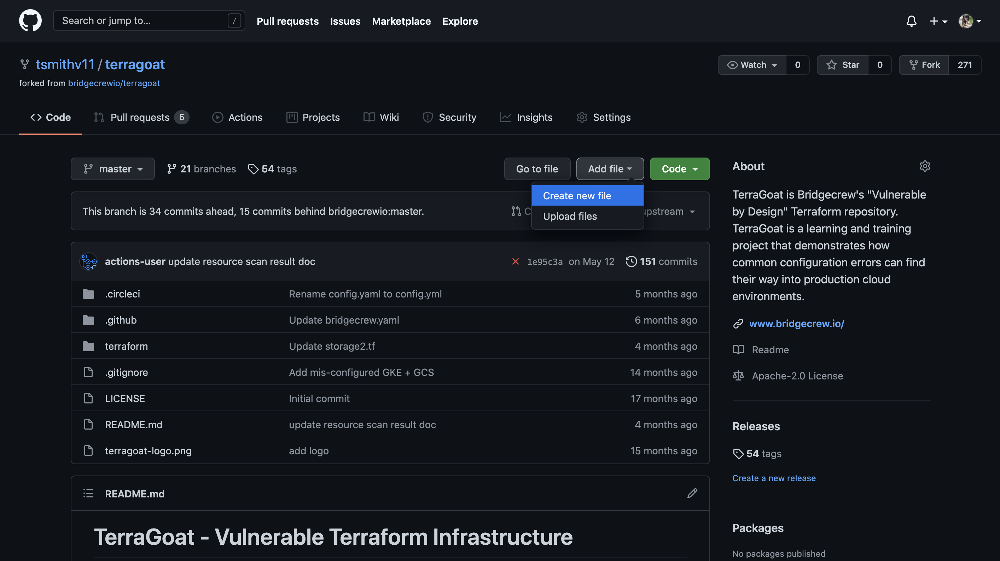
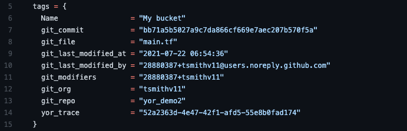

{}
<p style='text-align: left;'>
There are two options to detect drift. You can either add the integration with Terraform Cloud or tag your resources with Yor. These don't conflict with each other so you can add both.
</p>
{}

### An introduction to Yor

[Yor](http://github.com/bridgecrewio/yor) is an open-source tool that automatically tags infrastructure as code (IaC) templates with attribution and ownership details, unique IDs that get carried across to cloud resources, and any other need-to-know information. It can run locally, as a pre-commit hook, or in a CI/CD pipeline.

For drift detection, the important tag is `yor_trace`. It’s a unique identifier that helps us trace from a cloud runtime configuration back to the IaC that provisioned it. To do that we need 3 elements:

Yor automated tagging (this page)
Integration with the VCS that stores the IaC (we’ll use GitHub in step 5.4 as an example)
Cloud integration (we’ll use AWS in step 6.3 as an example)

Let’s start with Yor!

### Adding the Yor GitHub Action

If you followed the previous setup for the Bridgecrew GitHub Action, this will be very straightforward. If you’re in the home directory of your TerraGoat repository, select “Create new file”.



Set the path to `.github/workflows/yor.yml`. Add the following code:

```bash
name: IaC tag and trace

on:
  push:
  pull_request:

jobs:
  yor:
    runs-on: ubuntu-latest
    steps:
      - uses: actions/checkout@v2
        name: Checkout repo
        with:
          fetch-depth: 0
      - name: Run yor action
        uses: bridgecrewio/yor-action@main
```

This will run Yor to automatically tag your IaC resources every time you perform a push or pull request to your repo. The result will look something like this:



Notice the `yor_trace` tag? That’s all we need to track drift!