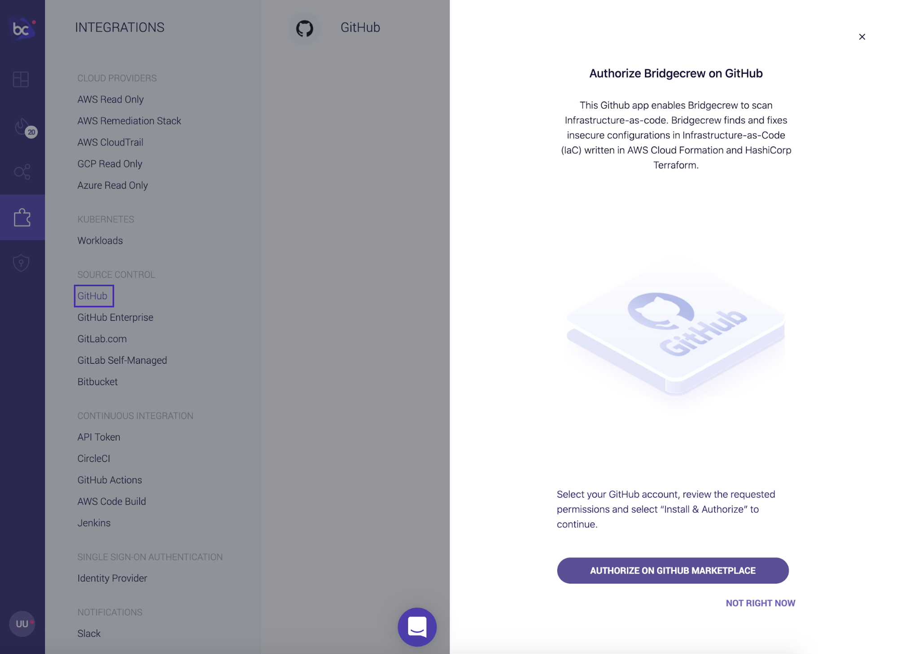
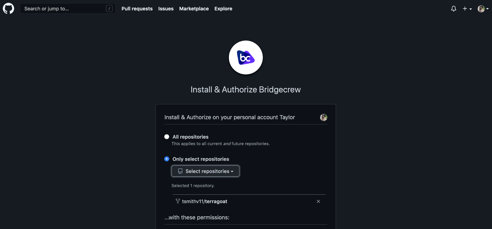
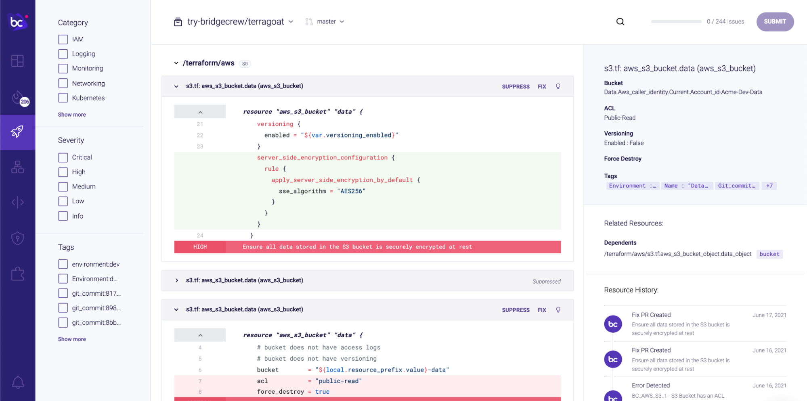

## Integrating Bridgecrew with GitHub

In this section, you’ll add a GitHub integration to automatically generate pull request comments and set up for automated fix pull requests (PRs) in the next section. This integration also provides native and automated scanning of incoming commits and pull requests.

Head back to the [Bridgecrew Integrations](https://www.bridgecrew.cloud/integrations/Github) tab and select GitHub under the Code Repositories section and click on the "GitHub organization" link:

Choose which accounts and repositories to grant the Bridgecrew GitHub integration access to:

This will bring you back to the Bridgecrew Integrations page. Select `<your-org>/terragoat`, "Next," and "Done."

Once you’ve connected Bridgecrew to your TerraGoat demo repository, Bridgecrew will scan your Terraform templates directly from GitHub again and bring the results into Bridgecrew.

Head over to the Projects tab and find the TerraGoat repository:

You will now see the same violation alerting from multiple sources. Although this may seem redundant, it’s actually an important feature for tracking security posture at multiple steps in the DevOps lifecycle.

**You’re all set!**

Now head over to your forked TerraGoat repository in GitHub to kick off a pull request to make sure it’s working.